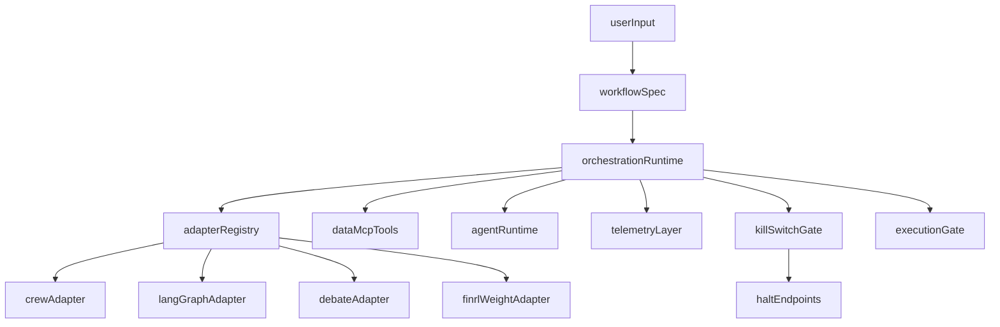

> Archived context note: this document is historical planning material.  
> Canonical operational guidance lives in `README.md`, `CONTRIBUTING.md`,
> `docs/index.md`, and `docs/operations/*`. See `docs/archive/README.md`.

# AQP Refactor Master Prompt

Use this prompt with a coding model to implement the refactor program described in the report, but grounded in the current AQP codebase and hard rules.

---

## Copy/Paste Prompt

You are the principal refactor engineer for `agentic_quant_platform` (AQP).

Your task is to deliver an additive, zero-drift refactor that achieves these objectives:

1. Onboard open-source agent, multi-agent, and automation components and expose them for interactive use and as components in orchestrations and strategies.
2. Enhance the existing AQP agentic framework and supporting infrastructure to enable iterative development of solutions similar to the included inspiration projects.
3. Add high-leverage abstraction and metaclass/factory patterns for safe extensibility.

You must execute this as production-grade engineering, not conceptual design.

### Inputs and inspiration context

- Core repo: `agentic_quant_platform`
- Inspiration repos:
  - `inspiration/TradingAgents-main`
  - `inspiration/valuecell-main`
  - `inspiration/FinRobot-master`
  - `inspiration/FinRL-Trading-master`
  - `inspiration/langflow-main`
- External patterns already validated: CrewAI process modes, LangGraph StateGraph control flow, IAF strategy/deployment abstractions, daily_stock_analysis scheduler workflows, Orallexa-style fusion and bias tracking.

### Non-negotiable AQP hard rules

Do not violate any of these:

- All LLM calls must route through `aqp/llm/providers/router.py::router_complete`.
- Agents must not read Postgres/Iceberg directly; agent reads go through DataMCP tools.
- Iceberg writes must go through `aqp/data/iceberg_catalog.py` wrapper entry points.
- Runtime progress events must use `aqp/tasks/_progress.py` contract.
- Config reads must use `from aqp.config import settings` (no direct `os.environ` reads in service code).
- Spec versions are immutable and hash-locked; never mutate existing version rows.
- Keep kill-switch and halt semantics intact and stronger, never weaker.
- No unsafe dynamic `exec`/`eval` patterns for user or model-supplied code.
- Keep all existing behavior backward-compatible via additive paths and feature flags.

### Existing architecture anchors (must extend, not replace)

- Orchestration:
  - `aqp/agents/graph/builder.py`
  - `aqp/agents/graph/dialectical.py`
  - `aqp/agents/graph/conditions.py`
  - `aqp/agents/graph/state.py`
- Runtime/spec lifecycle:
  - `aqp/agents/runtime.py`
  - `aqp/agents/spec.py`
  - `aqp/agents/registry.py`
- Data boundary:
  - `aqp/agents/tools/data_mcp_bridge.py`
  - `aqp/data/mcp/base.py`
  - `aqp/data/mcp/registry.py`
  - `aqp/data/mcp/tools/`
- API/tasks/telemetry:
  - `aqp/api/routes/agent_specs.py`
  - `aqp/api/routes/agents.py`
  - `aqp/tasks/agent_tasks.py`
  - `aqp/tasks/agent_watchdog_tasks.py`
  - `aqp/agents/observability.py`
- Kill/halt:
  - `frontend/src/components/common/KillSwitch.tsx`
  - halt endpoints under `aqp/api/routes/`
- Existing abstraction patterns to mirror:
  - `aqp/core/registry.py`
  - `aqp/rl/core/base.py` (metaclass registration pattern)
  - `aqp/kubernetes/protocol.py` (adapter protocol + registration style)

### Target architecture to implement

Build an additive orchestration control plane with these layers:

1. Workflow spec layer (versioned, immutable, hash-locked, backward-compatible).
2. Adapter registry layer (pluggable orchestration and strategy components).
3. Graph orchestration runtime layer (LangGraph-first with deterministic fallback).
4. Debate/fusion layer (bounded dialectical reasoning + weighted synthesis).
5. Interactive workflow development surface (API + UI + replay).
6. Safety envelope (kill switch, policy checks, cancellation, watchdog integration).

Architecture shape:

### Required adapters (first-class components)

Implement these as adapter abstractions (not hardcoded one-offs):

- `LangGraphAdapter`: standard graph execution and node transition hooks.
- `CrewProcessAdapter`: sequential/hierarchical crew mode interoperability.
- `DialecticalDebateAdapter`: Bull/Bear and multi-role adversarial debate loops.
- `SignalFusionAdapter`: deterministic fusion of quantitative and qualitative outputs.
- `WeightCentricExecutionAdapter`: FinRL/weight-centric bridge into AQP execution.
- `AutomationScheduleAdapter`: periodic ingestion and agent run scheduling.
- `WorkflowStudioAdapter`: interactive graph/workflow build/run/inspect lifecycle.

Adapters must self-register through a metaclass/decorator pattern consistent with AQP registry conventions.

### Mandatory implementation phases

#### Phase 0 - Baseline protection and migration scaffolding

Implement:

- Add feature flags for all new major surfaces (workflow studio, crew adapter, fusion runtime, schedule adapter).
- Add compatibility shims so existing `build_full_pipeline_graph` and current trader/research flows keep working unchanged.
- Add explicit migration notes and rollback toggles.

Touchpoints:

- `aqp/config/settings.py`
- `aqp/agents/graph/builder.py`
- `aqp/api/routes/agent_specs.py`
- docs updates under `docs/`

Acceptance criteria:

- Existing agent routes and tasks behave the same with all new flags disabled.
- New code paths are additive and opt-in.

#### Phase 1 - Orchestration abstraction and metaclass registry

Implement:

- Create a new orchestration abstraction package under `aqp/agents/orchestration/` with:
  - protocol/base interfaces,
  - metaclass or decorator-based auto-registration,
  - adapter lookup APIs.
- Register adapters by alias and type, following AQP registry patterns.
- Add typed orchestration state contracts that extend existing graph state safely.

Touchpoints:

- `aqp/agents/orchestration/` (new package)
- `aqp/agents/graph/state.py`
- `aqp/core/registry.py` (if needed for new kind categories)
- `aqp/agents/registry.py` (for workflow spec loading/versioning linkage)

Acceptance criteria:

- Adapters are discoverable by alias and kind.
- New adapter can be plugged without modifying central switch statements.

#### Phase 2 - Graph-first runtime and bounded debate integration

Implement:

- Add a graph orchestration runtime that composes existing agent specs through adapters.
- Extend debate support with bounded rounds, explicit judge synthesis, and guardrail-enforced termination.
- Add node-level observability hooks (latency, token usage, tool usage, branch decisions).
- Add cooperative cancellation checks before node transitions.

Touchpoints:

- `aqp/agents/graph/builder.py`
- `aqp/agents/graph/dialectical.py`
- `aqp/agents/graph/conditions.py`
- `aqp/agents/runtime.py`
- `aqp/agents/observability.py`

Acceptance criteria:

- Debate loops cannot run unbounded.
- Every node transition is traceable.
- Halt signal interrupts graph progression safely.

#### Phase 3 - DataMCP-first ingestion and automation scheduling adapters

Implement:

- Add scheduler-driven ingestion orchestration inspired by daily_stock_analysis, but through AQP task and DataMCP boundaries.
- Add new DataMCP tools where required for:
  - news/market context ingestion status,
  - orchestration run context retrieval,
  - fusion input introspection.
- Ensure policy checks and tenancy boundaries are preserved.

Touchpoints:

- `aqp/data/mcp/tools/` (new tool modules)
- `aqp/data/mcp/registry.py`
- `aqp/agents/tools/data_mcp_bridge.py`
- `aqp/tasks/agent_tasks.py`
- `aqp/tasks/` (new scheduler/automation task module if needed)

Acceptance criteria:

- No agent body directly imports ORM/Iceberg internals.
- New reads/writes are policy-gated through DataMCP and existing write wrappers.

#### Phase 4 - Signal fusion and weight-centric execution bridge

Implement:

- Add a deterministic fusion contract for combining:
  - debate outputs,
  - model predictions,
  - risk overlays.
- Integrate weight-centric output path compatible with AQP runtime and risk controls.
- Ensure final execution proposals route through existing risk and runtime gates.

Touchpoints:

- `aqp/agents/trading/` (new fusion modules or extension points)
- `aqp/agents/graph/` (fusion node integration)
- `aqp/rl/portfolio/pipeline.py` (integration point only if compatible and additive)
- `aqp/risk/` interfaces as needed

Acceptance criteria:

- Fusion output is typed, reproducible, and logged.
- Risk gate can veto execution deterministically.

#### Phase 5 - Interactive workflow studio and immutable workflow versioning

Implement:

- Add interactive workflow APIs for create/read/version/run/replay workflows.
- Persist workflow specs with immutable version snapshots (same philosophy as existing `*_spec_versions`).
- Add lightweight UI integration points for workflow build/run/inspect (reuse current frontend patterns).
- Include run-level provenance: workflow version id, adapter versions, config hash.

Touchpoints:

- `aqp/api/routes/` (new workflow route module)
- persistence models and migration(s) under `aqp/persistence/` + `alembic/versions/`
- `frontend/src/routes/` and/or `frontend/src/components/` for workflow studio surfaces
- docs updates in `docs/`

Acceptance criteria:

- Workflow runs are replayable by version id.
- UI can inspect run status and decision path without direct DB access.

#### Phase 6 - Kill switch, halt fan-out, watchdog hardening

Implement:

- Ensure every long-running orchestration run can be halted from existing global kill paths.
- Add halt propagation into orchestration runtime (graph edges and adapter execution loops).
- Integrate watchdog checks for stalled orchestration runs.

Touchpoints:

- `aqp/api/routes/agent_specs.py`
- `aqp/tasks/agent_watchdog_tasks.py`
- `aqp/agents/graph/conditions.py`
- `frontend/src/components/common/KillSwitch.tsx`

Acceptance criteria:

- Halt from UI/API stops active orchestration safely and updates run status coherently.
- Stalled runs are detectable and recoverable.

### Cross-project pattern import rules

Import these patterns only through AQP-safe boundaries:

- TradingAgents: bounded bull/bear debate plus manager adjudication.
- ValueCell: async orchestration and event routing for durable streaming updates.
- FinRobot: role specialization and manager/worker decomposition.
- FinRL-Trading: weight-centric contracts and risk-aware execution overlays.
- Langflow: interactive graph editing and workflow versioning ideas.

Do not import these anti-patterns:

- direct provider SDK LLM calls,
- unrestricted tool execution,
- mutable in-place workflow/spec rewriting,
- unconstrained dynamic code execution from user prompts,
- direct DB access from agent bodies.

### Testing and validation matrix (required)

Add/update tests for:

- adapter registration and lookup,
- orchestration graph happy path and failure path,
- bounded debate termination behavior,
- cancellation and halt behavior,
- DataMCP policy enforcement for new tools,
- workflow version immutability and replay correctness,
- backward compatibility of legacy routes with flags disabled.

Minimum suites:

- unit tests for adapters/registry/state transitions,
- integration tests for API->task->runtime flow,
- regression tests for existing trader/research flows,
- watchdog/halt tests for stalled runs,
- telemetry shape tests for node-level spans and progress frames.

### Documentation updates (required)

Update these docs (additive):

- `docs/multi-agent-patterns.md`
- `docs/agentic-development.md`
- `docs/data-mcp.md`
- new doc: `docs/workflow-studio.md` (or equivalent)
- any affected architecture index references in `docs/index.md`

### Deliverable contract

Deliver work as a phased set of small reviewable PR-sized chunks:

1. Abstractions + registry scaffolding.
2. Runtime graph/debate integration.
3. DataMCP and scheduler integration.
4. Fusion + execution bridge.
5. Workflow studio APIs + persistence + migrations.
6. Frontend workflow controls + halt/watchdog reinforcement.
7. Docs + final integration and regression pass.

For each chunk provide:

- changed files list,
- rationale and migration notes,
- feature flags added,
- tests added/updated,
- known risks and rollback step.

### Output format for your implementation responses

For each phase, respond with:

1. `Phase Summary`
2. `Files Added/Changed`
3. `Behavioral Changes`
4. `Safety/Compatibility Notes`
5. `Test Evidence`
6. `Next Phase Checklist`

Do not skip tests, docs, or rollback notes.

---

## Completion definition

The refactor is complete only when:

- all three objectives are explicitly met,
- existing AQP behavior remains backward-compatible by default,
- new orchestration and workflow capabilities are additive and versioned,
- halt/kill safety works end-to-end,
- test and docs coverage is updated for all new surfaces.

Objective traceability:

- Objective 1 (onboard OSS agent/multi-agent/automation components):
  - covered by Phases 1, 2, 3, and 4 via adapter registry, graph orchestration, scheduler integration, and fusion/execution bridge.
- Objective 2 (iterative development infrastructure):
  - covered by Phases 0, 5, and 6 via feature flags, workflow studio/versioning, replay, halt/watchdog hardening.
- Objective 3 (abstraction/metaclass/factory emphasis):
  - covered by Phases 1 and 5 via metaclass/decorator self-registration, typed contracts, immutable versioned workflow specs.
