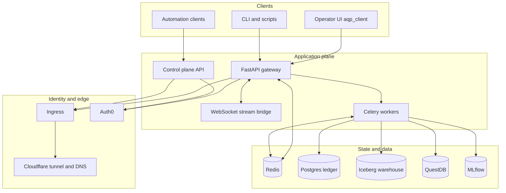
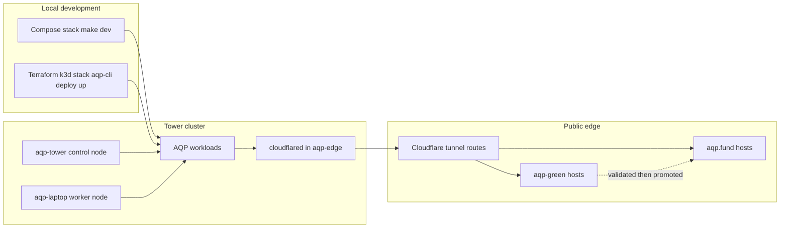

# Agentic Quant Platform (AQP)

Local-first agentic quant research, execution, and platform control plane.
AQP combines strategy research, backtesting, RL, data pipelines, and runtime
operations while keeping infrastructure and data under operator control.

> **New here?**
> Humans: [CONTRIBUTING.md](CONTRIBUTING.md), [aqp_docs/docs/concepts/platform/architecture.md](aqp_docs/docs/concepts/platform/architecture.md)  
> Agents: [AGENTS.md](AGENTS.md)  
> Full docs map: [aqp_docs/docs/intro/index.md](aqp_docs/docs/intro/index.md)

## Overview

- **Primary operator UI**: [aqp_client/](aqp_client/) (Vite 7 + React 19)
- **Primary runtime package**: [aqp/](aqp/) (agents, data, backtests, tasks, APIs, LLM gateway)
- **Reinforcement-learning subsystem**: [aqp_rl/](aqp_rl/) (`RLRuntime`, hash-locked specs, advantage estimators, policy backbones, weight-centric portfolio pipeline, Iceberg trajectory store)
- **Custom model boundary**: [aqp_models/](aqp_models/) (qlib-style ML framework, Predictor Hub, AlphaBacktestExperiment, walk-forward, finetune trainers, custom model serving via vLLM + Ollama)
- **Primary deployment assets**: [aqp_platform/deployments/](aqp_platform/deployments/) and [aqp_platform/terraform/](aqp_platform/terraform/)
- **Primary local setup runbook**: [aqp_docs/docs/how-to/operations/local-setup.md](aqp_docs/docs/how-to/operations/local-setup.md)
- **Primary Kubernetes runbook**: [aqp_docs/docs/how-to/operations/kubernetes-deploy.md](aqp_docs/docs/how-to/operations/kubernetes-deploy.md)

## Repository Structure (May 2026)

| Responsibility | Path | Status |
| --- | --- | --- |
| Monolith runtime domains | [aqp/](aqp/) | active |
| Reinforcement-learning subsystem | [aqp_rl/](aqp_rl/) | active |
| Custom model pulling / building / training / fine-tuning / evaluating / testing | [aqp_models/](aqp_models/) | active |
| Standalone management API | [aqp_control_plane/](aqp_control_plane/) | active |
| Shared platform contracts | [aqp_platform_core/](aqp_platform_core/) | active |
| Operator UI (Vite) | [aqp_client/](aqp_client/) | active |
| Bot runtime + templates | [aqp_bots/](aqp_bots/) | active |
| Curated snippet corpus | [aqp_snippets/](aqp_snippets/) | active |
| Standalone operator CLI | [aqp_cli/](aqp_cli/) | active |
| Internal admin (managed services + accounts) | [aqp_admin/](aqp_admin/) | active |
| Vendored Theia IDE workspace | [aqp_ide/](aqp_ide/) | active |
| Curator-owned project index (SSoT) | [aqp_index/](aqp_index/) | active |
| Canonical documentation | [aqp_docs/](aqp_docs/) | active |
| Hosted-platform deployment + build + IaC + cluster setup | [aqp_platform/](aqp_platform/) | active |
| Compose + Kubernetes artifacts | [aqp_platform/deployments/](aqp_platform/deployments/) | active |
| Infrastructure as code | [aqp_platform/terraform/](aqp_platform/terraform/) | active |
| RL subsystem (deprecated shim) | [aqp/rl/](aqp/rl/) | shim |
| Custom model framework (deprecated shim) | [aqp/ml/](aqp/ml/) | shim |
| Custom model serving (deprecated shims) | [aqp/llm/vllm_runner.py](aqp/llm/vllm_runner.py), [aqp/llm/ollama_client.py](aqp/llm/ollama_client.py) | shim |
| Legacy Next.js UI | [webui/](webui/) | rollback-only |
| Legacy Kubernetes tree | [aqp_platform/deploy/k8s/](aqp_platform/deploy/k8s/) | legacy |

> The former root-level `deployments/`, `terraform/`, `build/`, and `deploy/` folders, plus root `Dockerfile`, `.dockerignore`, and `docker-compose*.yml`, now live under [aqp_platform/](aqp_platform/). The former `configs/deployment/` and `configs/terraform/` subfolders moved to `aqp_platform/configs/`. `scripts/cluster_install/` moved to `aqp_platform/scripts/cluster_install/`.

For canonical boundary ownership, see [aqp_docs/docs/concepts/platform/repository-split.md](aqp_docs/docs/concepts/platform/repository-split.md)
and [aqp_docs/docs/concepts/platform/aqp-monorepo-paths.md](aqp_docs/docs/concepts/platform/aqp-monorepo-paths.md).

## Deployment Architectures

### 1) Local Compose stack (fast iteration)

Use this for day-to-day development:

```bash
make generate-config ENV=local
make dev
```

- Runbook: [aqp_docs/docs/how-to/operations/local-setup.md](aqp_docs/docs/how-to/operations/local-setup.md)
- Compose artifact map: [aqp_platform/deployments/README.md](aqp_platform/deployments/README.md)

### 2) Terraform-managed local k3d (ledgered control-plane path)

Use this when you want `aqp-cli deploy` lifecycle semantics and Terraform-run tracing:

```bash
aqp-cli deploy build
aqp-cli deploy up
aqp-cli deploy status
```

### 3) Kubernetes target deployment (cluster)

Use Kustomize overlays under [aqp_platform/deployments/kubernetes/](aqp_platform/deployments/kubernetes/):

```bash
kubectl apply -k aqp_platform/deployments/kubernetes/overlays/dev
```

- Canonical cluster rollout: [aqp_docs/docs/how-to/operations/kubernetes-deploy.md](aqp_docs/docs/how-to/operations/kubernetes-deploy.md)

### 4) Tower two-node cluster + AQP domain cutover

- Tower target rollout: [aqp_docs/docs/how-to/operations/tower-cluster-deploy.md](aqp_docs/docs/how-to/operations/tower-cluster-deploy.md)
- Blue/green cutover for `aqp.fund`: [aqp_docs/docs/how-to/operations/aqp-fund-blue-green-cutover.md](aqp_docs/docs/how-to/operations/aqp-fund-blue-green-cutover.md)
- Cloudflare tunnel manifests:
  - primary lane: [aqp_platform/deployments/kubernetes/edge/cloudflared-aqp/](aqp_platform/deployments/kubernetes/edge/cloudflared-aqp/)
  - green lane: [aqp_platform/deployments/kubernetes/edge/cloudflared-aqp-green/](aqp_platform/deployments/kubernetes/edge/cloudflared-aqp-green/)

## Architecture Diagrams

### Runtime architecture



### Deployment topology



## Documentation Locations

| Area | Canonical location | Status |
| --- | --- | --- |
| Documentation index | [aqp_docs/docs/intro/index.md](aqp_docs/docs/intro/index.md) | active |
| System architecture | [aqp_docs/docs/concepts/platform/architecture.md](aqp_docs/docs/concepts/platform/architecture.md) | active |
| Local setup | [aqp_docs/docs/how-to/operations/local-setup.md](aqp_docs/docs/how-to/operations/local-setup.md) | active |
| Kubernetes rollout | [aqp_docs/docs/how-to/operations/kubernetes-deploy.md](aqp_docs/docs/how-to/operations/kubernetes-deploy.md) | active |
| Tower two-node rollout | [aqp_docs/docs/how-to/operations/tower-cluster-deploy.md](aqp_docs/docs/how-to/operations/tower-cluster-deploy.md) | active |
| Blue/green cutover | [aqp_docs/docs/how-to/operations/aqp-fund-blue-green-cutover.md](aqp_docs/docs/how-to/operations/aqp-fund-blue-green-cutover.md) | active |
| Deployment asset map | [aqp_platform/deployments/README.md](aqp_platform/deployments/README.md) | active |
| Repository boundary map | [aqp_docs/docs/concepts/platform/repository-split.md](aqp_docs/docs/concepts/platform/repository-split.md) | migration |
| Monorepo path contract | [aqp_docs/docs/concepts/platform/aqp-monorepo-paths.md](aqp_docs/docs/concepts/platform/aqp-monorepo-paths.md) | active |
| Legacy Next.js docs | [aqp_docs/docs/concepts/trading/webui.md](aqp_docs/docs/concepts/trading/webui.md) | rollback-only |
| Legacy k8s tree | [aqp_platform/deploy/k8s/README.md](aqp_platform/deploy/k8s/README.md) | legacy |
| Historical context | [aqp_docs/docs/archive/README.md](aqp_docs/docs/archive/README.md) | archive |

## Useful Links

- Contributor onboarding: [CONTRIBUTING.md](CONTRIBUTING.md)
- Agent operating contract: [AGENTS.md](AGENTS.md)
- Workflow governance: [WORKFLOW.md](WORKFLOW.md)
- Code index governance: [aqp_docs/docs/concepts/platform/code-index-governance.md](aqp_docs/docs/concepts/platform/code-index-governance.md)
- Active frontend package: [aqp_client/README.md](aqp_client/README.md)
- Deployment artifacts: [aqp_platform/deployments/README.md](aqp_platform/deployments/README.md)
- Kubernetes manifests: [aqp_platform/deployments/kubernetes/](aqp_platform/deployments/kubernetes/)
- Terraform environments: [aqp_platform/terraform/environments/](aqp_platform/terraform/environments/)

## Changelog (concise)

### 2026-05-24

- Extracted the reinforcement-learning subsystem out of `aqp/rl/` into a
  new top-level boundary package [aqp_rl/](aqp_rl/) (src-layout) following
  the existing `aqp_bots/` / `aqp_platform_core/` / `aqp_control_plane/`
  pattern. The matching Celery task wrapper, FastAPI router, YAML spec
  library, and tests moved with the source. Legacy `aqp.rl.*` imports
  are preserved through a deprecation-warning shim under [aqp/rl/](aqp/rl/)
  per the strangler-migration policy in
  [aqp_docs/docs/concepts/platform/repository-split.md](aqp_docs/docs/concepts/platform/repository-split.md).
- Extracted custom model pulling, building, training, fine-tuning,
  evaluating, and testing out of `aqp/ml/` (and the model-pulling /
  serving slice of `aqp/llm/`) into a new top-level boundary package
  [aqp_models/](aqp_models/). Includes `src/aqp_models/serving/{vllm,ollama}.py`
  for the moved custom serving layer. The central LLM gateway
  (`router_complete`, memory, cache, prompts, tokens) **stays** at
  [aqp/llm/](aqp/llm/) per Hard Rule 2 in [AGENTS.md](AGENTS.md). Legacy
  imports preserved through deprecation shims.
- Pruned root-level build artifacts and scratch reports. Archived
  point-in-time planning material to [aqp_docs/docs/archive/](aqp_docs/docs/archive/).
- Updated [AGENTS.md](AGENTS.md), the `.cursor/rules/` set,
  [aqp_docs/docs/concepts/platform/repository-split.md](aqp_docs/docs/concepts/platform/repository-split.md), and
  [aqp_docs/docs/concepts/platform/aqp-monorepo-paths.md](aqp_docs/docs/concepts/platform/aqp-monorepo-paths.md) for
  the new boundaries.

### 2026-05-23

- Modernized this README to align with current active surfaces and runbooks.
- Replaced stale legacy deployment references with `aqp_platform/deployments/kubernetes` and
  current operations docs.
- Added canonical repository structure and deployment topology sections.
- Added architecture diagrams for runtime and edge deployment paths.

### 2026-05

- Introduced the tower two-node target and dedicated rollout runbook:
  [aqp_docs/docs/how-to/operations/tower-cluster-deploy.md](aqp_docs/docs/how-to/operations/tower-cluster-deploy.md).
- Added blue/green `aqp.fund` cutover flow and green lane tunnel artifacts:
  [aqp_docs/docs/how-to/operations/aqp-fund-blue-green-cutover.md](aqp_docs/docs/how-to/operations/aqp-fund-blue-green-cutover.md).
- Formalized repository boundary split guidance:
  [aqp_docs/docs/concepts/platform/repository-split.md](aqp_docs/docs/concepts/platform/repository-split.md).
- Promoted `aqp_client` (Vite) as the active operator UI and moved legacy surfaces
  to rollback/legacy status in [aqp_docs/docs/intro/index.md](aqp_docs/docs/intro/index.md).

For deeper historical notes and archived planning material, see
[aqp_docs/docs/archive/README.md](aqp_docs/docs/archive/README.md).

## License

MIT. See [LICENSE](LICENSE).
