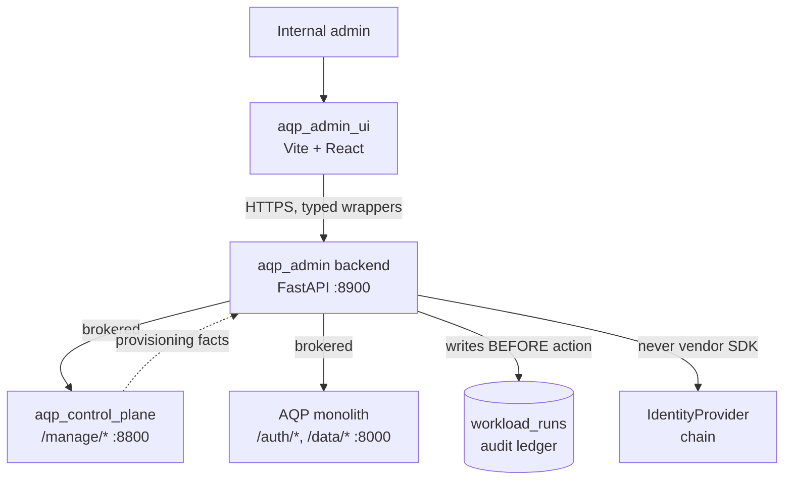

# aqp-admin architecture

## Boundary summary

| Concern | Where | Why |
| --- | --- | --- |
| Account state | `src/aqp_admin/accounts/` | Pure domain layer; no HTTP. |
| Managed-service orchestration | `src/aqp_admin/services/` | Brokers to control plane. |
| Billing / payments | `src/aqp_admin/providers/` | Provider impls swap out under stable iface. |
| HTTP surface | `src/aqp_admin/api/routers/` | Thin wrappers + auth + audit. |
| Settings | `src/aqp_admin/settings.py` | `AQP_ADMIN_*` env prefix. |
| Frontend routes | `aqp_admin_ui/src/routes/` | Vite 7 + React 19, mirrors aqp_client. |
| Typed API client | `aqp_admin_ui/src/lib/api.ts` | Generated or hand-rolled wrappers. |

## Non-goals

- Hosting the customer-facing operator UI (that's `aqp_client/`).
- Replacing the per-workload control plane (that's `aqp_control_plane/`).
- Direct vendor SDK use (Auth0, Stripe, Azure, etc.) inside route
  handlers — go through `IdentityProvider` or a registered provider in
  `src/aqp_admin/providers/`.
