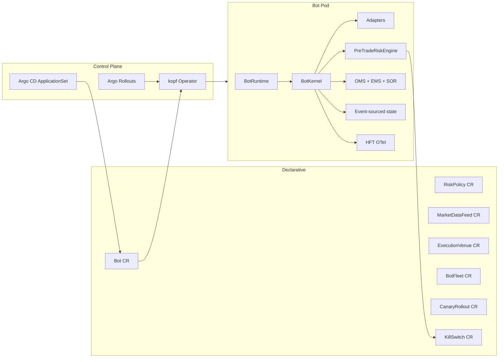

# aqp_bots — QuantBot Platform

> **Status:** active bot package + QuantBot Platform v0.2.0 extension.

`aqp_bots` is the AQP boundary that owns the Bot abstraction — the
smallest fully-addressable, individually-deployable, independently-
killable unit of trading or research workload. The v0.2.0 enterprise
extension layered the **QuantBot Platform** (a Kubernetes-native,
vendor-agnostic Python framework with a kopf-based operator, 9 CRDs,
full HFT path, event-sourced state, RTS 6 / SEC 15c3-5 risk, and
Argo Rollouts canaries) on top of the legacy bot path without
breaking any of it.

A legacy bot (`kind=trading` with no `capabilities` block) continues
to use the existing `BotRuntime → run_backtest_from_config →
build_session_from_config` path unchanged.

## Architecture (v0.2.0)



## Module layout

```
aqp_bots/
  spec.py                # BotSpec + 7 layer specs + Frequency/AssetClass
  base.py                # BaseBot ABC
  runtime.py             # BotRuntime — single sanctioned executor (rule 14)
  registry.py            # persist_spec — hash-locked snapshots (rule 15)
  deploy.py              # PaperSession / BacktestOnly / Kubernetes targets
  cli.py                 # aqp-bots <list|show|backtest|paper|chat|deploy|
                         #          run|replay|conformance|stress|render-manifest|validate>
  trading_bot.py
  research_bot.py
  rl_trading_bot.py
  templates/             # 8 sample BotSpecs (existing 2 + 6 new archetypes)
    trading/dual_ma_aapl.yaml
    research/equity_research_bot.yaml
    hft/nasdaq_mm_aapl.yaml
    stat_arb/pair_ko_pep.yaml
    eod/factor_momentum.yaml
    rl/ppo_perp_btc.yaml
    mev/eth_backrun.yaml
    research/macro_news_crew.yaml

  # QuantBot Platform v0.2.0
  schemas/               # Hot-path msgspec.Struct types (Tick/Quote/Bar/NewOrder/...)
  core/                  # BotKernel + LifecycleFSM + Clock + ids + MessageBus + futures
  adapters/              # MarketDataAdapter + ExecutionAdapter + ControlPlaneAdapter
    fix/                 # FIX session with full sequence-gap recovery
    websocket/           # Reconnect + msgspec decode
    rest/                # httpx + tenacity + aiolimiter
    grpc/                # gRPC adapter base
    onchain/             # web3.py + Flashbots
    bridges/             # Alpaca / IBKR / paper session bridges
  execution/             # Order FSM + OMS + EMS (TWAP/VWAP/POV/IS/Iceberg) + SOR + reconcile
  state/                 # Event store + snapshots + projections + replay
  risk/                  # RTS 6 / 15c3-5 PreTradeRiskEngine + 3-scope kill switch
    reg/                 # Regulatory crosswalks (engineering only — see ADR 009)
    service/             # Out-of-band FastAPI risk service
  telemetry/             # OTel + HFT span processor + Prometheus + structlog + health
  hft/                   # Cython SPSC ring buffer + PTP clock + NUMA + SR-IOV
  operator/              # kopf handlers + 9 CRDs + webhooks + render.py
    crds/yaml/           # The 9 CRD YAML definitions
  Dockerfile             # Distroless multi-stage build (target < 200 MiB)
  Dockerfile.hft         # Hardened slim Debian for kernel-bypass HFT bots
```

## Hard rules (preserved)

- **Rule 14**: `BotRuntime` is the single sanctioned executor. `BotKernel`
  is invoked only via `BotRuntime.run_kernel()`.
- **Rule 15**: `bot_versions` rows stay immutable. Operator reconciliation
  calls `persist_spec()`; never mutates rows.
- **Rule 28**: New adapters mirror the `KubernetesAdapterMeta` metaclass
  pattern.
- **Rule 45**: Workload ops route through `WorkloadRuntime`.

See [aqp_docs/bots.md](../aqp_docs/bots.md) for the full architectural
walkthrough.

## Validation

```bash
docker exec aqp-api python -m pytest tests/bots
```

## Where things live

| Need | Path |
| --- | --- |
| BotSpec + layer specs | [spec.py](spec.py) |
| BotKernel + lifecycle FSM | [core/](core/) |
| Adapters | [adapters/](adapters/) |
| Order FSM + OMS + EMS + SOR | [execution/](execution/) |
| Event-sourced state | [state/](state/) |
| RTS 6 / 15c3-5 risk engine | [risk/](risk/) |
| OTel + Prometheus + structlog | [telemetry/](telemetry/) |
| Cython SPSC + PTP + NUMA | [hft/](hft/) |
| kopf operator + 9 CRDs | [operator/](operator/) |
| Sample manifests | [templates/](templates/) |
| Operator deployment | [../aqp_platform/deployments/kubernetes/bots-operator/](../aqp_platform/deployments/kubernetes/bots-operator/) |
| Helm charts | [../aqp_platform/deployments/helm/](../aqp_platform/deployments/helm/) |
| Argo Rollouts canary | [../aqp_platform/deployments/argocd/rollouts/](../aqp_platform/deployments/argocd/rollouts/) |
| HFT node tier | [../aqp_platform/deployments/kubernetes/hft-nodes/](../aqp_platform/deployments/kubernetes/hft-nodes/) |
| Alembic migration (`bot_events` etc.) | [../alembic/versions/0058_bot_event_sourcing.py](../alembic/versions/0058_bot_event_sourcing.py) |
| API routes | [../aqp/api/routes/bots.py](../aqp/api/routes/bots.py) |
| Celery tasks | [../aqp/tasks/bot_tasks.py](../aqp/tasks/bot_tasks.py) |
| ORM models | [../aqp/persistence/models_bots.py](../aqp/persistence/models_bots.py) |
| ADRs | [../aqp_docs/architecture/decisions/006-quantbot-operator-pattern.md](../aqp_docs/architecture/decisions/006-quantbot-operator-pattern.md) and 007-010 |
