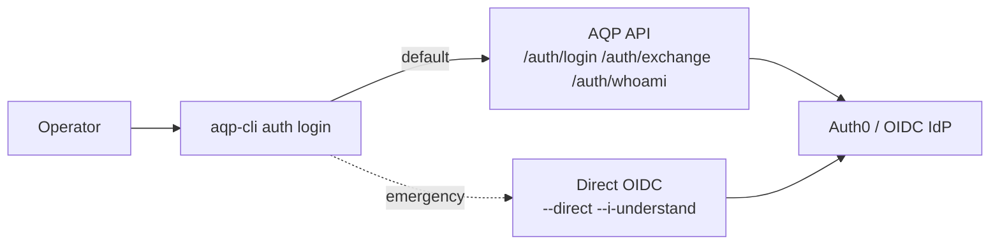

# aqp-cli operator guide

> Read [../README.md](../README.md) for install. This page is the operator runbook.

## Command map

```
aqp-cli setup     init | verify | render-config
aqp-cli services  list | status <service>
aqp-cli update    check | apply [--dry-run]
aqp-cli auth      login | whoami | providers | refresh | logout
aqp-cli account   profile | update | change-password | delete | audit | sessions * | mfa * | connections *
aqp-cli config    get | set | show | diff | clear
aqp-cli cp        deployments * | workloads * | cluster * | terraform * | cloudflare * | topology *
aqp-cli deploy    plan | apply | up | down | refresh | status | logs | endpoints | build | publish-rpi
aqp-cli viz       config | datasets | sync | export | import | render | cache-clear | datahub
aqp-cli client    start | stop | status | logs | build | typecheck
aqp-cli ide       start | stop | status | logs | build
aqp-cli tools     bots ... | control-plane ... | admin-api ... | helpers *
```

## Where state lives

| File / dir | Purpose |
| --- | --- |
| `~/.config/aqp/credentials/auth-session.json` | Cached access/refresh/id tokens for CLI auth sessions. |
| `~/.config/aqp/state/client-process.json` | Local Vite client background process metadata. |
| `~/.config/aqp/state/ide-process.json` | Local Theia background process metadata. |
| `~/.config/aqp/state/*.log` | Background process logs (`client.log`, `ide.log`). |
| `~/.config/aqp/topology.json` | Cached topology snapshot (refreshed by `services list`). |

## Auth flows



## Hard contracts (mirrored from [../AGENTS.md](../AGENTS.md))

1. The CLI never imports `aqp.*` or `aqp_control_plane.*` source.
2. Identity flows go through [aqp_docs/identity.md](../../aqp_docs/identity.md) (`IdentityProvider`).
3. Credentials resolve through [aqp_docs/credentials.md](../../aqp_docs/credentials.md) (`CredentialResolver`).
4. Token output is redacted to a 4-char prefix; secrets are `<redacted>`.
5. Service URLs come from the topology service, not constants.
