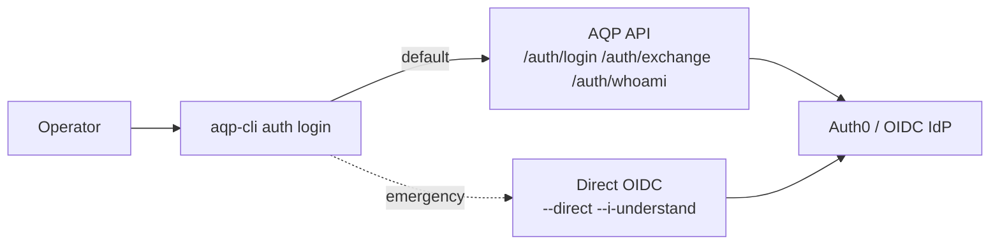

# aqp-cli operator guide

> Read [../README.md](../README.md) for install. This page is the operator runbook.

## Command map

```
aqp-cli setup     init | verify | render-config
aqp-cli services  list | status <service>
aqp-cli update    check | apply [--dry-run]
aqp-cli auth      login | whoami | providers | refresh | logout
aqp-cli account   profile | update | change-password | delete | audit | sessions * | mfa * | connections *
aqp-cli config    get | set | show | diff | clear
aqp-cli cp        deployments * | workloads * | cluster * | terraform * | cloudflare * | topology *
aqp-cli deploy    plan | apply | up | down | refresh | status | logs | endpoints | build | publish-rpi
aqp-cli viz       config | datasets | sync | export | import | render | cache-clear | datahub
aqp-cli client    start | stop | status | logs | build | typecheck
aqp-cli ide       install | build | start | stop | status | logs | open | url | env | detect | doctor
aqp-cli tools     bots ... | control-plane ... | admin-api ... | helpers *
```

## Where state lives

| File / dir | Purpose |
| --- | --- |
| `~/.config/aqp/credentials/auth-session.json` | Cached access/refresh/id tokens for CLI auth sessions. |
| `~/.config/aqp/state/client-process.json` | Local Vite client background process metadata. |
| `~/.config/aqp/state/ide-process.json` | Local Theia background process metadata. |
| `~/.config/aqp/state/*.log` | Background process logs (`client.log`, `ide.log`). |
| `~/.config/aqp/topology.json` | Cached topology snapshot (refreshed by `services list`). |

## Auth flows



## Hard contracts (mirrored from [../AGENTS.md](../AGENTS.md))

1. The CLI never imports `aqp.*` or `aqp_control_plane.*` source.
2. Identity flows go through [aqp_docs/identity.md](../../aqp_docs/identity.md) (`IdentityProvider`).
3. Credentials resolve through [aqp_docs/credentials.md](../../aqp_docs/credentials.md) (`CredentialResolver`).
4. Token output is redacted to a 4-char prefix; secrets are `<redacted>`.
5. Service URLs come from the topology service, not constants.

## AQP IDE — the canonical entrypoint

`aqp-cli ide` is the **only sanctioned way** to start, stop, inspect, and
update the AQP Theia IDE. The Theia browser app is never launched directly
with `yarn` outside of inner-loop development; production use goes through
the CLI so logs, ports, tenancy, and Auth0 state stay consistent.

| Subcommand | What it does | Backing routes / commands |
| --- | --- | --- |
| `install` | `yarn install` in `aqp_ide/`; `--frozen-lockfile` for CI | local yarn |
| `build [--dev/--prod]` | `yarn build:extensions` then `build:applications[:dev]` | local yarn |
| `start [--background/--foreground] [--port N] [--workspace P] [--open]` | spawns Theia; persists pid/port to `ide-process.json` | local yarn |
| `stop` | kills the backgrounded Theia | `taskkill` (Windows) / `SIGTERM` |
| `status` | running pid, log path, configured port, URL | local |
| `logs [--lines N]` | tails `ide.log` | local |
| `open [--no-browser]` | opens the IDE URL in the default browser | `webbrowser.open` |
| `url [--remote]` | prints local URL OR (`--remote`) the cluster URL via topology | `/manage/topology/services` |
| `env [--write PATH]` | renders the recommended `AQP_THEIA_*` env block | `/manage/topology/services` (best-effort) |
| `detect` | surfaces every reachable Theia (local + cluster) | local probe + `/manage/topology/services` |
| `doctor` | preflight checks (yarn, port free, lockfile, auth token, running pid) | local + keyring |

First-run sequence:

```bash
aqp-cli auth login --device
aqp-cli ide install
aqp-cli ide build --dev
aqp-cli ide start --open
# When done:
aqp-cli ide stop
```

The full IDE deep-dive lives at [../../aqp_ide/docs/cli-entrypoint.md](../../aqp_ide/docs/cli-entrypoint.md)
and [../../aqp_docs/aqp-ide.md](../../aqp_docs/aqp-ide.md).
