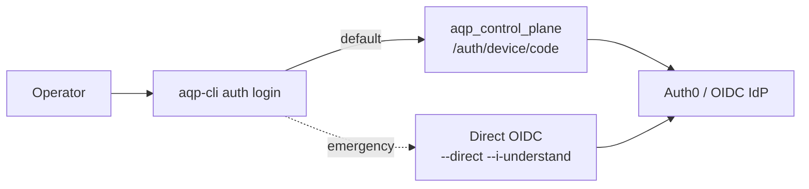

# aqp-cli operator guide

> Read [../README.md](../README.md) for install. This page is the operator runbook.

## Command map

```
aqp-cli setup     init | verify | render-config
aqp-cli services  list | status <service>
aqp-cli update    check | apply [--dry-run]
aqp-cli auth      login [--direct --i-understand] | whoami | logout
```

## Where state lives

| File / dir | Purpose |
| --- | --- |
| `~/.config/aqp/cli.toml` | Persistent CLI config (overridden by env / flags). |
| `~/.config/aqp/credentials/` | On-disk tokens via the [CredentialResolver](../../aqp_docs/credentials.md) chain. |
| `~/.config/aqp/topology.json` | Cached topology snapshot (refreshed by `services list`). |

## Auth flows



## Hard contracts (mirrored from [../AGENTS.md](../AGENTS.md))

1. The CLI never imports `aqp.*` or `aqp_control_plane.*` source.
2. Identity flows go through [aqp_docs/identity.md](../../aqp_docs/identity.md) (`IdentityProvider`).
3. Credentials resolve through [aqp_docs/credentials.md](../../aqp_docs/credentials.md) (`CredentialResolver`).
4. Token output is redacted to a 4-char prefix; secrets are `<redacted>`.
5. Service URLs come from the topology service, not constants.
