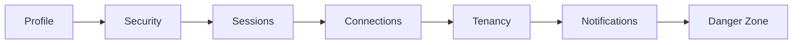

# Account management

## 1) Overview

The `/auth/profile` surface is the end-user account center for identity, security, session control, connected providers, and tenancy membership management. It keeps sensitive account operations in one place while delegating authentication authority to Auth0.

## 2) Profile tab

The Profile tab shows display name, avatar, and provider badge. Email is read-only because the canonical identity record is managed by Auth0.

## 3) Security tab

The Security tab includes:

- `PasswordChangeCard`: creates an Auth0 password-change ticket URL and redirects the user through the hosted reset flow.
- `MfaFactorsCard`: lists and manages MFA enrollment for TOTP, SMS, and WebAuthn factors.
- `RecentActivityCard`: displays the last 10 security-relevant audit events.

## 4) Sessions tab

The Sessions tab lists active sessions with browser, device, IP, approximate location, and last activity. Users can revoke individual sessions, or run a global "Sign out everywhere" action with friction confirmation.

## 5) Connections tab

The Connections tab supports linking and unlinking identity providers such as Microsoft, Google, Auth0 Database, and GitHub.

## 6) Tenancy tab

The Tenancy tab shows memberships, supports org/workspace switching, and exposes a user-level "Leave organization" action. Admin onboarding and tenancy administration are handled in separate admin routes.

## 7) Notifications tab

Notifications is a placeholder in v1 and reserved for a future v2 notification preferences model.

## 8) Danger Zone

Danger Zone contains permanent account-deletion actions gated by `<ConfirmFrictionDialog>` typed-email confirmation.

## What an admin can additionally do

Admins can use:

- [`/admin/onboarding`](/admin/onboarding) for onboarding flows including `EntraTenantLinkWizard`.
- [`/admin/users`](/admin/users) for user administration.

## What happens on the backend

Key backend modules:

- Auth0 Management API client: [`aqp/auth/management_api.py`](../aqp/auth/management_api.py)
- `/me/*` route module: [`aqp/api/routes/me.py`](../aqp/api/routes/me.py)
- Invite lifecycle routes: [`aqp/api/routes/invites.py`](../aqp/api/routes/invites.py)
- Audit emit helper: [`aqp/auth/audit.py`](../aqp/auth/audit.py)
