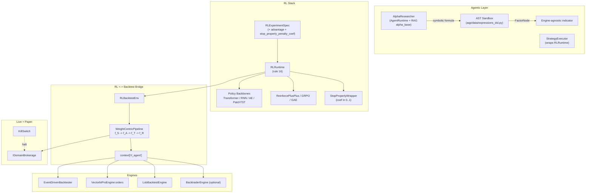

# Hybrid agentic-RL + backtest

> AQP's port of the FinRL-X "deployment-consistent" blueprint plus the
> NVIDIA-NeMo/RL advantage primitives — wired into AQP's existing
> spec-driven runtimes (rule 16).

## What changed

The Phase 1-9 rollout closes the "backtest-to-paper-trading gap" by
making the **target portfolio weight vector** the single immutable
interface between an RL policy and any execution mechanism
(offline backtest engine OR live broker). The same `w_t` flows
through:

- the offline simulation (via the new
  [`RLBacktestEnv`](../aqp/rl/envs/rl_backtest_env.py))
- the live paper / live execution
  (via [`WeightToOrders`](../aqp/rl/execution/weight_to_orders.py))
- the AST-sandboxed alpha factor authoring loop
  (via [`AlphaResearcher`](../aqp/agents/quant/alpha_researcher.py))



## Quick reference

| Concept | One-liner | File |
| --- | --- | --- |
| `WeightCentricPipeline` | FinRL-X `f_S -> f_A -> f_T -> f_R` composable pipeline | [aqp/rl/portfolio/pipeline.py](../aqp/rl/portfolio/pipeline.py) |
| `RLBacktestEnv` | `BaseRLEnv + gym.Env` wrapping any registered `BaseBacktestEngine` | [aqp/rl/envs/rl_backtest_env.py](../aqp/rl/envs/rl_backtest_env.py) |
| `RLAgentBridge` | Channel exposed via `context['rl_agent']` on every engine flipping `supports_rl_injection=True` | [aqp/rl/bridges/agent_bridge.py](../aqp/rl/bridges/agent_bridge.py) |
| `ReinforcePlusPlusAdvantage` | Leave-one-out cohort baseline + decoupled global normalisation (NeMo-RL port) | [aqp/rl/advantage/reinforce_plus_plus.py](../aqp/rl/advantage/reinforce_plus_plus.py) |
| `GRPOAdvantage` | Group-relative no-critic advantage (DeepSeek R1 / NeMo-RL parity) | [aqp/rl/advantage/grpo.py](../aqp/rl/advantage/grpo.py) |
| `StopProperlyWrapper` | Scales reward of truncated episodes by `coef in [0, 1]` (NeMo-RL `stop_properly_penalty_coef`) | [aqp/rl/rewards/stop_properly.py](../aqp/rl/rewards/stop_properly.py) |
| Truncating terminations | `DrawdownTermination` / `MarginCallTermination` / `RiskBreachTermination` carry `truncates_episode=True` | [aqp/rl/terminations/](../aqp/rl/terminations/) |
| `WeightToOrders` | Kill-switch-gated translator from target weights to `DomainOrder` | [aqp/rl/execution/weight_to_orders.py](../aqp/rl/execution/weight_to_orders.py) |
| `RedisFeatureStore` | Flink → Redis `IFeatureStore` for live RL observation | [aqp/streaming/feature_store/redis_store.py](../aqp/streaming/feature_store/redis_store.py) |
| `AlphaVantageIngester` | REST-poll Alpha Vantage and publish to Kafka | [aqp/streaming/ingesters/alphavantage.py](../aqp/streaming/ingesters/alphavantage.py) |
| `DeterministicMedallionReplay` | Read-only RL data pipeline pinned to silver/gold Iceberg snapshots | [aqp/rl/data_pipelines/medallion_replay.py](../aqp/rl/data_pipelines/medallion_replay.py) |
| `data.alphas.*` / `data.backtests.*` / `data.rl.*` / `data.brokers.*` | New DataMCPTools (rule 22) | [aqp/data/mcp/tools/](../aqp/data/mcp/tools/) |
| `alpha_factors` / `backtest_summaries` / `rl_trajectory_summaries` corpora | RAG "alpha base" (rule 11) | [aqp/rag/orders.py](../aqp/rag/orders.py) |
| `RLTradingBot` | Bot subtype driven by `RLRuntime` (rule 14) | [aqp/bots/rl_trading_bot.py](../aqp/bots/rl_trading_bot.py) |

## Spec extension

```yaml
training:
  total_timesteps: 200000
  log_interval: 10
  advantage:
    class: ReinforcePlusPlusAdvantage
    module_path: aqp.rl.advantage.reinforce_plus_plus
    kwargs:
      minus_baseline: true
      global_normalization: true
      leave_one_out: true
  stop_properly_penalty_coef: 0.2
```

## Companion docs

- [aqp_docs/weight-centric-pipeline.md](weight-centric-pipeline.md) —
  Deep dive on `f_S/f_A/f_T/f_R` semantics.
- [aqp_docs/rl-policy-backbones.md](rl-policy-backbones.md) —
  Transformer / RNN / Autoencoder / PatchTST backbones.
- [aqp_docs/alpha-researcher-agent.md](alpha-researcher-agent.md) —
  Symbolic alpha DSL + AlphaResearcher driver.

## Source-of-truth citations

- NeMo-RL `stop_properly_penalty_coef` scaling (commit
  `20d46a7d1bd987df1c89b3c5a81dc945c3d201e4`,
  `nemo_rl/algorithms/reward_functions.py`).
- NeMo-RL leave-one-out group baseline + decoupled global
  normalisation (`nemo_rl/algorithms/utils.py`
  `calculate_baseline_and_std_per_prompt` +
  `masked_mean(..., global_normalization_factor=...)`).
- Backtrader `cheat_on_open` / `next_open` / `order_target_percent`
  semantics (`backtrader/strategy.py`).
