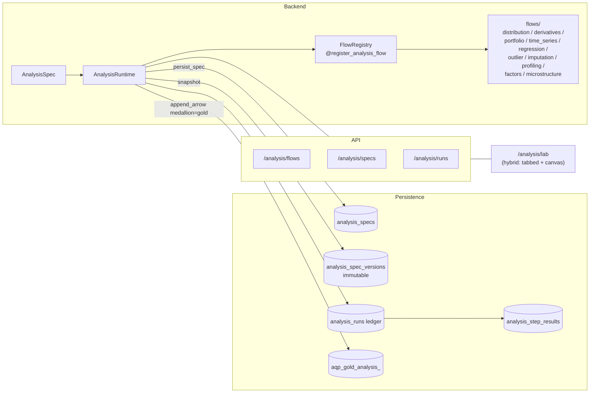

# Analysis Framework

> Doc map: [aqp_docs/index.md](index.md) · Lab guide: [aqp_docs/analysis-lab.md](analysis-lab.md) · Flow reference: [aqp_docs/analysis-flows.md](analysis-flows.md).

The analysis layer is AQP's hash-locked, runtime-driven umbrella for
every "explore a dataset" workflow — distribution audits, time-series
diagnostics, derivatives pricing, portfolio optimisation, regression
diagnostics, outlier / imputation work, and Alphalens-style factor
evaluation. It is the **statistical / quantitative-analysis** counterpart
of the **agentic-interpretation** layer in
[aqp_docs/analysis-agents.md](analysis-agents.md). The two namespaces are
deliberately distinct.

## Why a new umbrella

Most primitives existed already (`aqp.ml.flows`, `aqp.data.factors`,
`aqp.data.realised_volatility`, `aqp.data.microstructure`,
`aqp.options.normal_model`, `aqp.data.profiling.profiler`) but had no
single contract for:

- registering a flow with a JSON-schema-driven param model;
- composing multiple flows into a reproducible pipeline;
- snapshotting the spec into an immutable, hash-locked version row;
- writing every step's gold-tier output to Iceberg
  (`aqp_gold_analysis_<namespace>`) under medallion validation;
- emitting the same progress payload shape Celery + WebSocket
  consumers already understand.

The umbrella plugs every primitive into one canvas + one ledger.

## Layout

```
aqp/analysis/
    base.py        — FlowParams / FlowResult / FlowDescriptor / FlowContext
    spec.py        — AnalysisSpec / AnalysisStep / FlowRef / DatasetRef
    registry.py    — @register_analysis_flow + persist_spec + add_spec
    runtime.py     — AnalysisRuntime (sole sanctioned executor)
    pricing.py     — closed-form + MC math primitives (BSM, Greeks, GBM, SABR)
    flows/
        profiling.py / distribution.py / outlier.py / imputation.py /
        regression.py / time_series.py / derivatives.py / portfolio.py /
        factors.py / microstructure.py
```



## AnalysisSpec contract

Every spec is a Pydantic model that hashes its canonical JSON form
(SHA-256, sorted keys, no whitespace). Two specs with identical fields
collapse to one `analysis_spec_versions` row; any edit creates a new
version automatically.

```yaml
name: spy-distribution-audit
slug: spy-distribution-audit
kind: research
description: Distribution + GARCH + outlier audit for SPY daily bars.

dataset:
  iceberg_identifier: aqp_silver_alpha_vantage.equities_daily
  filters:
    vt_symbol: SPY.NYSE
  limit: 5000

steps:
  - alias: profile
    flow_ref:
      flow: profiling.describe
      params: {}
  - alias: returns_dist
    flow_ref:
      flow: distribution.descriptive_stats
      params: { column: log_return }
  - alias: shapiro
    flow_ref:
      flow: distribution.shapiro_wilk
      params: { column: log_return }
  - alias: garch
    flow_ref:
      flow: time_series.garch
      params: { column: log_return, p: 1, q: 1, horizon: 10 }

medallion_layer: gold
business_metadata:
  data_owner: research-team
  semantic_definition: "SPY daily distribution + volatility audit"
  domain: research.distribution_audit
  sla_class: tier-3-eod
```

## Hard rules

These hold across every analysis flow / spec / run. Any PR that
violates one will be sent back.

1. **Every analysis run goes through `AnalysisRuntime`.** REST + Celery
   tasks (`aqp.tasks.analysis_flow_tasks`) wrap it; flow code never
   writes to Iceberg / Postgres directly.
2. **`analysis_spec_versions` rows are immutable.** Re-snapshotting via
   `aqp.analysis.registry.persist_spec` creates a new version row when
   the SHA-256 hash changes — never update an existing row in place.
3. **Every per-step Iceberg write uses `iceberg_catalog.append_arrow`
   with `medallion_layer="gold"` and a `BusinessMetadata` block.** The
   default namespace is `aqp_gold_analysis_<flow.namespace>`; flows can
   override via `output_namespace=` on `register_analysis_flow`.
4. **Flows never call `litellm.completion` / `OllamaClient` directly.**
   v1 ships zero LLM-routed flows by design — interpretation is owned
   by the analysis-AGENTS stack ([aqp_docs/analysis-agents.md](analysis-agents.md)).
5. **Optional dependencies are guarded.** Flows that need `cvxpy`,
   `pyod`, `pywavelets`, `cupy`, etc. raise a friendly `RuntimeError`
   with the install hint when the import fails.
6. **No new diagram formats.** Mermaid only.

## REST surface

| Method | Path | Purpose |
|---|---|---|
| `GET`  | `/analysis/flows` | List flows + JSON-schema-derived param forms |
| `GET`  | `/analysis/flows/{flow}` | Single flow detail |
| `POST` | `/analysis/flows/{flow}/preview` | Sync preview against an inline payload |
| `POST` | `/analysis/flows/{flow}/preview-task` | Async preview via Celery (`agents` queue) |
| `GET`  | `/analysis/specs` | List saved specs |
| `POST` | `/analysis/specs` | Persist a new spec (idempotent on hash) |
| `GET`  | `/analysis/specs/{slug}` | Current spec + version history |
| `POST` | `/analysis/specs/{slug}/run` | Kick `AnalysisRuntime.run` via Celery |
| `GET`  | `/analysis/runs` | Paged ledger of runs |
| `GET`  | `/analysis/runs/{id}` | Run detail with joined step results |
| `GET`  | `/analysis/runs/{id}/results/{step}` | DuckDB-driven preview of one step's gold-tier output |
| `GET`  | `/analysis/datasets/columns?identifier=ns.name` | Column / dtype list for the lab forms |

## Persistence schema

Migration `0031_analysis_layer` adds four project-scoped tables:

| Table | Purpose |
|---|---|
| `analysis_specs` | Logical row (latest active version per slug) |
| `analysis_spec_versions` | Immutable hash-locked snapshot |
| `analysis_runs` | One row per `AnalysisRuntime.run()` invocation |
| `analysis_step_results` | One row per `AnalysisStep` in the spec |

`AnalysisRun.iceberg_result_table` is set when a step persists arrow
data; `AnalysisStepResult.artifact_uri` records the per-step
`namespace.name` so the lab can fetch the gold-tier output via DuckDB.

## Adding a new flow

1. Subclass `FlowParams` for the per-flow parameter shape.
2. Decorate a `(df, params, ctx) -> FlowResult` function with
   `@register_analysis_flow(name, namespace, label, ...)`.
3. (optional) Stash a `pyarrow.Table` on `result.arrow_table` to persist
   it under `aqp_gold_analysis_<namespace>` when run inside a spec.
4. Add a smoke test under `tests/analysis/`.
5. Update the relevant tab in [aqp_docs/analysis-flows.md](analysis-flows.md).

## Don't list

- Don't bypass `AnalysisRuntime` for spec execution — every progress /
  ledger / Iceberg / step-result side-effect is wired through it.
- Don't write to a non-`aqp_gold_analysis_*` namespace from a flow.
- Don't duplicate logic that already lives in
  `aqp.data.factors` / `aqp.data.microstructure` / `aqp.options.normal_model`
  — wrap them as a flow and keep the math in one place.
- Don't add diagrams in non-Mermaid formats.
- Don't put LLM-driven interpretation in a flow; that lives in
  `aqp.agents.analysis.*`.
