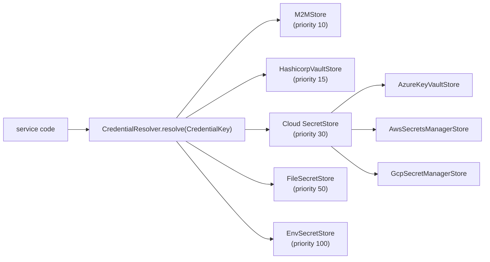

# Cloud credentials

How AQP routes secret resolution through `CredentialResolver` once the
cloud `SecretStore` siblings are wired. Phase C of the Phase 7
rollout (Terraform IaC + multi-cloud).

## Resolver chain



Lower priority numbers resolve first. The cloud store is added to the
default chain only when `AQP_DEFAULT_CLOUD_PROVIDER` matches and the
matching SDK is installed (see
[`aqp/credentials/resolver.py::_build_default_resolver`](../aqp/credentials/resolver.py)).

## Naming conventions

| Store              | Key format                                                    | Notes                                                                  |
| ------------------ | ------------------------------------------------------------- | ---------------------------------------------------------------------- |
| Env                | `<SERVICE>_<PURPOSE>` (uppercase, `:` → `_`)                 | Always-on safety net.                                                  |
| File               | `bootstrap_state_dir/<service>-<purpose>.json`                | Bootstrap workflows write these (Polaris principal, etc).              |
| Azure Key Vault    | `aqp-<service>-<purpose>` (alphanumerics + `-` only)          | Vault names disallow `:` / `/` / `_`.                                  |
| AWS Secrets Mgr    | `{prefix}<service>/<purpose>` (default prefix `aqp/`)         | Slashes are first-class path separators.                               |
| GCP Secret Mgr     | `projects/{project}/secrets/{prefix}<service>-<purpose>`      | Names allow `[A-Za-z0-9_-]` only — joins use `-`.                      |
| Vault KV v2        | `<mount>/data/<service>/<purpose>`                            | `hvac.Client.secrets.kv.v2.read_secret_version` adds `/data/` automatically. |

The cloud secret values are parsed as JSON first; when parsing fails
they're exposed via the canonical `credential` field.

## Example secret layouts

### Azure Key Vault — `aqp-msal-clientsecret`

```json
{
  "client_secret": "rxq8Q..."
}
```

### AWS Secrets Manager — `aqp/broker/api_key`

```
sk_live_abcdef1234567890
```

Plain string payload — exposed via `credential.get("credential")`.

### GCP Secret Manager — `aqp-postgres-password`

```json
{
  "password": "...",
  "username": "aqp"
}
```

### HashiCorp Vault KV v2 — `secret/data/aqp/redis/password`

```json
{
  "password": "..."
}
```

## Wiring a SecretStore

Pick a cloud + install the matching extra:

```bash
pip install 'agentic-quant-platform[cloud-azure]'   # AzureKeyVaultStore
pip install 'agentic-quant-platform[cloud-aws]'     # AwsSecretsManagerStore
pip install 'agentic-quant-platform[cloud-gcp]'     # GcpSecretManagerStore
pip install 'agentic-quant-platform[vault]'         # HashicorpVaultStore
```

Configure (matching cloud picked via `AQP_DEFAULT_CLOUD_PROVIDER`):

```
# Azure
AQP_DEFAULT_CLOUD_PROVIDER=azure
AQP_AZURE_TENANT_ID=...
AQP_AZURE_SUBSCRIPTION_ID=...
AQP_AZURE_KEYVAULT_URL=https://aqp-vault.vault.azure.net/

# AWS
AQP_DEFAULT_CLOUD_PROVIDER=aws
AQP_AWS_REGION=us-east-1
AQP_AWS_ACCOUNT_ID=123456789012
AQP_AWS_SECRETSMANAGER_PREFIX=aqp/

# GCP
AQP_DEFAULT_CLOUD_PROVIDER=gcp
AQP_GCP_PROJECT_ID=aqp-prod
AQP_GCP_REGION=us-central1
AQP_GCP_SECRET_PREFIX=aqp-

# Vault (any cloud)
AQP_VAULT_ADDR=https://vault.example.com
AQP_VAULT_NAMESPACE=...
AQP_VAULT_MOUNT=secret
AQP_VAULT_ROLE_ID=...
AQP_VAULT_SECRET_ID=...
```

The resolver auto-adds the matching cloud store + Vault store when
the env vars are present. Code that needs a credential does:

```python
from aqp.credentials import get_resolver
from aqp.credentials.protocol import CredentialKey

resolver = get_resolver()
cred = resolver.resolve(CredentialKey(service="msal", purpose="client_secret"))
secret = cred.require("client_secret")
```

## Authentication backends per cloud store

| Store                  | Identity source                                                  |
| ---------------------- | ---------------------------------------------------------------- |
| Azure Key Vault        | `DefaultAzureCredential` (az login / SP env / Workload Identity) |
| AWS Secrets Manager    | boto3 default chain (env / shared credentials / IRSA / EC2 role) |
| GCP Secret Manager     | `google.auth.default()` (gcloud ADC / SA file / Workload Identity)|
| HashiCorp Vault        | AppRole (preferred) or whatever the operator pre-configured     |

For cluster-side workloads the **Workload Identity** variants are the
canonical path:

- AKS — `AzureAksAdapter` + Azure Workload Identity (Service Account
  annotation `azure.workload.identity/client-id: <managed-identity>`).
- EKS — `AwsEksAdapter` + IRSA (`eks.amazonaws.com/role-arn`
  annotation).
- GKE — `GcpGkeAdapter` + GKE Workload Identity
  (`iam.gke.io/gcp-service-account` annotation).

## External Secrets Operator integration

The Terraform `secrets` module wires an
[`external-secrets`](https://external-secrets.io) `ClusterSecretStore`
pointing at whichever backend matches `vault_backend`. The
`secret_mappings` locals block emits one `ExternalSecret` per
`(k8s_secret_name, vault_path)` pair so AQP pods consume secrets via
mounted Secrets — never raw env vars.

See [`aqp_platform/terraform/modules/secrets/main.tf`](../aqp_platform/terraform/modules/secrets/main.tf)
for the full mapping table.
