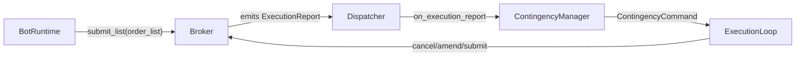

# Contingency graphs (OCO / OUO / OTO)

> Status: **Phase 2 shipped** (Alembic 0041). Manager:
> [`aqp/trading/execution/contingency.py`](../aqp/trading/execution/contingency.py).

## The three relationships

| Type | Behaviour |
| --- | --- |
| **OCO** (one cancels other) | When any constituent fills (partial or full), the others are canceled. Canonical use: bracket a position with a take-profit limit + stop-loss stop. |
| **OUO** (one updates other) | When any constituent's quantity changes (partial fill or amend), every other constituent's quantity is updated to match the remaining size. Useful when the bracket has more than two legs. |
| **OTO** (one triggers other) | The parent is the trigger; children are emulated until the parent fills, then they're submitted. Canonical use: place an entry limit + parked TP/SL waiting for the entry to hit. |

## Class layout



## Manager behaviour

For each constituent, the manager tracks shadow ``remaining_quantity``
and ``status``:

* On fill (full or partial), OCO emits ``CANCEL`` for every peer.
* On partial fill, OUO emits ``UPDATE_QUANTITY`` for every peer with
  the new ``remaining_quantity``.
* On full fill, OUO emits ``CANCEL`` for every peer (degenerates to
  OCO).
* On parent fill, OTO emits ``SUBMIT`` for every child. Subsequent
  child fills don't re-trigger anything.

## Venue dispatch

Two routes:

1. **Native atomic submission** -- when the broker sets
   ``supports_oco = True``, the broker's
   :meth:`IDomainBrokerage.submit_list` submits the whole list in a
   single venue call (Alpaca bracket orders, IBKR OCA groups). The
   manager STILL registers the list so a partial-cancel still emits
   cleanup commands when the venue's atomicity is best-effort.

2. **Manager-simulated** -- when the broker sets
   ``supports_oco = False``, the broker submits each constituent
   independently and the manager owns the cross-order cancels via
   :meth:`ContingencyManager.on_execution_report`.

## Code example

```python
from decimal import Decimal
from aqp.core.domain.identifiers import (
    ClientOrderId, InstrumentId, OrderListId, Symbol2, Venue,
)
from aqp.core.domain.enums import ContingencyType, OrderSide, OrderType
from aqp.core.domain.orders import LimitOrder, StopMarketOrder, OrderList

# Take-profit at 200, stop-loss at 180 -- OCO bracket
tp = LimitOrder(
    client_order_id=ClientOrderId("tp-1"),
    instrument_id=InstrumentId(Symbol2("AAPL"), Venue("NASDAQ")),
    order_side=OrderSide.SELL,
    quantity=Decimal("10"),
    order_type=OrderType.LIMIT,
    price=Decimal("200"),
)
sl = StopMarketOrder(
    client_order_id=ClientOrderId("sl-1"),
    instrument_id=InstrumentId(Symbol2("AAPL"), Venue("NASDAQ")),
    order_side=OrderSide.SELL,
    quantity=Decimal("10"),
    order_type=OrderType.STOP_MARKET,
    trigger_price=Decimal("180"),
)
order_list = OrderList(
    order_list_id=OrderListId("oco-1"),
    orders=[tp, sl],
    contingency_type=ContingencyType.OCO,
)
# Submit the entire list atomically (or simulated)
await broker.submit_list(order_list)
```

## Persistence

The Alembic ``0041`` migration adds:

* ``order_lists`` -- one row per :class:`OrderList`
* ``domain_orders.order_list_id`` FK -- ties constituents to parent
* ``execution_reports`` -- audit trail; the manager reads this to
  recover state after a restart

## Limitations

* OUO with three or more constituents updates ALL peers to the
  smallest remaining size. This matches the standard interpretation
  but may not be what every venue does -- check the venue's docs.
* OTO with multiple parents (a single child triggered by either of two
  parents) is NOT supported; that's a contingency-graph generalisation
  the manager can't currently express.
* Native broker OCO often comes with constraints (Alpaca brackets
  require the limit + stop to be on the same instrument; IBKR OCA
  groups allow cross-instrument). The contingency manager handles
  cross-instrument simulation.
