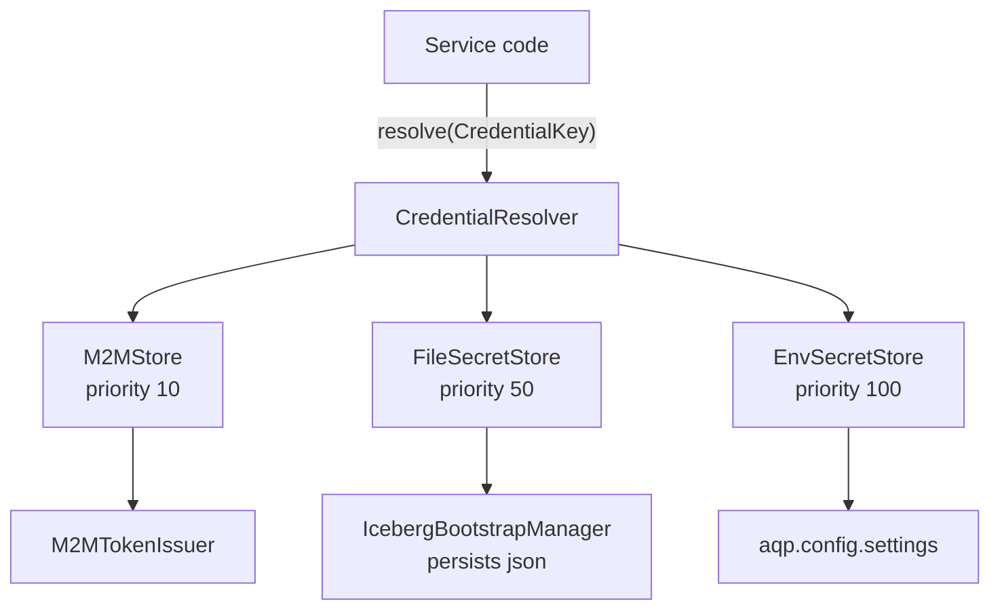

# Credentials resolver

AQP collapses every "where does this service's credential come from?"
question into a single :class:`aqp.credentials.CredentialResolver`.

The resolver walks an ordered chain of
:class:`aqp.credentials.SecretStore` instances and returns the first
non-empty hit, falling back to a caller-supplied default. The chain
order means a fresh M2M token wins over a bootstrap-minted file
payload, which wins over a static `settings` seed.

## Why

The motivating bug: `iceberg_bootstrap` mints a runtime principal
(`aqp_runtime`) and persists it to
`data/bootstrap/polaris-principal.json`, but `polaris_client` and
`iceberg_catalog._build_properties` historically read
`settings.polaris_client_*` / `settings.iceberg_rest_credential` —
the static `root` / `s3cr3t` seed — so Polaris kept rejecting the
API container's writes with `CREATE_TABLE_DIRECT_WITH_WRITE_DELEGATION`
403s.

The resolver closes that loop without forking the credential paths.

## Architecture



The resolver is a process-wide singleton built lazily by
:func:`aqp.credentials.get_resolver`. The default chain is `Env` +
`File`; `M2M` plugs in front when
:func:`aqp.auth.m2m.install_m2m_store` runs (controlled by
`AQP_AUTH_M2M_ENABLED`).

## Usage

```python
from aqp.credentials import CredentialKey, get_resolver

cred = get_resolver().resolve(
    CredentialKey("polaris", "oauth"),
    default={"client_id": "root", "client_secret": "s3cr3t"},
)
client_id = cred.get("client_id")
client_secret = cred.get("client_secret")
```

`Credential.source` is `"file"` / `"env"` / `"m2m"` / `"default"`,
useful for diagnostics.

## Field maps

Per `(service, purpose)`, here is what consumers expect:

- `polaris:oauth` → `client_id`, `client_secret`, `principal`
- `polaris:rest` / `iceberg:rest` → `credential` (`<id>:<secret>`),
  `token`, `oauth2_server_uri`, `scope`
- `trino:basic` → `user`, `source`, optional `token` / `access_token`
- `minio:static` → `access_key`, `secret_key`, `endpoint_url`, `region`
- `minio:sts` → `session_token` (M2M-issued)
- `neo4j:basic` → `user`, `password`, `uri`

Add new entries to
[aqp/credentials/stores/env_store.py](../aqp/credentials/stores/env_store.py)
when you wire a new service to the resolver.

## Bootstrap → resolver

Bootstrap workflows call
:func:`aqp.services.iceberg_bootstrap.persist_principal_credentials`
(and similar) to write JSON under `settings.bootstrap_state_dir`.
`FileSecretStore` reads those files; the bootstrap also resets any
caches that depend on the credentials (e.g.
`iceberg_catalog.reset_catalog_cache()`).

When you add a new bootstrap step:

1. Add the file name to
   [`aqp/credentials/stores/file_store.py::_FILE_MAP`](../aqp/credentials/stores/file_store.py).
2. Persist a JSON payload with at least `client_id` / `client_secret`.
3. Reset any consumer caches in your bootstrap writer.

## Diagnostics

`get_resolver().describe()` returns the active store chain and
priorities — wire it into a debug endpoint when you need to inspect
the resolution order from outside the process.

## Testing

`tests/credentials/` contains the canonical test patterns:

- Test the resolver chain priority order with `pytest`.
- Test new env store branches with a `_StubSettings` shim.
- Test new file store keys by writing the JSON to a `tmp_path`.

The `reset_resolver` fixture re-builds the singleton between tests so
you don't have to track down stale state.
