# Cross-market arbitrage

> Status: **Phase 5 shipped**. Combined deliverable across Phase 1
> (InstrumentADR / InstrumentGDR), Phase 4
> ([`aqp/math/arbitrage.py`](../aqp/math/arbitrage.py)), and Phase 5
> (DataMCP tools + strategy templates).

## Two flavours

The platform ships two cross-market arbitrage paths:

### A/H share -- mainland China <-> Hong Kong

The Chinese company has dual-listed shares: A-shares in CNY on the
SSE / SZSE, H-shares in HKD on HKEX. Same legal entity, same
economic rights, different regulatory regime + liquidity + currency.
The basis mean-reverts toward zero but periodically violently
diverges (Stock Connect inflow / outflow, regulatory news, FX
volatility).

Math: [`ah_share_basis()`](../aqp/math/arbitrage.py) in
:mod:`aqp.math.arbitrage`. Computes the FX-adjusted implied H-share
price from the A-share, subtracts the observed H-share price, and
classifies the arbitrage direction.

Agent surface: ``data.arbitrage.ah_share_basis`` (single-point) and
the ``arbitrage.ah_share_basis`` AnalysisFlow (time series).

### ADR <-> underlying foreign equity

A foreign company creates an American Depositary Receipt to list
on a US venue. 1 ADR represents ``conversion_ratio`` shares of the
underlying. The basis (ADR USD price -- conversion-adjusted
underlying USD-equivalent) should be near zero plus the depository
fee; persistent divergence is the arbitrage.

Math: [`adr_basis()`](../aqp/math/arbitrage.py) reads the
``conversion_ratio`` directly from the Phase 1
:class:`InstrumentADR` row (via the
``data.arbitrage.adr_underlying_basis`` MCP tool), then computes
the basis exactly as the A/H case.

Agent surface: ``data.arbitrage.adr_underlying_basis`` (single-point)
and the ``arbitrage.adr_basis`` AnalysisFlow (time series).

## Full pipeline (BABA example)

```mermaid
flowchart LR
    A[Agent query] -->|"what's BABA basis?"| ID[data.identity.resolve]
    ID -->|"instrument_id"| DR[data.instruments.depositary_receipts]
    DR -->|"conversion_ratio=8"| ADR[data.arbitrage.adr_underlying_basis]
    ADR -->|"basis_bps + direction"| Agent
    Agent -->|"if abs(basis) > threshold"| TM[Strategy template]
    TM -->|"adr_basis_arbitrage.yaml"| Bot[BotRuntime]
    Bot -->|"submit_list(oco)"| Broker
```

1. Agent resolves BABA ticker to its current instrument_id at the
   ``as_of`` timestamp.
2. The depositary-receipts tool returns the ADR's
   ``conversion_ratio`` (8) and the underlying's vt_symbol
   (``9988.HKEX``).
3. The arbitrage tool computes the basis given current prices + FX.
4. If the basis exceeds the cost-adjusted threshold, the agent
   instantiates the strategy template
   ``configs/strategy_templates/adr_basis_arbitrage.yaml`` (a
   :class:`Resource` row with ``resource_type='strategy_template'``).
5. The bot runtime submits a two-leg OCO order list (long ADR + short
   underlying, or vice versa) through the Phase 2 contingency manager.
6. Exit: the contingency manager auto-cancels the peer when one leg
   fills; the strategy emits an explicit close when the basis reverts.

## Common gotchas

* **FX volatility eats the alpha.** A/H share arbitrage is FX-
  unhedged unless the strategy template explicitly enables it
  (``fx_hedge_required: true`` in the YAML). For ADR basis trades,
  hedging the FX leg via a forward / futures position is almost
  always worth the cost.

* **Conversion ratio changes.** Depository banks announce conversion
  changes; the InstrumentADR row gets updated by the corporate-
  action pipeline. Strategies that hardcode the ratio break the
  moment that happens; use the MCP tool's auto-lookup instead.

* **Settlement asymmetry.** ADR settles T+1 in the US; the
  underlying may settle T+2 (Hong Kong) or T+1 (Tokyo). The MCP
  tool returns the basis as-of right now but a strategy executing
  on it has to plan for the settlement gap.

* **Stock Connect quotas.** Mainland-to-Hong Kong flow has daily
  quotas; an A-H basis trade may not be executable on a given day
  because the southbound (or northbound) capacity is exhausted.
  The strategy template enables a `quota_aware` check in
  Phase 5+.

## Strategy templates

Two templates ship pre-built (Phase 5, polymorphic Resources):

* [`configs/strategy_templates/ah_share_arbitrage.yaml`](../configs/strategy_templates/ah_share_arbitrage.yaml)
* [`configs/strategy_templates/adr_basis_arbitrage.yaml`](../configs/strategy_templates/adr_basis_arbitrage.yaml)

Cloning a template into a workspace emits a ``ResourceRelation`` row
with ``relation='translated_from'`` so the ownership graph audits
provenance (AGENTS rule 35). The cloned strategy is then editable
in the workspace; the original template is read-only and shared.
