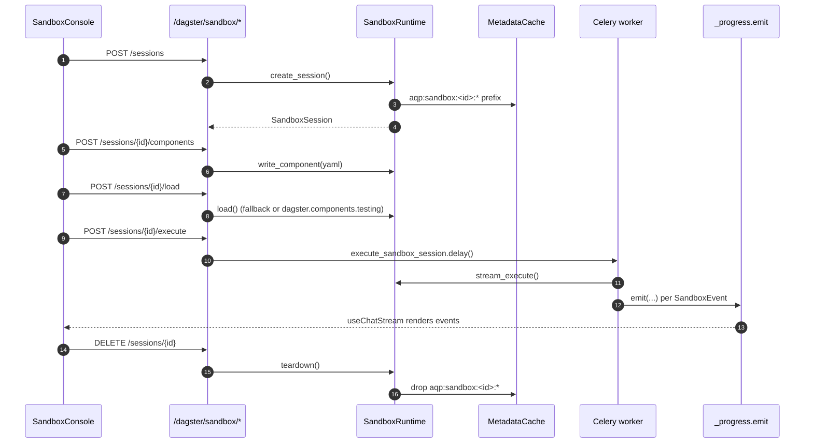

# Interactive Dagster sandbox

> Phase 3 of the self-service data fabric. The sandbox is an
> ephemeral, per-session Dagster definitions environment that loads
> a user-supplied component (or an Airbyte connection authored in
> the visual builder) and streams asset materialization events back
> to the UI **without** polluting production state.

The phase plan is
[`.cursor/plans/data-self-service-phase-3.plan.md`](../.cursor/plans/data-self-service-phase-3.plan.md).

## Architecture

## Isolation guarantees

- **Folder.** `tempfile.mkdtemp(prefix="aqp_sandbox_<session_id>_")`.
  Removed on teardown.
- **Redis namespace.** `aqp:sandbox:<session_id>:*` — never collides
  with `aqp:cache:*` (Phase 0) or `aqp:rag` / `aqp:` pubsub.
- **Environment.** A `ContextVar`-based
  [`SandboxEnvResolver`](../aqp/dagster/sandbox/env_resolver.py)
  swaps production endpoints (`iceberg_rest_uri`, `polaris_base_url`,
  `alpha_vantage_base_url`, `datahub_gms_url`, `kafka_bootstrap`) for
  safe / mocked alternatives during the session.
- **TTL.** Sessions auto-expire after 60 minutes. The
  `/dagster/sandbox/janitor` endpoint and a Celery beat job (future
  work) sweep expired sessions.

## REST surface

[`/dagster/sandbox/*`](../aqp/api/routes/dagster_sandbox.py):

| Method | Path | Purpose |
| --- | --- | --- |
| `POST` | `/dagster/sandbox/sessions` | Create a session. |
| `GET` | `/dagster/sandbox/sessions` | List active sessions. |
| `GET` | `/dagster/sandbox/sessions/{id}` | Session status. |
| `POST` | `/dagster/sandbox/sessions/{id}/components` | Write a component YAML to the sandbox folder. |
| `POST` | `/dagster/sandbox/sessions/{id}/airbyte` | Load an Airbyte connection (Phase 2 builder output) as a component. |
| `POST` | `/dagster/sandbox/sessions/{id}/load` | Parse + load components. Returns asset key tree. |
| `POST` | `/dagster/sandbox/sessions/{id}/execute` | Kick off Celery task; returns `TaskAccepted`. Streams events through `_progress.emit`. |
| `DELETE` | `/dagster/sandbox/sessions/{id}` | Tear down folder + Redis namespace + DB row. |
| `POST` | `/dagster/sandbox/janitor` | Drop expired sessions. |

## Frontend

[`/data/sandbox`](../aqp_client/src/routes/data/sandbox/page.tsx)
mounts the `SandboxConsole`:

- Three-pane layout (session, component editor, asset graph + log).
- Amber outline + `[SANDBOX]` tab title prefix mirroring the
  paper-mode guardrail.
- Airbyte connection selector uses
  `<EntityPicker kind="airbyte_connectors" />` so sandbox loads pull
  from the existing whitelist cache.

## Don't

- **Don't** let sandbox writes reach production Iceberg /
  Postgres. The env resolver swaps endpoints; if you add a new
  production endpoint, add it to
  `with_sandbox_overrides(...)`.
- **Don't** bypass the in-memory `SandboxRuntime` registry. The
  Postgres ledger is best-effort audit; the runtime is the
  authoritative state.
- **Don't** stream sandbox events through a custom transport. Use
  `_progress.emit` so the existing `useChatStream` consumes them
  with no further wiring.
- **Don't** persist secrets in `components_json`. Components are
  YAML descriptors; secrets stay in `CredentialResolver`.
