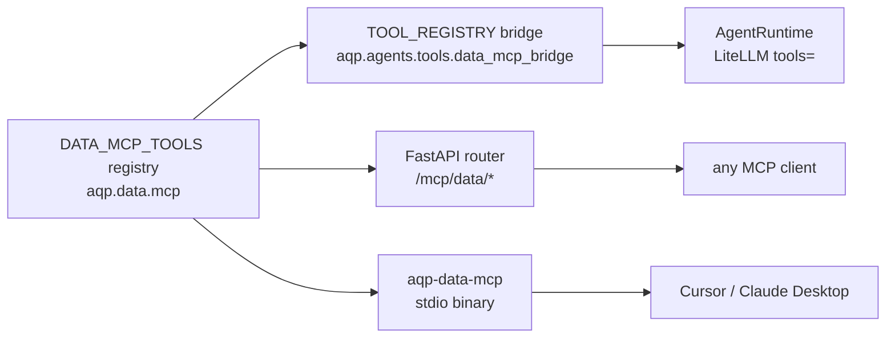

# DataMCP — Tool Catalog & Transports

> The canonical Model Context Protocol surface for the AQP data layer.
> One tool catalog, two transports — same source of truth for both
> AgentRuntime and external MCP clients.

## Why DataMCP?

Pre-DataMCP, AQP agents could in theory query Postgres directly,
import `aqp.data.iceberg_catalog` to read raw bytes, or call any
service module. That's a security anti-pattern (
[OWASP MCP Top 10 #10](https://owasp.org/www-project-mcp-top-10/2025/MCP10-2025%E2%80%93ContextInjection&OverSharing) ),
and a maintenance burden — every new dataset needed bespoke tool
glue.

DataMCP collapses both problems:

- **One catalog**: every read-or-write agents need is exposed as a
  registered `DataMCPTool` with a strict args schema, semantic
  description, and policy check.
- **Two transports**: AgentRuntime sees the same tools through the
  in-process bridge; external clients (Cursor, Claude Desktop, custom
  scripts) see them via the FastAPI HTTP server or the `aqp-data-mcp`
  stdio binary.
- **Sandboxed reads**: tools route through agent-views and tenancy
  policy checks. No agent can run a free-form `SELECT *` against
  Postgres.

## Architecture



## Tool catalog

Tools register at import time via `@register_data_mcp_tool`. They
are organised by domain under
[aqp/data/mcp/tools/](../aqp/data/mcp/tools/):

| Category | Tools |
| --- | --- |
| catalog | `data.catalog.browse`, `data.catalog.describe_dataset`, `data.catalog.profile_dataset`, `data.catalog.lineage` |
| entities | `data.entities.equity`, `.option_chain`, `.portfolio`, `.macro_series`, `.regulatory`, `.instrument_graph` |
| pipelines | `data.pipelines.list_manifests`, `.list_runs`, `.get_run`, `.run_manifest` (mutates) |
| sinks | `data.sinks.list`, `data.sinks.materialise` |
| sources | `data.sources.list`, `data.sources.get_wizard`, `data.sources.run_wizard` (mutates) |
| streaming | `data.streaming.kafka.list_topics`, `data.streaming.flink.list_jobs`, `data.streaming.producers.list` |
| iceberg | `data.iceberg.read_slice`, `data.iceberg.snapshot_history`, `data.iceberg.time_travel_read` |
| datahub | `data.datahub.lookup`, `data.datahub.sync` (mutates), `data.datahub.sync_log` |
| discovery | `data.discovery.browse`, `data.discovery.describe`, `data.discovery.promote` (mutates, data fabric phase 1) |
| orchestration | `data.orchestration.list_adapters`, `.list_runs`, `.get_run`, `.list_workflows`, `.fusion_inputs_for_run`, `.health` (Phase 3 + Phase 6 of the additive orchestration refactor) |
| automation | `data.automation.list_schedules`, `data.automation.get_schedule_status` (Phase 3) |

Browse the live catalog at `/data/hub` -> "DataMCP" tab, or
`GET /data-control/mcp/tools` for the JSON descriptor list.

The orchestration + automation tools are read-only and degrade
cleanly when the Phase 5 ``workflow_runs`` table hasn't been
provisioned yet (return empty list + ``table_present=False`` rather
than raising). See [workflow-studio.md](workflow-studio.md) for the
operator flow they back.

## Policy boundary

Every `DataMCPTool.invoke` runs:

1. **Args validation** against the Pydantic `args_schema`
2. **Policy check** (`policy_check(ctx)`) — by default enforces
   `required_scopes`, but tools can chain `enforce_tenancy`,
   `enforce_read_only_for_session`, `enforce_data_minimization`.
3. **Run** the tool body
4. **Lineage emit** through the `LineageWriter` observer
   (`transform_kind="mcp_tool"`)

Mutating tools (eg. `data.pipelines.run_manifest`) require
`data:write` in `granted_scopes`. Read tools default to `data:read`.

## Adding a tool

```python
from pydantic import BaseModel, Field
from aqp.data.mcp.base import DataMCPTool, MCPToolContext, MCPToolResult
from aqp.data.mcp.registry import register_data_mcp_tool


class MyToolInput(BaseModel):
    something: str = Field(..., description="...")


@register_data_mcp_tool
class MyTool(DataMCPTool):
    name = "data.mydomain.my_tool"
    description = "Short semantic description for the LLM router."
    args_schema = MyToolInput
    category = "mydomain"
    tags = ("mydomain", "read")
    required_scopes = ("data:read",)

    def run(self, *, ctx: MCPToolContext, something: str) -> MCPToolResult:
        ...
        return MCPToolResult(ok=True, data={...}, summary="...")
```

The bridge auto-installs the new alias into `TOOL_REGISTRY` on next
process boot. Add a test under `tests/data/mcp/`.

## Transports

### In-process bridge

`aqp.agents.tools.data_mcp_bridge.install_data_mcp_tools` wraps every
`DataMCPTool` as a CrewAI `BaseTool` and merges them into
`TOOL_REGISTRY`. AgentRuntime's existing OpenAI function-calling loop
then dispatches normally — no agent-side code changes.

### FastAPI HTTP transport

`aqp.data.mcp.server.build_mcp_router()` is mounted at `/mcp/data` in
[aqp/api/main.py](../aqp/api/main.py). Endpoints:

- `GET /mcp/data/tools` — list every tool descriptor
- `GET /mcp/data/tools/{name}` — describe one tool
- `POST /mcp/data/tools/{name}/invoke` — invoke

### stdio transport

`aqp-data-mcp` console script (registered in
[pyproject.toml](../pyproject.toml)) runs the stdio loop. Use this in
Cursor / Claude Desktop config:

```json
{
  "mcpServers": {
    "aqp-data": {
      "command": "aqp-data-mcp"
    }
  }
}
```

The stdio loop speaks JSON-line frames (`tools/list`,
`tools/describe`, `tools/invoke`, `ping`). When the official `mcp`
Python SDK is installed it's preferred; the line-based fallback works
for smoke tests and minimal containers.
