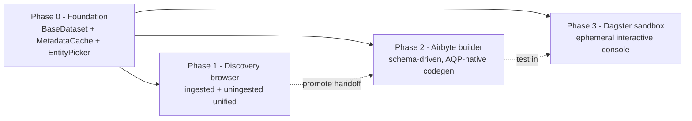

# Self-service data fabric (overview)

> Master narrative for the four-phase expansion that turned AQP's
> data layer into a self-service data-ops platform. Each phase
> ships its own detailed doc + Cursor rule + AGENTS.md hard rule.
> Use this page as the single entry point.

## Why we did this

A quant researcher should be able to discover a new alpha-relevant
dataset, register it, build an Airbyte connector for it, sandbox-test
it, and promote it into the production catalog without ever
touching free-text infrastructure-config inputs or pasting raw
secrets. AGENTS hard rules 29–32 codify the four pillars that make
that possible.

## Architecture at a glance

## Phases at a glance

| Phase | Surface | Key files | AGENTS rule | Doc |
| --- | --- | --- | --- | --- |
| 0 — Foundation | Kedro-style `BaseDataset`, Redis prefetch cache, `EntityPicker` | [`aqp/data/datasets/`](../aqp/data/datasets/), [`aqp/cache/`](../aqp/cache/), [`aqp_client/src/components/common/EntityPicker.tsx`](../aqp_client/src/components/common/EntityPicker.tsx), Alembic 0032 | 29 | [datasets-catalog.md](datasets-catalog.md), [metadata-cache.md](metadata-cache.md) |
| 1 — Discovery | Unified ingested + uningested catalog browser, CRUD, lifecycle classification, promote handoff | [`aqp/data/discovery/`](../aqp/data/discovery/), [`aqp/api/routes/discovery.py`](../aqp/api/routes/discovery.py), [`/data/discovery`](../aqp_client/src/routes/data/discovery/page.tsx) | 30 | [data-discovery.md](data-discovery.md) |
| 2 — Airbyte builder | Schema-driven low-code builder, AQP Fetcher codegen (no `AIRBYTE_ENABLE_UNSAFE_CODE`) | [`aqp/data/airbyte/builder/`](../aqp/data/airbyte/builder/), [`aqp/data/fetchers/userland/`](../aqp/data/fetchers/userland/), Alembic 0033 | 31 | [airbyte-builder.md](airbyte-builder.md) |
| 3 — Sandbox | Per-session ephemeral Dagster + Airbyte sandbox, isolated Redis, env override, streaming logs | [`aqp/dagster/sandbox/`](../aqp/dagster/sandbox/), [`/data/sandbox`](../aqp_client/src/routes/data/sandbox/page.tsx), Alembic 0034 | 32 | [dagster-sandbox.md](dagster-sandbox.md) |

## How the phases compose

1. **Phase 0** adds `dataset_kind`, `is_ingested`, `spec_hash`, and
   `external_spec_json` columns to `dataset_catalogs` (Alembic
   0032), wires the metadata prefetch worker into the FastAPI
   lifespan, and lands the `EntityPicker` component. From this
   phase forward, no new code may introduce a free-text input that
   names an existing entity.
2. **Phase 1** uses the new columns to expose pending / external
   entries side-by-side with ingested datasets at
   `/data/discovery`. Promote handoff emits
   `LineageEvent(transform_kind="discovery.promoted")` and deep-
   links into `/airbyte/builder?from=discovery&entry_id=…`.
3. **Phase 2** consumes that deep-link in
   [`ConnectorBuilderForm`](../aqp_client/src/components/airbyte/builder/ConnectorBuilderForm.tsx),
   pre-fills metadata + base URL, and produces either a low-code
   YAML manifest or an AQP-native Fetcher stub under
   `aqp/data/fetchers/userland/`. Credentials are picked through
   `<EntityPicker kind="credentials" />` — never typed as free
   text.
4. **Phase 3** loads the resulting connection (or any custom
   component) inside an ephemeral, per-session sandbox at
   `/data/sandbox`. Production endpoints are swapped via a
   `ContextVar` env resolver; the Redis namespace is locked to
   `aqp:sandbox:<session_id>:*`. Streaming events flow back through
   the existing `_progress.emit` frame contract — no new transport.

## Hard rules added

- **Rule 29** — every catalog entry is a typed `BaseDataset` spec;
  entity dropdowns read from `MetadataCache`.
- **Rule 30** — uningested entries flow through `DiscoveryService`;
  agents read via `data.discovery.*` MCP tools.
- **Rule 31** — no `AIRBYTE_ENABLE_UNSAFE_CODE`; custom Python lives
  under `aqp/data/fetchers/userland/`.
- **Rule 32** — sandbox sessions never touch the production Redis
  prefix or production endpoints; streaming uses the canonical
  progress frame.

## Where to start

- **Operator**: launch the API + frontend and visit `/data/discovery`.
- **Developer adding a feature**: pick the matching phase doc above,
  read the corresponding `.cursor/rules/*.mdc`, and follow the "Add a …"
  rows in [AGENTS.md](../AGENTS.md)'s "Where to look for X" section.
- **Agent**: the master plan + per-phase plan files live under
  [`.cursor/plans/`](../.cursor/plans/) and capture the
  file-by-file checklist for each phase's PR set.
