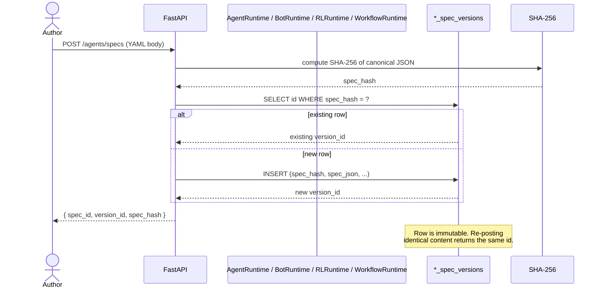
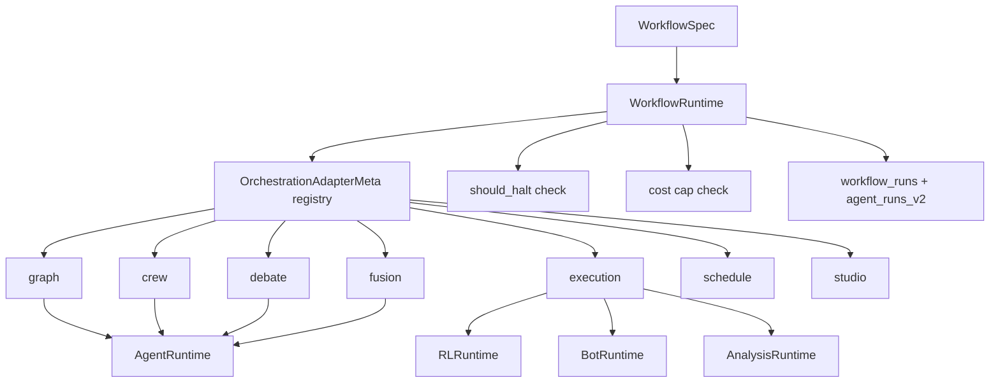

import RunnableCode from '@site/src/components/RunnableCode';

# Agentic pipeline

> Doc map: [intro](../../intro/index.md) ·
> Sequence diagrams: [flows](../platform/flows.md#3-agentic-crew-run) ·
> Spec-pattern primer: [agentic-development](./agentic-development.md) ·
> Multi-agent topologies: [multi-agent-patterns](./multi-agent-patterns.md) ·
> Orchestration adapters: [workflow-studio](./workflow-studio.md) ·
> Worked tutorial: [tutorials/first-agent-workflow](../../tutorials/first-agent-workflow.md).

This page walks through the AQP agentic-trading lifecycle: pick a
model, register a data source, snapshot the spec, dispatch through
the workflow runtime, and review the run. Every action has a REST +
CLI surface so you can script the same flow; every action also has
an `aqp_client` (Vite UI) route at `aqp.fund` so a human can drive
it.

The pipeline is **five stages**. The new stage since the prior
version of this doc is **Spec snapshot** — every spec-driven run
now hash-locks into an immutable `*_spec_versions` row before any
work happens.

```mermaid
flowchart LR
    subgraph llmStage [1. Models and providers]
        Pull["Ollama pull"]
        Vllm["vLLM profile up"]
        Sera["SERA-32B opt-in"]
        Defaults["router_complete defaults"]
    end
    subgraph dataStage [2. Data sources]
        Discovery["DiscoveryService"]
        Inspector["Parquet / Iceberg inspector"]
        AirbyteBuilder["Airbyte builder + userland Fetcher"]
        Sandbox["Dagster sandbox (ephemeral)"]
    end
    subgraph snapshotStage [3. Spec snapshot]
        AgentSpec["AgentSpec / BotSpec"]
        WfSpec["WorkflowSpec"]
        Hash["SHA-256 hash"]
        Versions["*_spec_versions row"]
    end
    subgraph dispatchStage [4. Workflow dispatch]
        WfRuntime["WorkflowRuntime"]
        AgentRt["AgentRuntime"]
        BotRt["BotRuntime"]
        RlRt["RLRuntime"]
        Adapters["7 orchestration adapters"]
    end
    subgraph reviewStage [5. Review]
        WS["WebSocket /chat/stream"]
        Ledger["agent_runs_v2 + workflow_runs"]
        Inkeep["Inkeep AI assistant (in-product)"]
        Mcp["docs MCP server"]
    end

    llmStage --> snapshotStage
    dataStage --> snapshotStage
    snapshotStage --> Hash --> Versions
    Versions --> dispatchStage
    WfRuntime --> AgentRt
    WfRuntime --> BotRt
    WfRuntime --> RlRt
    WfRuntime --> Adapters
    dispatchStage --> reviewStage
```



## 1 — Models and providers

Open [`/models`](https://aqp.fund/models) in the operator UI
(`aqp_client`). The page lives at
[aqp_client/src/routes/models/](https://github.com/julianwileymac/agentic_quant_platform/tree/main/aqp_client/src/routes/models)
and exposes three tabs:

- **Ollama (host)** — type a model tag in *Pull a model* (e.g.
  `nemotron`, `llama3.2`, `qwen2:7b`) and click **Pull**. A Celery
  task streams progress over the canonical
  `/chat/stream/{task_id}` envelope so the page shows a real-time
  download bar.
- **vLLM** — every YAML under
  [`configs/llm/`](https://github.com/julianwileymac/agentic_quant_platform/tree/main/configs/llm)
  becomes a profile card showing compose status, served models,
  and `Start` / `Stop` buttons. Starting a profile auto-saves its
  `base_url` as the active vLLM endpoint.
- **SERA-32B** — opt-in Ai2 Open Coding model for the codebase
  MCP elaborator (see [sera](../data/sera.md)). Configure
  `AQP_SERA_ENABLED=true` + `AQP_SERA_ENDPOINT` in your env.

Every model call routes through
[`router_complete`](https://github.com/julianwileymac/agentic_quant_platform/blob/main/aqp/llm/providers/router.py)
(AGENTS rule 2). Provider selection is declared in
`AgentSpec.model`; the runtime drives the call — never call
`router_complete` directly from inside an agent body (AGENTS rule
12).

REST equivalents (each returns `TaskAccepted` for streaming endpoints):

```bash
curl -X POST localhost:8000/agentic/models/pull \
    -H 'content-type: application/json' \
    -d '{"name":"llama3.2"}'

curl -X DELETE localhost:8000/agentic/models/llama3.2
curl -X GET    localhost:8000/agentic/models/running
curl -X GET    localhost:8000/agentic/vllm/profiles
curl -X POST   localhost:8000/agentic/vllm/start \
    -H 'content-type: application/json' \
    -d '{"profile":"vllm_nemotron"}'
```

## 2 — Data sources

Open [`/data/hub`](https://aqp.fund/data/hub) in the operator UI.
This is the active replacement for the legacy Solara explorer pages.

The Hub exposes the four data-plane tiers (see [data-plane](../data/data-plane.md)):

- **Discovery browser** — unified ingested / pending / orphan /
  external_only entries; filter chips drive the
  [`DiscoveryService`](https://github.com/julianwileymac/agentic_quant_platform/blob/main/aqp/data/discovery/service.py).
- **Iceberg Editor** — namespace browser + parquet preview + column
  profiling.
- **Airbyte builder** — schema-driven connector editor at
  [aqp_client/src/components/airbyte/builder/](https://github.com/julianwileymac/agentic_quant_platform/tree/main/aqp_client/src/components/airbyte/builder).
  Emits either Airbyte YAML or an AQP-native `Fetcher` stub. No
  free-text credential fields — every secret resolves through
  `<EntityPicker kind="credentials" />` (AGENTS rule 31).
- **Dagster sandbox** — ephemeral per-session Dagster + Airbyte
  environment (AGENTS rule 32).

REST surface:

```bash
curl -X GET  http://localhost:8000/discovery/entries
curl -X POST http://localhost:8000/sources/alpha_vantage/probe
curl -X POST http://localhost:8000/discovery/entries/<id>/promote
curl -X POST http://localhost:8000/dagster/sandbox/sessions
```

Or invoke the data MCP tools directly:

```bash
curl -X POST http://localhost:8000/mcp/data/tools/data.discovery.browse/invoke \
    -H "Content-Type: application/json" \
    -H "Authorization: Bearer $(aqp-cli auth token)" \
    -d '{"namespace_prefix":"aqp_silver_yfinance"}'
```

## 3 — Spec snapshot

Every spec-driven run hash-locks the spec into a `*_spec_versions`
row before any work happens. The same content always returns the
same `version_id`; any field change creates a new row; old rows
stay forever for replay. This is the invariant that makes the
entire agentic pipeline auditable.



Five hash-locked spec types ship today:

| Spec | Runtime | Versions table | AGENTS rule |
| --- | --- | --- | --- |
| `AgentSpec` | `AgentRuntime` | `agent_spec_versions` | 12-13 |
| `BotSpec` | `BotRuntime` | `bot_versions` | 14-15 |
| `RLExperimentSpec` | `RLRuntime` | `rl_experiment_versions` | 16-17 |
| `AnalysisSpec` | `AnalysisRuntime` | `analysis_spec_versions` | 23-24 |
| `WorkflowSpec` | `WorkflowRuntime` | `workflow_spec_versions` | 40-41 |

Plus two additive ones from the management engine:

| Spec | Runtime | Versions table | AGENTS rule |
| --- | --- | --- | --- |
| `TerraformStackSpec` | `TerraformRuntime` | `terraform_stack_spec_versions` | 42-43 |
| (workload ops) | `WorkloadRuntime` | `workload_runs` (write-only ledger) | 45 |

REST:

```bash
# AgentSpec
curl -X POST http://localhost:8000/agents/specs \
    -H "Content-Type: application/json" \
    -d @configs/agents/research_lite.yaml

# WorkflowSpec
curl -X POST http://localhost:8000/workflows/specs \
    -H "Content-Type: application/json" \
    -d @configs/workflows/my-research-loop.yaml
```

## 4 — Workflow dispatch

`WorkflowRuntime` is the additive control plane that composes every
spec runtime into multi-node DAGs. It ships with seven
`OrchestrationAdapter` kinds (AGENTS rule 40):

- **graph** — LangGraph state machine
- **crew** — CrewAI manager-pattern crew
- **debate** — bounded debate with N participants
- **fusion** — fan-out / fan-in
- **execution** — wraps an `RLRuntime` / `BotRuntime` / `AnalysisRuntime` as a single node
- **schedule** — Cron-triggered, idempotent
- **studio** — Operator-driven UI wiring at
  [`/workflows`](https://aqp.fund/workflows)



Dispatch:

```bash
curl -X POST http://localhost:8000/workflows/<name>/run \
    -H "Content-Type: application/json" \
    -d '{"inputs": {...}}'
```

The runtime:

1. Re-hash-locks every referenced spec (idempotent).
2. Opens a `workflow_runs` row with `status=pending`.
3. Builds the adapter DAG.
4. Walks nodes; for each, opens an `agent_runs_v2` row and
   delegates to the relevant runtime.
5. Emits canonical progress frames at every transition.
6. Calls `should_halt()` before every step — the topbar
   [KillSwitch](https://github.com/julianwileymac/agentic_quant_platform/blob/main/aqp_client/src/components/common/KillSwitch.tsx)
   reaches every node within ~250ms.
7. Enforces `cost_caps` (`per_node_max_tokens`, `per_run_max_usd`)
   per AGENTS rule 12.

Replay:

```bash
curl -X POST http://localhost:8000/workflows/runs/<run_id>/replay
```

Replay reuses the same `workflow_spec_versions` row + every
referenced `*_spec_versions` row; a new `workflow_runs` row lands
with a `parent_run_id` pointer.

## 5 — Review

Three review surfaces, each consuming the same canonical ledger:

### WebSocket stream

The frame envelope is `{task_id, stage, message, timestamp,
**extras}` per AGENTS rule 4. Subscribe from any client:

```javascript
const ws = new WebSocket(`ws://localhost:8000/chat/stream/${task_id}`);
ws.onmessage = (e) => {
  const f = JSON.parse(e.data);
  console.log(f.stage, f.message, f.extras);
};
```

### `agent_runs_v2` + `workflow_runs` ledger

Agent-safe reads via DataMCP:

```bash
curl -X POST http://localhost:8000/mcp/data/tools/data.workflows.describe/invoke \
    -H "Content-Type: application/json" \
    -d '{"workflow_run_id": "<id>"}'

curl -X POST http://localhost:8000/mcp/data/tools/data.agents.list_runs/invoke \
    -H "Content-Type: application/json" \
    -d '{"workflow_run_id": "<id>", "limit": 20}'
```

Each row carries `experiment_id` + `test_id` (AGENTS rule 34),
`total_tokens`, `total_cost_usd`, and a full per-step breakdown
under `agent_run_steps`.

### Inkeep AI assistant + docs MCP server

Two new surfaces in 2026-05:

- **Inkeep widget in-product.** The "Ask AI" button in
  [aqp_client](https://github.com/julianwileymac/agentic_quant_platform/tree/main/aqp_client)
  routes to an Inkeep agent that has the entire docs corpus +
  every public AQP API spec ingested. It cites by URL and never
  invents references.
- **Docs MCP server at `docs.aqp.fund/mcp`.** An RFC 9728 + 8707
  compliant Cloudflare Worker (AGENTS rule 49). Cursor / Claude /
  Continue / custom scripts connect to it for `search`,
  `fetch_page`, and `list_pages` over the same corpus. In-platform
  agents reach it through the bridged `data.docs.*` MCP tools.

Both surfaces compose with the workflow runtime: a workflow node
can call Inkeep / the docs MCP server as an external tool, and the
`agent_runs_v2` row records the call.

## Worked example: build a research workflow

Goal: snapshot an `AgentSpec` + `WorkflowSpec`, dispatch the
workflow, tail progress, inspect the ledger — all from this page.

### Step 1 — snapshot an `AgentSpec`

<RunnableCode runner="stackblitz" stackblitzTemplate="typescript" code={`
const r = await fetch("http://localhost:8000/agents/specs", {
  method: "POST",
  headers: { "Content-Type": "application/json" },
  body: JSON.stringify({
    name: "ResearchLite",
    role: "research-analyst",
    model: { provider: "ollama", name: "nemotron" },
    tools: ["data.discovery.browse", "data.research_papers.search"],
    cost_caps: { per_run_max_tokens: 4000, per_run_max_usd: 0.25 },
  }),
});
const { spec_id, version_id, spec_hash } = await r.json();
console.log({ spec_id, version_id, spec_hash });
`} />

Re-running with identical content returns the same
`(spec_id, version_id)` — the runtime treats it as a no-op.

### Step 2 — snapshot a `WorkflowSpec` that references it

<RunnableCode runner="stackblitz" stackblitzTemplate="typescript" code={`
const r = await fetch("http://localhost:8000/workflows/specs", {
  method: "POST",
  headers: { "Content-Type": "application/json" },
  body: JSON.stringify({
    name: "MyFirstResearchLoop",
    adapter_kind: "graph",
    nodes: [
      { id: "research", agent_spec: "ResearchLite",
        inputs: { universe: ["SPY", "QQQ", "IWM"], lookback_days: 30 } },
    ],
    edges: [],
    cost_caps: { per_run_max_usd: 0.5 },
    halt_check_seconds: 5,
  }),
});
const { workflow_spec_id, version_id } = await r.json();
console.log({ workflow_spec_id, version_id });
`} />

### Step 3 — dispatch

<RunnableCode runner="stackblitz" stackblitzTemplate="typescript" code={`
const r = await fetch("http://localhost:8000/workflows/MyFirstResearchLoop/run", {
  method: "POST",
  headers: { "Content-Type": "application/json" },
  body: JSON.stringify({ inputs: {} }),
});
const { task_id, workflow_run_id } = await r.json();
console.log({ task_id, workflow_run_id });
`} />

### Step 4 — tail progress

```bash
curl -N http://localhost:8000/chat/stream/<task_id>
```

You will see frames in the canonical envelope. Expected stages:
`workflow.started` → `node.research.started` →
`agent.token` (×N) → `node.research.completed` →
`workflow.completed`.

### Step 5 — inspect the ledger

Demonstrate the analysis pattern with a small inline sample of what
the MCP describe call returns:

<RunnableCode runner="pyodide" code={`
sample = {
    "workflow_run": {
        "id": "wf-demo",
        "workflow_name": "MyFirstResearchLoop",
        "workflow_spec_version_id": "wfv-7",
        "status": "completed",
        "started_at": "2026-05-25T18:00:00Z",
        "ended_at": "2026-05-25T18:00:42Z",
        "total_tokens": 3214,
        "total_cost_usd": 0.067,
    },
    "agent_runs": [
        {
            "id": "ar-1",
            "agent_name": "ResearchLite",
            "node_id": "research",
            "agent_spec_version_id": "asv-12",
            "status": "completed",
            "total_tokens": 3214,
            "step_count": 6,
        }
    ],
}

wf = sample["workflow_run"]
print(f"workflow_run_id : {wf['id']}")
print(f"  status        : {wf['status']}")
print(f"  duration      : {wf['ended_at']} - {wf['started_at']}")
print(f"  cost          : \${wf['total_cost_usd']:.3f}  ({wf['total_tokens']} tokens)")

for ar in sample["agent_runs"]:
    print()
    print(f"  node          : {ar['node_id']}")
    print(f"  agent_run_id  : {ar['id']}")
    print(f"  spec_version  : {ar['agent_spec_version_id']}")
    print(f"  steps         : {ar['step_count']}")
`} />

### Step 6 — verify

- `agent_spec_versions` row exists with the recorded `spec_hash`.
- `workflow_spec_versions` row exists; its content references the
  `agent_spec_versions` row from Step 1.
- One `workflow_runs` row + one `agent_runs_v2` row (one node).
- `total_cost_usd` is under the workflow's `per_run_max_usd` cap.
- Re-dispatching by triggering Step 3 again creates a NEW
  `workflow_runs` row but reuses ALL the same `*_spec_versions` rows.

### What next

- Walk the full tutorial: [tutorials/first-agent-workflow](../../tutorials/first-agent-workflow.md).
- Add a second node: [concepts/agentic/workflow-studio](./workflow-studio.md) — the seven adapter kinds.
- Read the topology catalogue: [concepts/agentic/multi-agent-patterns](./multi-agent-patterns.md).
- Snapshot an agent spec from the CLI: [how-to/recipes/snapshot-an-agent-spec](../../how-to/recipes/snapshot-an-agent-spec.md).

## The four-runtime story

This pipeline is one of four overlapping execution surfaces. Each
has its own concept doc but they all share the same hash-lock
invariant, the same canonical progress frame, the same kill-switch
fan-out, and the same `experiment_id` audit chain.

| Runtime | Lifecycle surface | Worked tutorial | Concept doc |
| --- | --- | --- | --- |
| `AgentRuntime` | Single agent, single spec | (covered here) | [agents](./agents.md) |
| `BotRuntime` | Bot = universe + strategy + ML + agents + RAG + risk | [tutorials/first-bot](../../tutorials/first-bot.md) | [bots](./bots.md) |
| `RLRuntime` | Train / evaluate / paper / replay / walk-forward | [tutorials/first-rl-experiment](../../tutorials/first-rl-experiment.md) | [concepts/rl/rl-framework](../rl/rl-framework.md) |
| `WorkflowRuntime` | Composition layer over the other three | [tutorials/first-agent-workflow](../../tutorials/first-agent-workflow.md) | [workflow-studio](./workflow-studio.md) |

## Hard rules (agentic-pipeline scope)

The full set is in
[AGENTS.md](https://github.com/julianwileymac/agentic_quant_platform/blob/main/AGENTS.md).
The agentic-pipeline subset:

- **Rules 12-13** — All spec-driven agent runs go through
  `AgentRuntime`; `agent_spec_versions` rows are immutable.
- **Rule 22** — Agents never read Postgres / Iceberg directly;
  every read through a `DataMCPTool`.
- **Rule 40** — All workflow lifecycle actions go through
  `WorkflowRuntime`.
- **Rule 41** — `workflow_spec_versions` rows are immutable
  hash-locked snapshots.
- **Rule 34** — Every run-producing flow populates `experiment_id`.
- **Rule 49** — Every MCP server is RFC 9728 + 8707 conformant.
- **Rule 54** — Delegated agent tokens for HTTP MCP calls go
  through `TokenExchangeBroker` (RFC 8693 + Auth0 Custom Token
  Exchange Profile `aqp-agent-delegation`).

## Deeper reads

- [agentic-development](./agentic-development.md) — AQP's spec-pattern mapped to the broader agentic-coder vocabulary.
- [agents](./agents.md) — `AgentSpec` schema + `AgentRuntime` lifecycle.
- [multi-agent-patterns](./multi-agent-patterns.md) — sequential / parallel / debate / coordinator / ReAct topologies.
- [workflow-studio](./workflow-studio.md) — the additive `WorkflowRuntime` + seven adapter kinds.
- [orchestration-refactor-rollout](./orchestration-refactor-rollout.md) — operator rollout / rollback runbook.
- [alpha-researcher-agent](./alpha-researcher-agent.md), [research-agents](./research-agents.md), [selection-agents](./selection-agents.md), [trader-agents](./trader-agents.md), [analysis-agents](../strategy/analysis-agents.md) — domain agent suites.
- [bots](./bots.md) — bot entity (`TradingBot` / `ResearchBot`) and `BotRuntime`.
- [agent-watchdog](../data/agent-watchdog.md) — Celery beat task that halts stalled agent_runs_v2 rows.
- [reference/api](../../reference/api/index.mdx) — the `agents` + `workflows` tags (interactive playground).
- [reference/python/aqp/agents](../../reference/python/index.mdx) — auto-generated Python reference.
