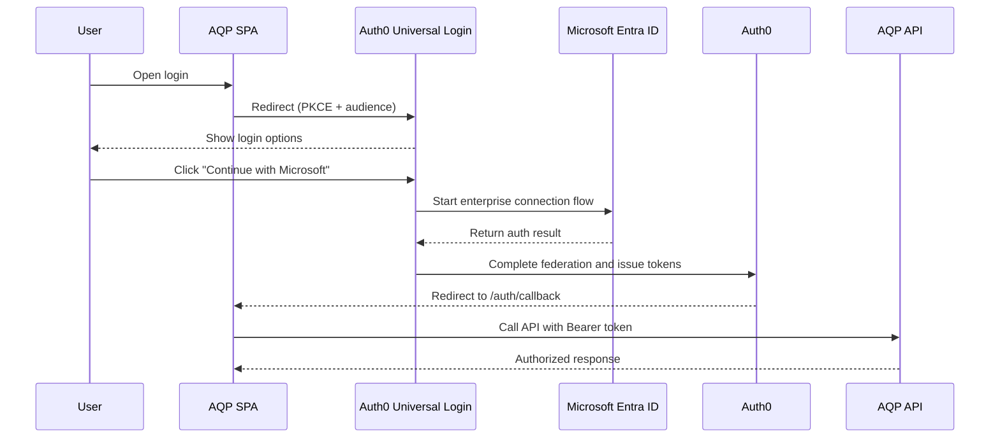

# Auth0 + Microsoft Entra federation runbook

This runbook covers the one-time operator setup for federating Microsoft Entra ID through Auth0 Universal Login, so AQP keeps one identity control plane while still supporting enterprise SSO and account lifecycle features.

## 1) What this gives you

Users authenticate through Auth0 Universal Login, can choose Microsoft via an enterprise connection, and then call the AQP API with Auth0-issued access tokens that include AQP custom claims.



## 2) Auth0 tenant resources to create

1. **AQP API resource**
   - Navigate: `Dashboard > Applications > APIs > Create API`
   - Name: `AQP API`
   - Identifier: `https://api.aqp.local` (operator-selected; this becomes `AQP_AUTH_OIDC_AUDIENCE`)
   - Signing algorithm: `RS256`
   - Permissions to add:
     - `read:messages`
     - `write:messages`
     - `admin`
     - `data:read`
     - `data:write`
   - Enable RBAC and enable **Add Permissions in the Access Token**.

2. **AQP SPA Application**
   - Navigate: `Dashboard > Applications > Applications > Create Application`
   - Name: `AQP SPA`
   - Type: `Single Page Application`
   - Allowed Callback URLs: `http://localhost:3001/auth/callback,https://<your-host>/auth/callback`
   - Allowed Logout URLs: `http://localhost:3001/auth/logout,https://<your-host>/auth/logout`
   - Allowed Web Origins: `http://localhost:3001,https://<your-host>`
   - Token Endpoint Authentication Method: `None` (public client + PKCE)
   - Grant Types: `Authorization Code` and `Refresh Token`
   - Refresh Token settings: rotation enabled, reuse interval `0`
   - Save the Client ID as `VITE_AUTH0_CLIENT_ID`.

3. **AQP Management API M2M Application**
   - Navigate: `Dashboard > Applications > Applications > Create Application`
   - Type: `Machine to Machine`
   - Authorize it for `Auth0 Management API`.
   - Grant scopes:
     - `read:users` - read user profiles and identity links.
     - `update:users` - patch profile/app metadata updates.
     - `create:users` - create user records when needed.
     - `delete:users` - hard-delete user accounts.
     - `read:user_sessions` - list active Auth0 sessions.
     - `delete:sessions` - revoke sessions and sign users out.
     - `read:authentication_methods` - list enrolled MFA methods.
     - `delete:authentication_methods` - remove MFA methods.
     - `create:authentication_method_enrollment_tickets` - generate MFA enrollment tickets.
     - `read:guardian_factors` - list available MFA factor types.
     - `create:user_tickets` - generate password change ticket URLs.
     - `read:logs` - fetch Auth0 audit/security events.
   - Save Client ID + Secret as:
     - `AQP_AUTH0_MGMT_API_CLIENT_ID`
     - `AQP_AUTH0_MGMT_API_CLIENT_SECRET`
   - Audience is `https://<tenant>.auth0.com/api/v2/` and maps to `AQP_AUTH0_MGMT_API_AUDIENCE`.

4. **Microsoft Enterprise Connection**
   - Navigate: `Dashboard > Authentication > Enterprise > Microsoft Azure AD`
   - Connection name: `azure-ad-myorg` (operator-selected). This becomes:
     - `AQP_AUTH0_MICROSOFT_CONNECTION`
     - `VITE_AUTH0_MS_CONNECTION`
   - Use Common Endpoint: `Yes` for multi-tenant. Use tenant-specific endpoint for single-tenant installs.
   - Domain: leave blank for multi-tenant.
   - Paste Client ID + Client Secret from the Microsoft Entra app registration (Section 3).
   - Identity API: `Microsoft Identity Platform v2.0`
   - Attribute mapping: `Standard`
   - Open the `AQP SPA` app -> `Connections` tab -> enable this connection.

5. **(Optional) Google social connection**
   - Navigate: `Dashboard > Authentication > Social > Google`
   - Auth0 dev keys are acceptable only for testing.
   - For production, configure your own Google OAuth client (see [Google OAuth 2.0 setup](https://developers.google.com/identity/protocols/oauth2)).

6. **Auth0 Action — post-login**
   - Implement the Action from Section 4.
   - Ensure it is enabled on the **Login Flow** trigger.

7. **(Optional, recommended) Custom Domain**
   - Navigate: `Dashboard > Branding > Custom Domains > Add Domain`
   - Example domain: `auth.aqp.example`
   - Add the CNAME record shown by Auth0.
   - Wait for verification (typically about 5 minutes).
   - Universal Login uses the custom domain automatically once verified.

8. **Universal Login branding**
   - Navigate: `Dashboard > Branding > Universal Login > Customize`
   - Use the **New Universal Login** (template-based), not Classic.
   - Choose the `Identifier First + Biometrics` template.
   - Set logo URL and primary color from your brand guide.

## 3) Microsoft Entra app registration walkthrough

1. In Azure portal, open `Microsoft Entra ID > App registrations > New registration`.
2. Name the app `AQP via Auth0`.
3. Supported account types: `Accounts in any organizational directory (Multitenant)` for B2B, or single-tenant for internal-only access.
4. Redirect URI: `Web`, set to `https://<auth0-tenant>.auth0.com/login/callback`.
5. Click **Register**.
6. Copy **Application (client) ID** and paste into the Auth0 Microsoft Enterprise Connection.
7. Open `Certificates & secrets > New client secret`, then copy the **Value** (not secret ID) into the Auth0 Microsoft Enterprise Connection.
8. In `API permissions`, add Microsoft Graph delegated permissions: `openid`, `profile`, `email`, `User.Read`; then grant admin consent.
9. In `Authentication`:
   - `Allow public client flows`: `No`
   - Front-channel logout URL: `https://<auth0-tenant>.auth0.com/v2/logout`
10. Optional token configuration: add optional claims `email`, `family_name`, and `given_name` if you want those in ID tokens.

## 4) The Auth0 Action JavaScript

Use this Action on the Login Flow -> Post Login trigger:

```javascript
/**
 * AQP post-login Action.
 * Calls /_internal/auth0/sync on the AQP API and injects the
 * returned custom claims into the access token. Also carries the
 * Auth0 connection name (e.g. "azure-ad-myorg") so the AQP audit
 * log records WHICH IdP drove this login.
 *
 * Secrets used:
 *   AQP_API_URL                  e.g. https://api.aqp.example
 *   AQP_M2M_CLIENT_ID            Auth0 Management API M2M client id (reused)
 *   AQP_M2M_CLIENT_SECRET        Auth0 Management API M2M client secret
 *   AQP_M2M_AUDIENCE             Same as AQP API resource identifier
 *
 * Set them at: Actions > Library > Custom > <your action> > Add Secret
 */
const NS = "https://aqp/";

async function mintM2MToken(secrets) {
  const url = `https://${event.tenant.id}.auth0.com/oauth/token`;
  const res = await fetch(url, {
    method: "POST",
    headers: { "Content-Type": "application/json" },
    body: JSON.stringify({
      grant_type: "client_credentials",
      client_id: secrets.AQP_M2M_CLIENT_ID,
      client_secret: secrets.AQP_M2M_CLIENT_SECRET,
      audience: secrets.AQP_M2M_AUDIENCE,
    }),
  });
  if (!res.ok) return null;
  const body = await res.json();
  return body.access_token || null;
}

exports.onExecutePostLogin = async (event, api) => {
  const aqpApi = event.secrets.AQP_API_URL;
  if (!aqpApi) return; // Action mis-configured; fail open
  let token = await api.cache.get("aqp_m2m_token");
  if (!token || !token.value) {
    const fresh = await mintM2MToken(event.secrets);
    if (!fresh) return;
    api.cache.set("aqp_m2m_token", fresh, { ttl: 50 * 60 * 1000 });
    token = { value: fresh };
  }
  const payload = {
    user_id: event.user.user_id,
    email: event.user.email,
    organization_id: event.organization?.id,
    organization_name: event.organization?.name,
    requested_claims: {
      connection: event.connection?.name,
      strategy: event.connection?.strategy,
    },
  };
  try {
    const res = await fetch(`${aqpApi}/_internal/auth0/sync`, {
      method: "POST",
      headers: {
        Authorization: `Bearer ${token.value}`,
        "Content-Type": "application/json",
      },
      body: JSON.stringify(payload),
    });
    if (!res.ok) return;
    const claims = await res.json();
    for (const [k, v] of Object.entries(claims)) {
      if (v === null || v === undefined) continue;
      api.accessToken.setCustomClaim(`${NS}${k}`, v);
      api.idToken.setCustomClaim(`${NS}${k}`, v);
    }
  } catch (err) {
    // Fail open — never block the user's login if AQP API is down.
    console.log("aqp_sync_failed", err.message);
  }
};
```

The Action intentionally fails open. Blocking sign-in for every user because of a temporary outage in `/_internal/auth0/sync` is a worse failure mode than skipping one claim sync. The next successful login reconciles claims again.

## 5) `.env` values to set on AQP

Use `.env.example` as the canonical source for all names and defaults.

### API + worker (`AQP_*`)

- `AQP_AUTH_PROVIDER=auth0`
- `AQP_AUTH_OIDC_ISSUER` (Auth0 issuer URL)
- `AQP_AUTH_OIDC_AUDIENCE` (AQP API identifier)
- `AQP_AUTH_OIDC_CLIENT_ID`
- `AQP_AUTH_OIDC_CLIENT_SECRET` (required only for confidential clients)
- `AQP_AUTH_LOGIN_CALLBACK`
- `AQP_AUTH_LOGOUT_CALLBACK`
- `AQP_AUTH_SESSION_SECRET`
- `AQP_AUTH_M2M_ENABLED=true`
- `AQP_AUTH_M2M_AUDIENCE` (normally same as API audience)
- `AQP_AUTH0_MGMT_API_AUDIENCE`
- `AQP_AUTH0_MGMT_API_CLIENT_ID`
- `AQP_AUTH0_MGMT_API_CLIENT_SECRET`
- `AQP_AUTH0_DATABASE_CONNECTION`
- `AQP_AUTH0_MICROSOFT_CONNECTION`
- `AQP_AUTH0_GOOGLE_CONNECTION` (if Google is enabled)
- `AQP_AUTH_REQUIRE_EMAIL_VERIFIED`

### SPA build-time config (`VITE_*`)

- `VITE_AUTH0_DOMAIN`
- `VITE_AUTH0_CLIENT_ID`
- `VITE_AUTH0_AUDIENCE`
- `VITE_AUTH0_SCOPE`
- `VITE_AUTH0_REDIRECT_URI`
- `VITE_AUTH0_ORGANIZATION` (optional)
- `VITE_AUTH0_MS_CONNECTION`
- `VITE_AUTH0_GOOGLE_CONNECTION`
- `VITE_AUTH0_BRAND_NAME`
- `VITE_AUTH0_BRAND_LOGO_URL`

## 6) Verification curl commands

```bash
# Public endpoint (should return 200 without auth)
curl http://localhost:8000/api/public

# Private endpoint (401 without token)
curl http://localhost:8000/me

# Private endpoint (200 with access token)
curl http://localhost:8000/me -H 'Authorization: Bearer YOUR_ACCESS_TOKEN'

# Scoped endpoint (403 if token lacks read:messages)
curl http://localhost:8000/api/private-scoped -H 'Authorization: Bearer YOUR_ACCESS_TOKEN'
```

For a quick test token, use `Auth0 Dashboard > APIs > AQP API > Test`.

## 7) Cutover checklist

- [ ] Auth0 tenant created
- [ ] AQP API + SPA + Management API M2M apps created
- [ ] Microsoft Enterprise Connection created + tested
- [ ] Auth0 Action installed + enabled on Login Flow
- [ ] `.env` populated on the AQP API + worker
- [ ] `.env.local` populated on the SPA build + rebuild + redeploy
- [ ] `AQP_AUTH_PROVIDER=auth0` set
- [ ] `AQP_AUTH_ENFORCE=strict` confirmed in prod
- [ ] Smoke: `/api/public` 200, `/api/private` 401 then 200, Microsoft button -> Entra -> callback -> `/`

## 8) Troubleshooting

- `401 invalid_token` after Microsoft login: verify the Action ran in `Dashboard > Monitoring > Logs` (filter event type `sapi` or `sf`).
- `invalid_request: missing audience`: ensure the authorize request includes `audience=`. The SPA should pass this from `VITE_AUTH0_AUDIENCE`.
- `Wrong issuer`: ensure issuer uses the Auth0 tenant domain ending in `.auth0.com`. If a custom domain is configured, confirm token issuer behavior and enable **Use Custom Domain in Tokens** when required.
