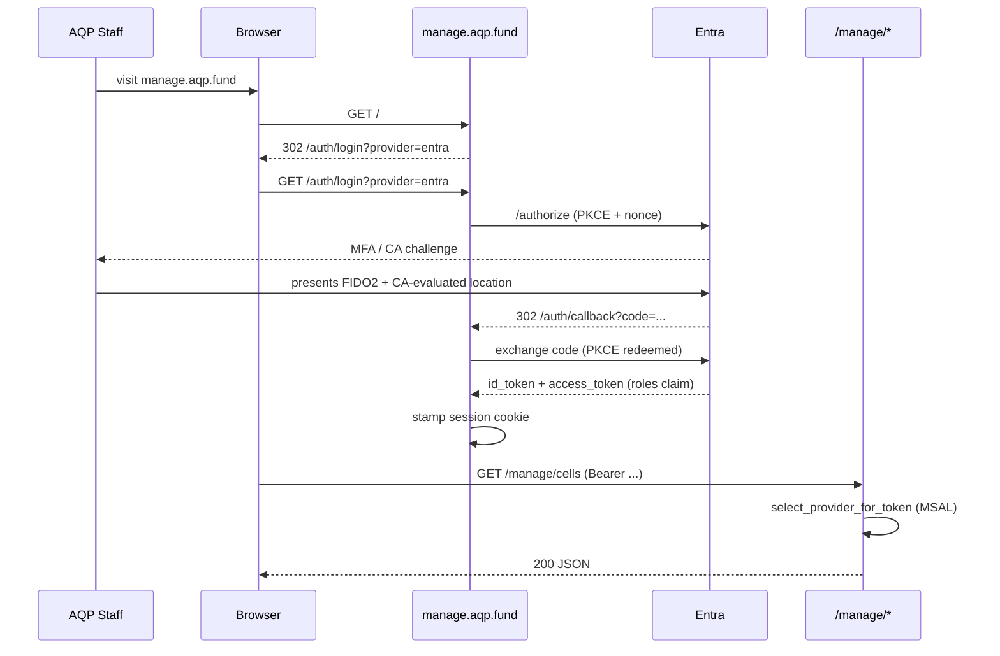

# Entra ID as the AQP staff user pool

Microsoft Entra ID is the **first user pool** for the managed AQP
platform. AQP staff (engineers, operators, compliance, finance,
auditors, SOC) sign in to `manage.aqp.fund` through the AQP staff
Entra tenant; Auth0 stays as the customer-facing B2C fallback and the
documented degraded-mode entry path.

This page explains *what* the rollout does and *why*. The runbook
that walks through *how* lives at
[`how-to/entra-terraform-bootstrap`](../../how-to/entra-terraform-bootstrap.md);
the long-form plan with phases + risks at
[`docs/plans/entra-internal-tenant-rollout.md`](pathname:///docs/plans/entra-internal-tenant-rollout.md);
and the architectural decision at
[ADR-011](../../architecture/decisions/011-entra-as-first-pool.md).

## Why Entra, why now

| Driver | Detail |
| --- | --- |
| MFA + Conditional Access | Entra carries the company's existing MFA + CA enforcement; staff already authenticate to it daily for Microsoft 365. |
| Audit centralisation | Sign-in logs land in the corporate SIEM via the existing Entra log stream; no separate Auth0 export to maintain. |
| Group-driven authorisation | Group membership in Entra → app-role claim on AQP tokens. New hires onboard via a single HR-side group action. |
| No client secrets in CI | GitHub Actions OIDC + federated credentials replace the old `AZURE_CLIENT_SECRET` repo secret. |
| Customer separation | The AQP staff tenant is independent of every customer tenant. Customer tenants continue to flow through the `EntraTenantLink` B2B approval wizard (AGENTS rule 44). |

## What is under Terraform control

- **3 app registrations**: `aqp-staff` (login app), `aqp-manage-api`
  (Resource Server), `aqp-ci-github` (federated-credential-only).
- **3 service principals** with `app_role_assignment_required = true`
  on the manage API + CI app.
- **7 app roles** on the manage API: Admin, Operator, Auditor,
  Compliance, Finance, Engineer, Viewer.
- **7 directory groups**: AQP-Admins, AQP-Operations, AQP-Auditors,
  AQP-Compliance, AQP-Finance, AQP-Engineering, AQP-SOC.
- **Group → app-role assignments** mapping each group to one or more
  roles.
- **Federated credentials** for GitHub Actions OIDC (per-environment
  + per-branch, never wildcards).
- **Named locations** representing AQP-trusted IP ranges (referenced
  by Conditional Access policies).

## What is NOT under Terraform control

- **Conditional Access policies**. CA policies require an Entra ID P2
  license + manual Security review. The Terraform module records
  policy display names as documentation; the verify helper queries
  Microsoft Graph at smoke-test time to confirm each named policy
  exists.
- **Group membership**. HR + Security own membership through the
  Azure Portal (or Entitlement Management). Terraform owns *which
  groups exist + what roles they confer*; not *who is in them*.
- **Customer-tenant Entra integration**. Customer tenants flow through
  the existing `EntraTenantLink` B2B wizard (AGENTS rule 44). This
  rollout is internal-only.
- **Privileged Identity Management (PIM)**. Tracked as future work in
  the rollout plan §7.

## Token shape

Every staff access token minted for `api://aqp-manage-api` carries:

| Claim | Value |
| --- | --- |
| `iss` | `https://login.microsoftonline.com/{aqp_staff_tenant_id}/v2.0` |
| `aud` | `api://aqp-manage-api` |
| `roles` | one or more of `Admin`, `Operator`, `Auditor`, `Compliance`, `Finance`, `Engineer`, `Viewer` |
| `groups` | the staff member's directory group object ids (security-only) |
| `oid` | the user's Entra object id (stable across renames) |
| `tid` | the AQP staff Entra tenant id |
| `preferred_username` | `firstname.lastname@<aqp-domain>` |

The application reads `roles` to gate `/manage/*` routes; a staff
member with no roles is treated as `Viewer` until promoted by an admin.

## Provider-chain priority

`aqp/auth/providers/__init__.py` exposes
[`select_provider_for_token`](pathname:///docs/concepts/identity/entra-internal-tenant.md#provider-chain-priority)
which:

1. Decodes the token's `iss` claim (no signature check).
2. If `iss` matches the AQP staff issuer, returns
   `MsalEntraIdentityProvider`.
3. Otherwise falls back to `get_active_provider()` (Auth0 in
   production).

The `manage.aqp.fund` mounts use this selector instead of the bare
`get_active_provider()` so internal-tenant tokens always route through
MSAL first. Customer tokens (different `iss`) continue to land on
Auth0.

## Lifecycle

| Phase | What happens | Owner |
| --- | --- | --- |
| 0. Pre-flight | Tenant id confirmed; bootstrap SP provisioned | Identity team |
| 1. Plan + module land | `aqp_entra_directory` module shipped + plan-only validated | Platform |
| 2. Apply + smoke | Resources created; staff member tests login | Platform |
| 3. Cutover | `auth_msal_priority` set so MSAL wins for staff | Platform + Identity |
| 4. Group onboarding | HR populates the seven groups | HR + Security |
| 5. CI cutover | All workflows switch to OIDC federation | DevOps |

See the rollout plan for week-level scheduling, exit criteria, and
rollback procedures.

## How a staff member signs in

## Reading the audit trail

Every Entra-side mutation lands in two places:

- The **Entra audit log** (corporate SIEM via existing log stream).
  Captures app-registration changes, group-membership changes,
  CA-policy edits, admin consents.
- The **AQP `terraform_runs` ledger**. Captures every Terraform
  apply on the `entra-internal` stack with the operator who triggered
  it, the SHA of the rendered HCL, the previous + new state hashes,
  and whether the run succeeded or rolled back.

Auditors who need a full reconstruction window query both. The Phase 7
evidence-bundle export already includes `terraform_runs` rows in its
deterministic archive.

## Related

- [`how-to/entra-terraform-bootstrap`](../../how-to/entra-terraform-bootstrap.md)
- [`how-to/entra-onboard-new-staff`](../../how-to/entra-onboard-new-staff.md)
- [`how-to/entra-rotate-secrets`](../../how-to/entra-rotate-secrets.md)
- [`architecture/decisions/011-entra-as-first-pool`](../../architecture/decisions/011-entra-as-first-pool.md)
- The Terraform module:
  [`aqp_platform/terraform/modules/aqp_entra_directory/`](pathname:///aqp_platform/terraform/modules/aqp_entra_directory/README.md)
- Long-form rollout plan:
  [`docs/plans/entra-internal-tenant-rollout.md`](pathname:///docs/plans/entra-internal-tenant-rollout.md)
