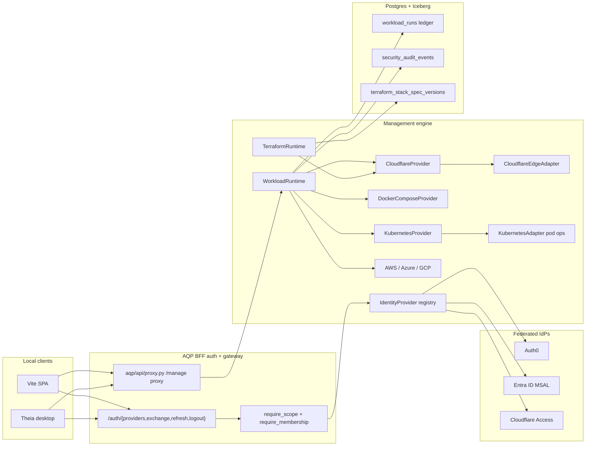

# AQP Management Engine

Canonical narrative for the unified management/control surface
shipped by the `aqp_management_engine` plan
(`.cursor/plans/aqp_management_engine_fd9f1de7.plan.md`).

## What it owns

The Management Engine is the single direct-control surface for:

- **Workload lifecycle** — start / stop / scale / restart / exec /
  tail logs / apply config / rotate secret. One Python ABC
  (`aqp_platform_core.providers.InfrastructureProvider`), one
  runtime (`aqp_platform_core.runtime.WorkloadRuntime`), one audit
  ledger row per action (`workload_runs`).
- **Identity provider configuration** — Auth0 + Microsoft Entra ID
  (MSAL) + Cloudflare Access, all registered through
  `IdentityProviderMeta`. The BFF (`/auth/{providers,exchange,refresh,logout}`)
  is the canonical surface for SPA + Theia clients.
- **Cloudflare edge** — tunnels, DNS records, Access apps. Runtime
  CRUD via `aqp.cloudflare.CloudflareEdgeAdapter`; IaC via the
  `aqp_platform/terraform/modules/cloudflare_edge` module (provider
  `cloudflare/cloudflare ~> 5.6`).
- **Entra tenant onboarding** — `pending` -> `active` via
  `POST /tenancy/entra-links/{id}/promote` (Phase E of the plan).

## Architecture

## Deployment modes

`AQP_MANAGEMENT_MODE` controls how the engine runs:

| Mode | Workload calls go to | Audit sink | Use case |
|---|---|---|---|
| `embedded` (default) | In-process `WorkloadRuntime` | `PostgresWorkloadAuditSink` | Single-image deployment |
| `sidecar` | HTTP `/manage/*` proxy -> `aqp_control_plane` | `JsonlAuditSink` | Air-gapped or multi-tenant deployments |

Both modes import the SAME `WorkloadRuntime` class — operators
choose by setting the env var; no code branches.

## Provider matrix

| Provider | start / stop / scale | restart | exec | tail_logs | rotate_secret | Notes |
|---|---|---|---|---|---|---|
| `docker_compose` | yes | yes | yes (Docker SDK) | yes | no | Local dev + admin overlays |
| `kubernetes` | yes | yes (annotation bump) | yes (`stream` + `_preload_content=False`) | yes (`watch.Watch().stream`) | yes (rolling restart) | Production target |
| `aws` | stub | stub | stub | stub | stub | Real `health` + delegated `list_deployments` when EKS attached |
| `azure` | stub | stub | stub | stub | stub | Real `health` + delegated `list_deployments` when AKS attached |
| `gcp` | stub | stub | stub | stub | stub | Real `health` + delegated `list_deployments` when GKE attached |
| `cloudflare` | yes | yes (config reload) | n/a | n/a | destructive (opt-in) | Tunnel + Access app + DNS lifecycle |

Cloud providers gate K8s delegation on
`AQP_CP_{AWS,AZURE,GCP}_DELEGATE_K8S=true`.

## Halt + audit

- `POST /workloads/halt` fires the `WorkloadRuntime.halt_all`
  helper (per-process registry) and writes a `HALTED` finish row
  for every in-flight `workload_runs` entry. Wired into the
  frontend `KillSwitch` alongside the existing halt endpoints
  (rule 45 + frontend rule 2).
- Every audit row carries `experiment_id` + `test_id` per
  AGENTS rule 34. The Postgres mirror table
  (`workload_runs`, Alembic 0055) is indexed on `status +
  started_at DESC`, `action + started_at DESC`, and
  `provider_alias + target`.

## Cloudflare end-to-end

Phase D of the plan ships:

- `aqp/cloudflare/{client,adapter}.py` — Python SDK wrapper +
  `CloudflareEdgeAdapter` (tunnels, DNS, Access apps).
- `aqp/api/routes/cloudflare.py` — REST surface under
  `/cloudflare/*` (`cluster:admin` for writes,
  `cluster:read` for reads).
- `aqp/data/mcp/tools/cloudflare.py` — DataMCP tools for agents
  (`data.cloudflare.{health,list_tunnels,create_tunnel,put_tunnel_config,list_access_apps,put_access_app,put_dns_record}`).
- `aqp/auth/providers/cloudflare_access.py` — new
  `CloudflareAccessProvider` that validates `Cf-Access-Jwt-Assertion`
  headers and merges claims into the active `RequestContext`.
- `aqp_platform/terraform/modules/cloudflare_edge` + Jinja codegen template
  (`aqp/terraform/codegen/templates/cloudflare_edge.tf.j2`) +
  `cloudflare = "~> 5.6"` in `aqp_platform/terraform/versions.tf`.
- Optional `cloudflare_enabled` block in
  `aqp_platform/terraform/environments/rpi/main.tf` — replaces the manual
  cloudflared deployment under
  `rpi_kubernetes/kubernetes/base-services/cloudflared/`.

## Frontend

- `aqp_client/src/lib/api/{workloads,cloudflare,clusterPods}.ts` —
  typed clients matching the new REST surface.
- `aqp_client/src/routes/manage/page.tsx` — Workload Studio.
- `aqp_client/src/routes/cluster-mgmt/page.tsx` — Cluster pods
  browser (exec + log tail land in Phase F-2).
- `aqp_client/src/routes/cloudflare/page.tsx` — Cloudflare edge
  studio.
- `aqp_client/src/lib/auth/MsalProvider.tsx` — new MSAL branch of
  `AuthProvider`; selects between `<MsalProvider>` and
  `<Auth0Provider>` based on `authConfig.provider`.
- `aqp_client/public/redirect.html` — MSAL v5 redirect bridge.

## Theia

- `theia-extensions/aqp/src/browser/auth/aqp-auth-service.ts` —
  additive BFF auth service (calls `/auth/providers` +
  `/auth/refresh`). Auth0Service still owns the direct PKCE flow.
- `theia-extensions/aqp/src/browser/widgets/management-widget.tsx` —
  iframe embedding the Vite Workload Studio, cluster-mgmt, and
  cloudflare routes inside Theia. New env vars on
  `browser.Dockerfile`: `AQP_THEIA_FRONTEND_URL`,
  `AQP_THEIA_PROVIDERS_URL`.

## Subagent + rule + skill

- `.cursor/agents/aqp-management-engine.md` — direct-control
  subagent that maps every control route to a `data.*` MCP tool
  and refuses raw HTTP shortcuts.
- `.cursor/rules/aqp-management-engine.mdc` — always-on rule
  that bans printing tokens, refresh tokens, M2M client_secrets,
  MFA secrets, `Cf-Access-Jwt-Assertion` values, kubeconfig
  contents, and full `Authorization` headers in any transcript.
- `.cursor/skills/aqp-management-engine/SKILL.md` — named
  workflows the subagent reaches for first (start, stop,
  restart, exec, tail-logs, provision-tunnel, rotate-secret,
  promote-entra-link, halt-all).
