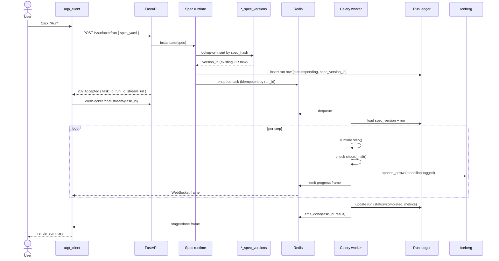
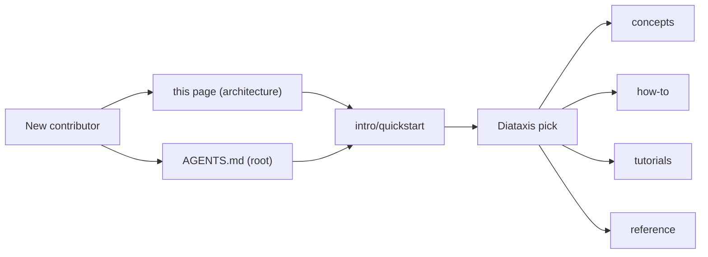

import RunnableCode from '@site/src/components/RunnableCode';

# Architecture

> Human entry point. Pair with the AI-agent entry point at
> [AGENTS.md](https://github.com/julianwileymac/agentic_quant_platform/blob/main/AGENTS.md)
> and the doc map at [/intro](../../intro/index.md).
>
> Cold-start path: [/intro/quickstart](../../intro/quickstart.md).
> Deployment path: [how-to/operations/local-setup](../../how-to/operations/local-setup.md)
> or [how-to/operations/kubernetes-deploy](../../how-to/operations/kubernetes-deploy.md).

AQP is a **local-first, agentic quantitative research and trading
platform**. Every LLM call, every backtest, every reinforcement-learning
rollout, and every piece of metadata stays on local hardware — no
proprietary alpha leaves the box. The codebase distills patterns from
Microsoft Qlib, AI4Finance FinRL, QuantConnect Lean, OpenBB, vnpy, and
TradingAgents into one coherent platform.

The platform is organised around **four invariants** that hold across
every subsystem:

1. **Hash-locked spec runtimes.** `AgentSpec`, `BotSpec`,
   `RLExperimentSpec`, and `AnalysisSpec` each have a single sanctioned
   executor (`AgentRuntime` / `BotRuntime` / `RLRuntime` /
   `AnalysisRuntime`). Any spec change creates a new immutable
   `*_spec_versions` row; old versions stay forever for replay.
2. **Medallion lakehouse.** Every Iceberg write goes through
   [`iceberg_catalog.append_arrow`](https://github.com/julianwileymac/agentic_quant_platform/blob/main/aqp/data/iceberg_catalog.py)
   with a declared bronze / silver / gold layer; agents read through
   `data.*` MCP tools, never raw ORM.
3. **One LLM gateway, one progress bus.** Every model call routes
   through
   [`router_complete`](https://github.com/julianwileymac/agentic_quant_platform/blob/main/aqp/llm/providers/router.py);
   every Celery task emits canonical progress frames through
   [`aqp.tasks._progress`](https://github.com/julianwileymac/agentic_quant_platform/blob/main/aqp/tasks/_progress.py).
4. **Topology is data, not code.** Service URLs, MCP audiences, and
   credential references resolve through
   [`aqp_platform/configs/deployment/topology.yaml`](https://github.com/julianwileymac/agentic_quant_platform/blob/main/aqp_platform/configs/deployment/topology.yaml).

## System component diagram

```mermaid
flowchart TB
    subgraph clients [Clients]
        Browser["aqp_client (Vite :3001)"]
        CloudUI["aqp_ui (Next.js cloud)"]
        Admin["aqp_admin (manage.aqp.fund)"]
        CLI["aqp-cli (device-flow auth)"]
        IDE["aqp_ide (Theia 1.72)"]
        Agents["IDE agents (Cursor / Claude / Continue)"]
    end

    subgraph edge [Cloudflare edge]
        DocsEdge["docs.aqp.fund (Pages)"]
        DocsMcp["docs MCP Worker (RFC 9728+8707)"]
        StatusEdge["status.aqp.fund (Instatus)"]
        TunnelEdge["aqp-fund-edge tunnel"]
    end

    subgraph api [API gateway (aqp/api)]
        FastAPI["FastAPI :8000"]
        DataMcp["/mcp/data"]
        CodeMcp["/mcp/codebase"]
        WS["WebSocket relay"]
    end

    subgraph cp [Control plane (aqp_control_plane)]
        ManageApi["aqp-cp :9000 (manage.aqp.fund)"]
        TfRuntime["TerraformRuntime"]
        WlRuntime["WorkloadRuntime"]
    end

    subgraph runtimes [Spec runtimes]
        AgentRt["AgentRuntime"]
        BotRt["BotRuntime (aqp_bots)"]
        RlRt["RLRuntime (aqp_rl)"]
        AnaRt["AnalysisRuntime"]
        WfRt["WorkflowRuntime"]
    end

    subgraph workers [Celery workers]
        WDefault["worker (default / backtest / agents / paper)"]
        WTraining["worker-gpu (training queue)"]
        WTerraform["worker-terraform"]
        Beat["beat (cron)"]
    end

    subgraph runtime [Backends]
        Redis[(Redis 7)]
        Postgres[(PostgreSQL 16 + pgvector + RLS)]
        Iceberg["Iceberg lakehouse (bronze / silver / gold)"]
        Hudi["Hudi (upsert-heavy)"]
        DuckDB["DuckDB views"]
        Mlflow["MLflow"]
        R2[("R2 (Logpush 365d)")]
    end

    subgraph llms [LLM tier]
        Ollama["Ollama (host)"]
        Vllm["vLLM (compose --profile vllm)"]
        Sera["SERA-32B (Modal, opt-in)"]
        Router["router_complete + LiteLLM"]
    end

    subgraph observability [Observability]
        OTEL["OTEL collector :4317"]
        Jaeger["Jaeger"]
        Posthog["PostHog Cloud EU"]
        Plausible["Plausible (cookieless)"]
    end

    Browser --> FastAPI
    CloudUI --> FastAPI
    CloudUI --> ManageApi
    Admin --> ManageApi
    CLI --> FastAPI
    IDE --> FastAPI
    Agents -.MCP.-> DataMcp
    Agents -.MCP.-> CodeMcp
    Agents -.MCP.-> DocsMcp

    Browser -.DocsPanel.-> DocsEdge
    DocsEdge --> DocsMcp

    TunnelEdge --> FastAPI
    TunnelEdge --> ManageApi
    TunnelEdge --> Browser

    FastAPI --> AgentRt
    FastAPI --> BotRt
    FastAPI --> RlRt
    FastAPI --> AnaRt
    FastAPI --> WfRt
    WfRt --> AgentRt
    WfRt --> RlRt
    WfRt --> BotRt

    AgentRt -.tasks.-> Redis
    BotRt -.tasks.-> Redis
    RlRt -.tasks.-> Redis
    Beat -.cron.-> Redis
    Redis -.dispatch.-> WDefault
    Redis -.dispatch.-> WTraining
    Redis -.dispatch.-> WTerraform

    WDefault --> Postgres
    WDefault --> Iceberg
    WDefault --> Hudi
    WDefault --> Router
    WTraining --> Mlflow
    WTraining --> Router

    ManageApi --> TfRuntime
    ManageApi --> WlRuntime
    TfRuntime --> WTerraform

    Iceberg --> DuckDB
    Router --> Ollama
    Router -.optional.-> Vllm
    Router -.opt-in.-> Sera

    FastAPI -.spans.-> OTEL
    ManageApi -.spans.-> OTEL
    OTEL --> Jaeger
    DocsEdge -.events.-> Posthog
    DocsEdge -.pageviews.-> Plausible
    DocsEdge -.logpush.-> R2
```

Solid lines are default-profile data paths; dotted lines are
opt-in / asynchronous.

## The four edge surfaces

AQP exposes four hostnames, each behind its own Cloudflare property:

- **`aqp.fund`** — operator UI ([aqp_client](https://github.com/julianwileymac/agentic_quant_platform/tree/main/aqp_client)).
  Vite + React 19 + Tailwind 4 + shadcn/ui. Routes the topbar
  KillSwitch, paper trading dashboards, RL Lab, Analysis Lab,
  Workflow Studio, Data Hub.
- **`api.aqp.fund`** — public API
  ([aqp/api](https://github.com/julianwileymac/agentic_quant_platform/tree/main/aqp/api)).
  FastAPI gateway, 30+ route modules, Stripe-style date epochs
  (first epoch `2026-06-01`).
- **`manage.aqp.fund`** — control plane
  ([aqp_control_plane](https://github.com/julianwileymac/agentic_quant_platform/tree/main/aqp_control_plane)).
  Workload lifecycle, TerraformRuntime, IdP wiring. Never imports
  `aqp.*`.
- **`docs.aqp.fund`** — documentation
  ([aqp_docs](https://github.com/julianwileymac/agentic_quant_platform/tree/main/aqp_docs)).
  Docusaurus 3 on Cloudflare Pages. Pages Functions for
  content-negotiation, sanitised page fragments, and the
  "Was this helpful?" feedback loop. Standalone MCP Worker at
  `/mcp` (RFC 9728 + 8707 compliant per AGENTS rule 49).

Plus two adjacent zones:

- **`status.aqp.fund`** — Instatus status page. Separate Cloudflare
  zone so it stays up when the cluster is degraded.
- **`archive.aqp.fund`** — frozen Stripe-style API epochs after the
  12-month sunset window.

## Request lifecycle

Every spec-driven dispatch — backtest, agent run, RL training,
analysis flow, workflow — follows the same canonical shape. The two
new contracts since the prior version of this doc:

- **Hash-lock first.** Before any work happens, the runtime computes
  the spec's SHA-256, looks for a matching `*_spec_versions` row,
  inserts a new immutable row if the content changed.
- **Kill switch reachable.** Every long-running runtime is in the
  topbar [KillSwitch](https://github.com/julianwileymac/agentic_quant_platform/blob/main/aqp_client/src/components/common/KillSwitch.tsx)
  fan-out list. The runtime checks `should_halt` on every step.



The frame envelope is `{task_id, stage, message, timestamp,
**extras}` per AGENTS rule 4. The `should_halt` check makes every
spec-runtime an immediate stop target for the topbar kill switch.

## Repository map

The monorepo is organised by responsibility. Each top-level package
has its own `AGENTS.md` enforcing strict boundaries; cross-package
imports are blocked in CI.

| Package | Role | Owner | Public-surface contract |
| --- | --- | --- | --- |
| [aqp/](https://github.com/julianwileymac/agentic_quant_platform/tree/main/aqp) | Quant runtime — strategies, backtests, agents, RAG, Iceberg | `platform-team` | [aqp/api/main.py::create_app](https://github.com/julianwileymac/agentic_quant_platform/blob/main/aqp/api/main.py) |
| [aqp_control_plane/](https://github.com/julianwileymac/agentic_quant_platform/tree/main/aqp_control_plane) | Workload lifecycle + Terraform driver + provider adapters | `platform-team` | [aqp_cp/main.py::create_app](https://github.com/julianwileymac/agentic_quant_platform/blob/main/aqp_control_plane/src/aqp_cp/main.py); NEVER imports `aqp.*` |
| [aqp_platform_core/](https://github.com/julianwileymac/agentic_quant_platform/tree/main/aqp_platform_core) | Shared value types, ABCs, auth/resource filters, topology | `platform-team` | Dependency-light; consumed by both `aqp/` and `aqp_control_plane/` |
| [aqp_client/](https://github.com/julianwileymac/agentic_quant_platform/tree/main/aqp_client) | Active Vite + React 19 operator UI at `aqp.fund` | `platform-team` | `pnpm --filter aqp_client dev` |
| [aqp_ui/](https://github.com/julianwileymac/agentic_quant_platform/tree/main/aqp_ui) | Cloud-hosted Next.js PaaS frontend (dual Auth0 + Entra) | `platform-team` | Never imports `aqp.*` / `aqp_control_plane.*` |
| [aqp_admin/](https://github.com/julianwileymac/agentic_quant_platform/tree/main/aqp_admin) | Internal admin at `manage.aqp.fund` (audit-first) | `platform-team` | Mirrors `aqp_control_plane` boundary |
| [aqp_rl/](https://github.com/julianwileymac/agentic_quant_platform/tree/main/aqp_rl) | RL stack — `RLExperimentSpec` + `RLRuntime` + Iceberg trajectories | `rl-team` | Legacy `aqp.rl.*` is a deprecation shim |
| [aqp_models/](https://github.com/julianwileymac/agentic_quant_platform/tree/main/aqp_models) | ML framework, custom model serving (vLLM + Ollama), AlphaBacktestExperiment | `ml-team` | Legacy `aqp.ml.*` + `aqp/llm/{vllm_runner,ollama_client}.py` are deprecation shims |
| [aqp_bots/](https://github.com/julianwileymac/agentic_quant_platform/tree/main/aqp_bots) | Bot templates + `BotRuntime` (smallest deployable unit) | `agentic-team` | YAML at `aqp_bots/templates/{trading,research}/` |
| [aqp_ide/](https://github.com/julianwileymac/agentic_quant_platform/tree/main/aqp_ide) | Theia 1.72 IDE + six AQP extensions | `platform-team` | Canonical entrypoint: `aqp-cli ide` |
| [aqp_cli/](https://github.com/julianwileymac/agentic_quant_platform/tree/main/aqp_cli) | Standalone operator CLI (HTTP-only, device-flow auth) | `platform-team` | Never imports `aqp.*` / `aqp_control_plane.*` |
| [aqp_platform/](https://github.com/julianwileymac/agentic_quant_platform/tree/main/aqp_platform) | Hosted-platform deployment + IaC + build assets | `infra-team` | No `import aqp.*`; `TerraformRuntime`-only |
| [aqp_index/](https://github.com/julianwileymac/agentic_quant_platform/tree/main/aqp_index) | Curator-owned single source of truth | `docs-team` | Sole-writer is the `aqp-index-curator` subagent |
| [aqp_docs/](https://github.com/julianwileymac/agentic_quant_platform/tree/main/aqp_docs) | This site (Docusaurus 3 on Cloudflare Pages) | `docs-team` | Quality gates in [.github/workflows/docs-ci.yml](https://github.com/julianwileymac/agentic_quant_platform/blob/main/.github/workflows/docs-ci.yml) |
| [aqp_snippets/](https://github.com/julianwileymac/agentic_quant_platform/tree/main/aqp_snippets) | Curated knowledge + extractions + inspiration trees | `docs-team` | Runtime code MUST NOT import this tree |

Inside `aqp/` the subsystems map one-to-one to concept docs:

| `aqp/<package>/` | Doc |
| --- | --- |
| [agents/](https://github.com/julianwileymac/agentic_quant_platform/tree/main/aqp/agents) | [agentic-pipeline](../agentic/agentic-pipeline.md), [agents](../agentic/agents.md), [workflow-studio](../agentic/workflow-studio.md), [multi-agent-patterns](../agentic/multi-agent-patterns.md) |
| [analysis/](https://github.com/julianwileymac/agentic_quant_platform/tree/main/aqp/analysis) | [analysis-framework](../strategy/analysis-framework.md), [analysis-lab](../strategy/analysis-lab.md), [analysis-flows](../strategy/analysis-flows.md) |
| [api/](https://github.com/julianwileymac/agentic_quant_platform/tree/main/aqp/api) | [reference/api](../../reference/api/index.mdx) (auto-generated) |
| [backtest/](https://github.com/julianwileymac/agentic_quant_platform/tree/main/aqp/backtest) | [backtest-engines](../strategy/backtest-engines.md), [vbtpro-integration](../strategy/vbtpro-integration.md), [hft-backtest](../strategy/hft-backtest.md) |
| [cli/](https://github.com/julianwileymac/agentic_quant_platform/tree/main/aqp/cli) | [providers](../data/providers.md) |
| [codebase/](https://github.com/julianwileymac/agentic_quant_platform/tree/main/aqp/codebase) | [codebase-mcp](../data/codebase-mcp.md) |
| [core/](https://github.com/julianwileymac/agentic_quant_platform/tree/main/aqp/core) | [core-types](./core-types.md) |
| [data/](https://github.com/julianwileymac/agentic_quant_platform/tree/main/aqp/data) | [data-plane](../data/data-plane.md), [data-catalog](../data/data-catalog.md), [data-mcp](../data/data-mcp.md), [datasets-catalog](../data/datasets-catalog.md), [data-discovery](../data/data-discovery.md), [airbyte-builder](../data/airbyte-builder.md), [dagster-sandbox](../data/dagster-sandbox.md) |
| [llm/](https://github.com/julianwileymac/agentic_quant_platform/tree/main/aqp/llm) | [providers](../data/providers.md), [sera](../data/sera.md) |
| [persistence/](https://github.com/julianwileymac/agentic_quant_platform/tree/main/aqp/persistence) | [domain-model](./domain-model.md), [erd](./erd.md), [reference/data-dictionary](../../reference/data-dictionary/index.mdx) |
| [providers/](https://github.com/julianwileymac/agentic_quant_platform/tree/main/aqp/providers) | [data-plane](../data/data-plane.md) |
| [risk/](https://github.com/julianwileymac/agentic_quant_platform/tree/main/aqp/risk) | [paper-trading](../trading/paper-trading.md) |
| [streaming/](https://github.com/julianwileymac/agentic_quant_platform/tree/main/aqp/streaming) | [streaming](../data/streaming.md), [streaming-admin](../data/streaming-admin.md), [live-market](../data/live-market.md) |
| [tasks/](https://github.com/julianwileymac/agentic_quant_platform/tree/main/aqp/tasks) | [agent-watchdog](../data/agent-watchdog.md) |
| [trading/](https://github.com/julianwileymac/agentic_quant_platform/tree/main/aqp/trading) | [paper-trading](../trading/paper-trading.md), [paper-metadata-gate](../trading/paper-metadata-gate.md) |
| [ws/](https://github.com/julianwileymac/agentic_quant_platform/tree/main/aqp/ws) | [observability](../trading/observability.md) |
| [ui/](https://github.com/julianwileymac/agentic_quant_platform/tree/main/aqp/ui) | **Deprecated** (legacy Solara) — rollback only |

For the full canonical repository-split contract (boundaries, import
guards, future extraction map) read
[repository-split](./repository-split.md). For the
file-by-file path contract for cross-repo references read
[aqp-monorepo-paths](./aqp-monorepo-paths.md).

## Hard rules (cardinal subset)

Every contributor reads the full 55 hard rules in
[AGENTS.md](https://github.com/julianwileymac/agentic_quant_platform/blob/main/AGENTS.md).
The cardinal subset that surfaces in this doc:

- **Rule 1.** `Symbol.parse(vt_symbol)` only. Never split a
  `vt_symbol` on `.`.
- **Rule 2.** All LLM calls go through `router_complete`.
- **Rule 3.** All Iceberg writes go through `iceberg_catalog.append_arrow`.
- **Rule 4.** All progress emits use the canonical frame envelope.
- **Rule 5.** All cross-task state goes through Postgres; never
  pickle ORM objects.
- **Rule 12-19, 23-25, 40-41.** The five spec runtimes
  (`AgentRuntime`, `BotRuntime`, `RLRuntime`, `AnalysisRuntime`,
  `WorkflowRuntime`) are the only sanctioned executors for their
  respective specs. Specs are immutable once committed; behaviour
  changes always create a new version row.
- **Rule 22.** Agents NEVER read Postgres / Iceberg directly. Every
  catalog / dataset / entity read goes through a registered
  `DataMCPTool`.
- **Rule 42-45.** TerraformRuntime owns all `terraform apply`;
  WorkloadRuntime owns all runtime workload ops; both write to the
  `workload_runs` + `terraform_runs` audit ledgers before executing.
- **Rule 47.** Service URLs resolve through the topology service;
  AQP is cluster-agnostic.
- **Rule 49.** Every MCP server is RFC 9728 + 8707 conformant.
- **Rule 52.** Step-up MFA (RFC 9470) on every halt + every
  destructive surface.

## Worked example: trace your first request

Goal: dispatch a backtest, watch the WebSocket frames, inspect the
ledger row and the Iceberg gold output — without leaving this page.

### Step 1 — dispatch

The example below targets your local compose stack at
`http://localhost:8000`. Hit "Run" to fire a sample momentum backtest.

<RunnableCode runner="stackblitz" stackblitzTemplate="typescript" code={`
const r = await fetch("http://localhost:8000/backtest", {
  method: "POST",
  headers: { "Content-Type": "application/json" },
  body: JSON.stringify({
    strategy_config_path: "configs/strategies/momentum_demo.yaml",
    start: "2024-01-01",
    end: "2024-06-30",
    engine: "vbt-pro:signals",
  }),
});
const { task_id, run_id, stream_url } = await r.json();
console.log({ task_id, run_id, stream_url });
`} />

### Step 2 — tail the WebSocket

Switch to your terminal and tail the canonical progress frames:

```bash
curl -N http://localhost:8000/chat/stream/<task_id>
```

You will see frames in the `{task_id, stage, message, timestamp,
**extras}` shape. Stages: `start` → `bar.processed` (×N) →
`done` (carries the final `BacktestResult`).

### Step 3 — inspect the ledger

Pyodide can run this synchronous SQL via DuckDB against a small
parquet snapshot of `backtest_runs`:

<RunnableCode runner="pyodide" pyodidePackages={["duckdb"]} code={`
import duckdb
# Replace with the URL of your local /export-data endpoint when running
# against the real platform. Inline data here keeps the doc snippet
# self-contained.
rows = [
    {"id": "demo", "strategy_name": "MyFirstMomentum",
     "sharpe": 1.42, "max_drawdown": -0.083,
     "total_return": 0.187, "n_trades": 26},
]
con = duckdb.connect()
con.execute("CREATE TABLE backtest_runs AS SELECT * FROM rows", {"rows": rows})
print(con.execute("SELECT * FROM backtest_runs").fetchdf())
`} />

When pointed at the real platform, replace the inline list with a
[/data/exports](../../how-to/recipes/query-data-via-mcp.md) MCP call
and the same SQL works against the actual ledger snapshot.

### Step 4 — read the Iceberg gold output

```python
from pyiceberg.catalog import load_catalog
cat = load_catalog("aqp")
table = cat.load_table(f"aqp_gold_backtests.run_{run_id}")
df = table.scan().to_pandas()
print(df[["timestamp", "equity", "drawdown"]].tail(10))
```

### Step 5 — verify

- A `backtest_runs` row with non-NULL `sharpe` exists.
- The WebSocket emitted a `stage=done` frame with the same `run_id`.
- An `aqp_gold_backtests.run_<run_id>` Iceberg table is queryable.
- The `KillSwitch` topbar element shows a green status.

### What next

- Run the full walkthrough in [tutorials/first-backtest](../../tutorials/first-backtest.md).
- Author a custom strategy: [how-to/recipes/add-a-strategy](../../how-to/recipes/add-a-strategy.md).
- Promote the backtest to paper: [how-to/recipes/promote-a-bot-to-paper](../../how-to/recipes/promote-a-bot-to-paper.md).
- Replace the single-strategy dispatch with a multi-node workflow:
  [tutorials/first-agent-workflow](../../tutorials/first-agent-workflow.md) +
  [concepts/agentic/workflow-studio](../agentic/workflow-studio.md).

## Deployment modes

### docker-compose (default)

```bash
docker compose up -d
```

Brings up `redis`, `postgres`, `aqp-core`, `aqp-worker`, `aqp-beat`,
`aqp-client`, `chromadb`, `mlflow`, `otel-collector`, `jaeger`. The
Iceberg catalog runs in PyIceberg SQL mode against the host bind
mount under `data/iceberg/`. Optional profiles:

- `--profile streaming` — adds Redpanda + Flink for live market data.
- `--profile vllm` — adds a containerised vLLM inference server.
- `--profile legacy` — restores the older MinIO + iceberg-rest
  topology for rollback only.

### Native dev (no Docker)

```bash
pip install -e ".[full,dev]"
alembic upgrade head
uvicorn aqp.api.main:app --reload
celery -A aqp.tasks.celery_app worker --loglevel=info
```

### Kubernetes

```bash
make deploy-k8s ENV=prod
```

Manifests live under
[aqp_platform/deployments/kubernetes/](https://github.com/julianwileymac/agentic_quant_platform/tree/main/aqp_platform/deployments/kubernetes).
The TerraformRuntime owns every `terraform apply`; see
[how-to/operations/kubernetes-deploy](../../how-to/operations/kubernetes-deploy.md)
and [how-to/operations/aqp-fund-blue-green-cutover](../../how-to/operations/aqp-fund-blue-green-cutover.md).

### Cloudflare Pages (docs only)

`docs.aqp.fund` deploys via the
[cloudflare_pages_docs](https://github.com/julianwileymac/agentic_quant_platform/tree/main/aqp_platform/terraform/modules/cloudflare_pages_docs)
Terraform module — out of cluster, on the edge, behind Cloudflare
Access for `/internal/*` and `/enterprise/*`.

## Where to start



| If you want to... | Read |
| --- | --- |
| Get the platform running locally | [intro/quickstart](../../intro/quickstart.md) |
| Understand the doc conventions | [intro/conventions](../../intro/conventions.md) |
| See the canonical repository layout | [repository-split](./repository-split.md) |
| Run a backtest end-to-end | [tutorials/first-backtest](../../tutorials/first-backtest.md) |
| Promote a bot from backtest to paper | [tutorials/first-bot](../../tutorials/first-bot.md) |
| Train an RL agent | [tutorials/first-rl-experiment](../../tutorials/first-rl-experiment.md) |
| Compose an agent workflow | [tutorials/first-agent-workflow](../../tutorials/first-agent-workflow.md) |
| Browse the API surface | [reference/api](../../reference/api/index.mdx) |
| Browse the Python surface | [reference/python](../../reference/python/index.mdx) |
| Inspect tables and columns | [reference/data-dictionary](../../reference/data-dictionary/index.mdx) |
| Author a new strategy | [how-to/recipes/add-a-strategy](../../how-to/recipes/add-a-strategy.md) |
| Query data without touching ORM | [how-to/recipes/query-data-via-mcp](../../how-to/recipes/query-data-via-mcp.md) |
| Snapshot an agent spec | [how-to/recipes/snapshot-an-agent-spec](../../how-to/recipes/snapshot-an-agent-spec.md) |
| Trigger a kill switch | [how-to/operations/kill-switch-incident-response](../../how-to/operations/kill-switch-incident-response.md) |
| Deploy to Kubernetes | [how-to/operations/kubernetes-deploy](../../how-to/operations/kubernetes-deploy.md) |
| Read the agentic-coding contract | [concepts/agentic/agentic-development](../agentic/agentic-development.md) |
| Run docs from an AI agent | `/llms.txt`, `/llms-full.txt`, `/mcp` |

## Deeper reads

- [concepts/platform/repository-split](./repository-split.md) — boundary
  contract for every `aqp_*` package.
- [concepts/agentic/workflow-studio](../agentic/workflow-studio.md) —
  the `WorkflowRuntime` orchestration layer composing every spec
  runtime.
- [concepts/agentic/agentic-development](../agentic/agentic-development.md) —
  the spec-pattern mapped to the broader agentic-coding vocabulary.
- [concepts/identity/management-engine](../identity/management-engine.md) —
  `WorkloadRuntime` + control-plane audit ledger.
- [concepts/infrastructure/terraform-control-plane](../infrastructure/terraform-control-plane.md) —
  `TerraformRuntime` + hash-locked stack specs.
- [reference/api](../../reference/api/index.mdx) — Scalar-rendered API
  playground.
- [reference/python](../../reference/python/index.mdx) — Griffe-generated
  Python reference.
