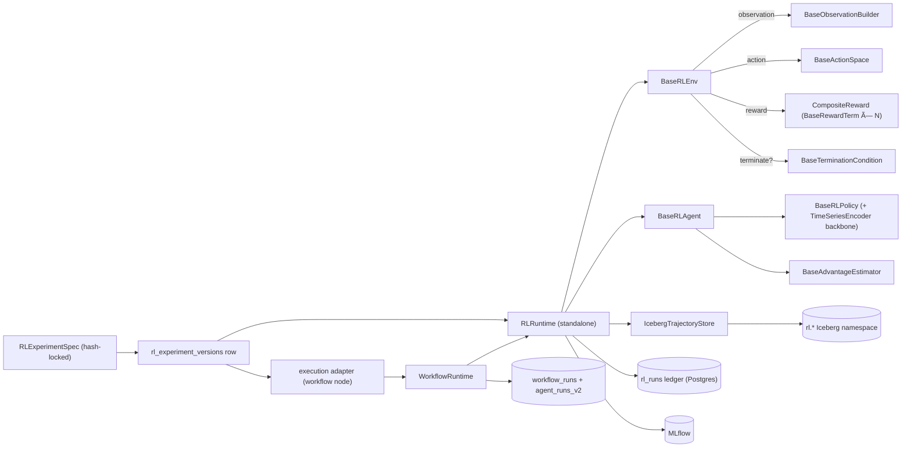

import RunnableCode from '@site/src/components/RunnableCode';

# Reinforcement learning framework

The RL layer in AQP follows a metaclass-driven, registry-first design
inspired by FinRL's library structure and FinRobot's tool-augmented
agent runtime. Every concrete component (env, observation, action,
reward, termination, policy, agent, data pipeline, ensembler,
experiment, trajectory store) auto-registers through
[`aqp_rl/src/aqp_rl/core/base.py`](https://github.com/julianwileymac/agentic_quant_platform/blob/main/aqp_rl/src/aqp_rl/core/base.py)
so the API and the lab UI can browse them at runtime.

This page is the canonical entry point. For shorter cuts:

- [rl-lab](./rl-lab.md) — interactive RL Lab + builders.
- [rl-components](./rl-components.md) — auto-generated component
  reference (browse via `/rl/components` in the operator UI).
- [rl-iceberg](./rl-iceberg.md) — Iceberg trajectory / equity /
  reward-decomposition tables and DuckDB views.
- [rl-market-dynamics](./rl-market-dynamics.md) — Phase 6 slice-and-merge regime
  labeller + `RegimeAwareObservation` +
  `RegimeStratifiedEvaluation`.
- [rl-prudex-evaluation](./rl-prudex-evaluation.md) — Phase 9
  PRUDEX-Compass framework (17 measures, 5 visualisations).
- [rl-finagent](./rl-finagent.md) — Phase 10 FinAgent multimodal
  5-stage LLM-hybrid adapter.
- [weight-centric-pipeline](./weight-centric-pipeline.md) — FinRL-X
  four-stage `f_S → f_A → f_T → f_R` pipeline.
- [architecture/decisions/010-rl-production-enhancement](../../architecture/decisions/010-rl-production-enhancement.md) —
  full Phase 1-12 production-enhancement ADR.

## Phase 1-12 production enhancements (May 2026)

The Phase 1-12 deliverables documented in
[ADR-010](../../architecture/decisions/010-rl-production-enhancement.md)
add the following components under their canonical `rl_alias` /
`kind`:

| Phase | Components |
| --- | --- |
| 1 (Rewards) | `differential_sharpe`, `differential_downside`, `implementation_shortfall`, `running_inventory`, `exp_utility`, `hindsight`, `dp_distillation` |
| 2 (Analytical) | `almgren_chriss_residual`, `avellaneda_stoikov_residual` (+ `aqp_rl.analytical.{almgren_chriss,avellaneda_stoikov,cartea_jaimungal}` helpers) |
| 3 (Envs) | `tradesim_algotrading`, `tradesim_portfolio`, `tradesim_execution`, `tradesim_hft`, `finagent_trading` |
| 4 (Agents) | `eiie`, `deeptrader`, `investor_imitator`, `eteo`, `opd`, `deepscalper`, `hft_ddqn`, `ppo_inhouse` |
| 5 (Backbones) | `eiie_conv`, `sagcn`, `market_scorer`, `hft_qnet`, `eteo_dual_head`, `pd_dual_rnn`, `sarl_lstm` |
| 6 (MDM) | `slice_and_merge_regime_flow` (analysis flow), `regime_aware` observation, `regime_stratified` experiment |
| 7 (CSDI) | `csdi_imputed` dataset kind |
| 8 (Validation) | `CombinatorialPurgedKFold`, `probability_of_backtest_overfitting`, `rademacher_anti_serum`, `deflated_sharpe_ratio`, `walk_forward_anchored`, `walk_forward_rolling`, `benjamini_hochberg`, `holm_bonferroni`, `validation_suite` experiment |
| 9 (PRUDEX) | `PrudexMetrics`, `PrudexReport`, `compute_prudex_metrics`, 5 chart helpers, `prudex_compass` experiment |
| 10 (FinAgent) | `finagent_layered` adapter + 5 AgentSpec YAMLs under `configs/agents/finagent/` + 3 tools under `aqp/agents/tools/finagent/` |
| 11 (Replay) | `GeneralReplayBuffer`, `PrioritizedReplayBuffer`, `NStepInfoReplayBuffer` |
| 12 (Parity) | Determinism + kill-switch tests around `WeightCentricPipeline` + `WeightToOrders` |

## Contracts

Two execution shapes share the same hash-locked spec. The standalone
shape is the original RL pipeline; the workflow-wrapped shape lets
`WorkflowRuntime` compose RL training into larger multi-stage
agentic pipelines (AGENTS rule 40 + ADR-005 + Phase 5 of the
orchestration refactor).



## Hard rules

1. **All RL train / evaluate / paper / replay / walk-forward goes
   through
   [`aqp_rl/src/aqp_rl/runtime.py::RLRuntime`](https://github.com/julianwileymac/agentic_quant_platform/blob/main/aqp_rl/src/aqp_rl/runtime.py)**
   (AGENTS rule 16). Tasks under
   [`aqp_rl/tasks/rl_tasks.py`](https://github.com/julianwileymac/agentic_quant_platform/blob/main/aqp_rl/tasks/rl_tasks.py)
   and API routes under
   [`aqp_rl/api/routes/rl.py`](https://github.com/julianwileymac/agentic_quant_platform/blob/main/aqp_rl/api/routes/rl.py)
   wrap it; they never call `agent.train` directly.
2. **`rl_experiment_versions` rows are immutable, hash-locked.**
   Re-snapshotting via
   [`aqp_rl/src/aqp_rl/registry.py::persist_spec`](https://github.com/julianwileymac/agentic_quant_platform/blob/main/aqp_rl/src/aqp_rl/registry.py)
   inserts a new row when the SHA-256 of the spec changes (AGENTS
   rule 17).
3. **Trajectory persistence flows through
   [`IcebergTrajectoryStore`](https://github.com/julianwileymac/agentic_quant_platform/blob/main/aqp_rl/src/aqp_rl/trajectories/iceberg_writer.py)**
   → `iceberg_catalog.append_arrow` (AGENTS rule 18).
4. **All concrete components register through the
   [`RLComponent`](https://github.com/julianwileymac/agentic_quant_platform/blob/main/aqp_rl/src/aqp_rl/core/base.py)
   metaclass.** Set `rl_kind` to one of the canonical kinds; the
   metaclass calls `@register` automatically (AGENTS rule 19).
5. **LLM calls inside `LLMHybridAgent` route through
   [`router_complete`](https://github.com/julianwileymac/agentic_quant_platform/blob/main/aqp/llm/providers/router.py)**
   (AGENTS rule 20).
6. **Advantage estimation goes through
   [`BaseAdvantageEstimator`](https://github.com/julianwileymac/agentic_quant_platform/blob/main/aqp_rl/src/aqp_rl/advantage/base.py)**
   (AGENTS rule 36). The native
   `ReinforcePlusPlusAdvantage` / `GRPOAdvantage` / `GAEAdvantage`
   register through the metaclass alongside envs / rewards /
   policies.
7. **Policy backbones go through
   [`TimeSeriesEncoder`](https://github.com/julianwileymac/agentic_quant_platform/blob/main/aqp_rl/src/aqp_rl/policies/backbones/base.py)**
   (AGENTS rule 37). The four shipped backbones —
   `TransformerBackbone`, `RecurrentBackbone`,
   `AutoencoderBackbone`, `PatchTSTBackbone` — wrap existing
   `aqp_models.models` modules so the policy network and the
   offline ML stack share one source of truth.
8. **Weight-centric portfolio actions go through the FinRL-X
   four-stage pipeline
   [`WeightCentricPipeline`](https://github.com/julianwileymac/agentic_quant_platform/blob/main/aqp_rl/src/aqp_rl/portfolio/pipeline.py)**
   (`f_S → f_A → f_T → f_R`, AGENTS rule 38). Risk overlay (`f_R`)
   re-uses
   [`RiskLimits`](https://github.com/julianwileymac/agentic_quant_platform/blob/main/aqp/risk/limits.py)
   so offline backtests and live paper paths produce identical
   target-weight vectors.

## Hash-lock invariant in practice

The `*_spec_versions` table is the contract that makes RL replayable.
Three concrete consequences:

- **Same content → same version.** Re-posting an identical spec
  returns the existing `version_id`. No duplicate row, no
  side-effect.
- **Any field change → new version.** Bump a hyperparameter, swap a
  reward term, retune the LR schedule — the SHA-256 changes, the
  row is new. The old row stays forever.
- **Replay is across data, not across code.** When you
  `RLRuntime(spec).replay(new_window)`, the runtime loads the
  pinned `version_id` from `rl_runs`, rebuilds the env / agent
  exactly as the original train run, and feeds it the new bars.
  This is how "would this policy have held up in Q1 2024?"
  questions get a deterministic answer.

This is why
[`aqp_rl/src/aqp_rl/registry.py::persist_spec`](https://github.com/julianwileymac/agentic_quant_platform/blob/main/aqp_rl/src/aqp_rl/registry.py)
is the only sanctioned path: every direct mutation to the table
would corrupt the replay contract.

## Packages

| Path | Purpose |
| --- | --- |
| [aqp_rl/src/aqp_rl/core/](https://github.com/julianwileymac/agentic_quant_platform/tree/main/aqp_rl/src/aqp_rl/core) | Abstract bases + `RLComponent` metaclass + schema helpers. |
| [aqp_rl/src/aqp_rl/spec.py](https://github.com/julianwileymac/agentic_quant_platform/blob/main/aqp_rl/src/aqp_rl/spec.py) | `RLExperimentSpec` declarative blueprint. |
| [aqp_rl/src/aqp_rl/runtime.py](https://github.com/julianwileymac/agentic_quant_platform/blob/main/aqp_rl/src/aqp_rl/runtime.py) | `RLRuntime` single sanctioned executor. |
| [aqp_rl/src/aqp_rl/envs/](https://github.com/julianwileymac/agentic_quant_platform/tree/main/aqp_rl/src/aqp_rl/envs) | Concrete envs (existing + FinRL ports + TradeSim + FinAgent). |
| [aqp_rl/src/aqp_rl/rewards/](https://github.com/julianwileymac/agentic_quant_platform/tree/main/aqp_rl/src/aqp_rl/rewards) | Composable reward terms. |
| [aqp_rl/src/aqp_rl/observations/](https://github.com/julianwileymac/agentic_quant_platform/tree/main/aqp_rl/src/aqp_rl/observations) | Observation builders. |
| [aqp_rl/src/aqp_rl/actions/](https://github.com/julianwileymac/agentic_quant_platform/tree/main/aqp_rl/src/aqp_rl/actions) | Action-space implementations. |
| [aqp_rl/src/aqp_rl/terminations/](https://github.com/julianwileymac/agentic_quant_platform/tree/main/aqp_rl/src/aqp_rl/terminations) | End-of-episode predicates. |
| [aqp_rl/src/aqp_rl/data_pipelines/](https://github.com/julianwileymac/agentic_quant_platform/tree/main/aqp_rl/src/aqp_rl/data_pipelines) | Iceberg / Yahoo / Alpaca / streaming / replay pipelines. |
| [aqp_rl/src/aqp_rl/agents/](https://github.com/julianwileymac/agentic_quant_platform/tree/main/aqp_rl/src/aqp_rl/agents) | SB3 / ElegantRL / RLlib / CleanRL / LLM-hybrid + classical / Q-family / actor-critic / evolutionary. |
| [aqp_rl/src/aqp_rl/policies/](https://github.com/julianwileymac/agentic_quant_platform/tree/main/aqp_rl/src/aqp_rl/policies) | Policy backbones (`TimeSeriesEncoder` subclasses). |
| [aqp_rl/src/aqp_rl/advantage/](https://github.com/julianwileymac/agentic_quant_platform/tree/main/aqp_rl/src/aqp_rl/advantage) | Advantage estimators (native REINFORCE++ / GRPO / GAE). |
| [aqp_rl/src/aqp_rl/ensemblers/](https://github.com/julianwileymac/agentic_quant_platform/tree/main/aqp_rl/src/aqp_rl/ensemblers) | Walk-forward / best-of-N / curriculum / meta-ensemble. |
| [aqp_rl/src/aqp_rl/experiments/](https://github.com/julianwileymac/agentic_quant_platform/tree/main/aqp_rl/src/aqp_rl/experiments) | Experiment runners (basic / walk-forward / ablation / alpha-backtest / regime-stratified / validation-suite / PRUDEX-Compass). |
| [aqp_rl/src/aqp_rl/applications/](https://github.com/julianwileymac/agentic_quant_platform/tree/main/aqp_rl/src/aqp_rl/applications) | One-call FinRL-style apps (stock / portfolio / crypto / fundamentals / paper). |
| [aqp_rl/src/aqp_rl/portfolio/](https://github.com/julianwileymac/agentic_quant_platform/tree/main/aqp_rl/src/aqp_rl/portfolio) | `WeightCentricPipeline` (FinRL-X `f_S → f_A → f_T → f_R`). |
| [aqp_rl/src/aqp_rl/trajectories/](https://github.com/julianwileymac/agentic_quant_platform/tree/main/aqp_rl/src/aqp_rl/trajectories) | Iceberg-backed trajectory writer + DuckDB views. |
| [aqp_rl/src/aqp_rl/bridges/](https://github.com/julianwileymac/agentic_quant_platform/tree/main/aqp_rl/src/aqp_rl/bridges) | Backtest-engine + WorkflowRuntime adapters. |
| [aqp/persistence/models_rl.py](https://github.com/julianwileymac/agentic_quant_platform/blob/main/aqp/persistence/models_rl.py) | ORM for specs, versions, runs, evaluations, refs, registrations. |
| [aqp_rl/api/routes/rl.py](https://github.com/julianwileymac/agentic_quant_platform/blob/main/aqp_rl/api/routes/rl.py) | REST surface. |
| [aqp_rl/tasks/rl_tasks.py](https://github.com/julianwileymac/agentic_quant_platform/blob/main/aqp_rl/tasks/rl_tasks.py) | Celery tasks driven by `RLRuntime`. |
| [aqp_client/src/routes/rl/](https://github.com/julianwileymac/agentic_quant_platform/tree/main/aqp_client/src/routes/rl) | RL Lab + builders + library + runs UI (active Vite frontend). |
| [aqp_rl/configs/](https://github.com/julianwileymac/agentic_quant_platform/tree/main/aqp_rl/configs) | Preset / reward / observation / data-pipeline YAMLs. |
| [aqp_rl/tests/](https://github.com/julianwileymac/agentic_quant_platform/tree/main/aqp_rl/tests) | Hermetic test suite. |

Legacy `aqp.rl.*` is a deprecation shim that re-exports from
`aqp_rl.*`; new code imports from `aqp_rl` directly.

## Spec lifecycle

1. **Author** an `RLExperimentSpec` (YAML or in-code Pydantic).
2. **Persist** via
   [`aqp_rl.registry.persist_spec`](https://github.com/julianwileymac/agentic_quant_platform/blob/main/aqp_rl/src/aqp_rl/registry.py)
   → `rl_experiment_specs` + `rl_experiment_versions` (hash-locked
   snapshot).
3. **Run** via `RLRuntime.train` / `.evaluate` / `.paper` / `.replay` /
   `.walk_forward` → opens an `rl_runs` row, builds the env / agent
   from `build_from_config`, drives training, persists per-step
   trajectories to Iceberg, finalises the run row.
4. **Inspect** via the API
   (`/rl/runs/{id}/equity`, `/trajectories`,
   `/reward-decomposition`, `/episodes`) and the lab UI run-detail
   page (equity chart, reward decomposition, episode summary,
   replay slider).

## Worked example: train + replay

Goal: snapshot a 50k-step PPO experiment, train it, inspect the
ledger row, read trajectories from Iceberg, and replay against
fresh data — all from this page.

### Step 1 — snapshot the spec

The experiment YAML lives at
[`aqp_rl/configs/experiments/my_first_rl.yaml`](https://github.com/julianwileymac/agentic_quant_platform/tree/main/aqp_rl/configs/experiments).
Dispatch the train run:

<RunnableCode runner="stackblitz" stackblitzTemplate="typescript" code={`
const r = await fetch("http://localhost:8000/rl/runs", {
  method: "POST",
  headers: { "Content-Type": "application/json" },
  body: JSON.stringify({
    spec_path: "aqp_rl/configs/experiments/my_first_rl.yaml",
    mode: "train",
  }),
});
const { task_id, rl_run_id, spec_version_id, spec_hash } = await r.json();
console.log({ task_id, rl_run_id, spec_version_id, spec_hash });
`} />

Notice `spec_hash` in the response — that is the immutable hash-lock
key. Re-posting the same YAML returns the same `spec_version_id`.

### Step 2 — tail progress

```bash
curl -N http://localhost:8000/chat/stream/<task_id>
```

Frames arrive in the canonical envelope (AGENTS rule 4). Expected
stages: `start` → `data.loaded` → `env.built` → `agent.built` →
`train.step` (×many, sparse) → `train.checkpoint` → `done`.

### Step 3 — inspect the ledger

The agent-safe read is `data.rl.list` / `data.rl.describe`:

```bash
curl -X POST http://localhost:8000/mcp/data/tools/data.rl.describe/invoke \
    -H "Content-Type: application/json" \
    -H "Authorization: Bearer $(aqp-cli auth token)" \
    -d '{"rl_run_id": "<from-step-1>"}'
```

The response carries `status`, `mean_reward`, `total_timesteps`,
`spec_version_id`, MLflow run id, and the trajectory namespace.

### Step 4 — read trajectories from Iceberg

Pyodide does not ship PyIceberg, but it ships duckdb + pyarrow, and
the trajectory writer exports a parquet-compatible view. The
snippet below shows the analytical pattern with inline sample data
so it runs in your browser.

<RunnableCode runner="pyodide" pyodidePackages={["duckdb", "pyarrow"]} code={`
import duckdb
con = duckdb.connect()

# Inline sample of what data.rl.trajectories returns.
con.execute("""
    CREATE TABLE trajectories AS SELECT * FROM (VALUES
        (0, 0, 0.0012, 0.10),
        (0, 1, -0.0008, 0.10),
        (0, 2, 0.0021, 0.15),
        (0, 3, 0.0007, 0.15),
        (1, 0, -0.0014, 0.05),
        (1, 1, 0.0033, 0.20),
        (1, 2, 0.0019, 0.20)
    ) AS t(episode, step, reward, action_weight)
""")

print(con.execute("""
    SELECT episode,
           COUNT(*) AS steps,
           SUM(reward) AS episode_return,
           AVG(action_weight) AS avg_weight
    FROM trajectories
    GROUP BY episode
    ORDER BY episode
""").fetchdf())
`} />

The same pattern works against the real Iceberg trajectory tables
via the
[`data.iceberg.read_snapshot`](https://github.com/julianwileymac/agentic_quant_platform/blob/main/aqp/data/mcp/tools/iceberg.py)
MCP tool. The tables are:

- `aqp_silver_rl_trajectories.<spec_hash>` — per-step `(episode, step, obs_hash, action, reward, value, log_prob)`
- `aqp_silver_rl_equity_curves.<spec_hash>` — per-step equity / drawdown
- `aqp_silver_rl_action_logs.<spec_hash>` — full action vectors per step
- `aqp_silver_rl_reward_decomposition.<spec_hash>` — per-term reward attribution

### Step 5 — replay against fresh data

The killer feature of hash-locked specs: replay the trained policy
against a different time window WITHOUT touching the spec.

<RunnableCode runner="stackblitz" stackblitzTemplate="typescript" code={`
const r = await fetch("http://localhost:8000/rl/runs/<rl_run_id_from_step_1>/replay", {
  method: "POST",
  headers: { "Content-Type": "application/json" },
  body: JSON.stringify({ start: "2024-01-01", end: "2024-03-31" }),
});
const { task_id, rl_run_id: replay_run_id, reused_spec_version_id } = await r.json();
console.log({ task_id, replay_run_id, reused_spec_version_id });
`} />

The new `rl_runs` row carries `parent_run_id` and the SAME
`spec_version_id` as the original train run. Two `rl_runs` rows,
one `rl_experiment_versions` row.

### Step 6 — verify

- `rl_experiment_versions` row with the recorded `spec_hash`.
- Two `rl_runs` rows referencing it (`train` + `replay`).
- Trajectory tables in `aqp_silver_rl_trajectories.<spec_hash>`.
- MLflow runs visible at `http://localhost:5000/#/experiments`.
- Topbar `KillSwitch` shows green; `should_halt` returned false on
  every step.

### What next

- Walk the full tutorial: [tutorials/first-rl-experiment](../../tutorials/first-rl-experiment.md).
- Compose into a workflow:
  [tutorials/first-agent-workflow](../../tutorials/first-agent-workflow.md)
  + [concepts/agentic/workflow-studio](../agentic/workflow-studio.md).
- Add a custom reward term: [rl-components](./rl-components.md).
- Browse the trajectory schema: [rl-iceberg](./rl-iceberg.md).

## Inspiration sources

- **FinRL** (`aqp_snippets/inspiration/FinRL-master`) — env taxonomy
  (StockTrading, StockPortfolio, multi-crypto), `DataProcessor` /
  `FeatureEngineer` / `df_to_array`, `DRLAgent` / `DRLEnsembleAgent`,
  composite reward. Ported as registered presets in
  `aqp_rl.envs.finrl_*`, `aqp_rl.data_pipelines.*`, and the
  `WalkForwardEnsembler`.
- **FinRobot** (`aqp_snippets/inspiration/FinRobot-master`) —
  multi-agent LLM workflow + tool-augmented analysis. Bridged via
  `LLMHybridAgent` (LLM proposes, RL refines) and `FundamentalBuilder`.
- **FinRL-X** — the four-stage weight-centric pipeline (`f_S → f_A
  → f_T → f_R`) is ported as
  [`WeightCentricPipeline`](https://github.com/julianwileymac/agentic_quant_platform/blob/main/aqp_rl/src/aqp_rl/portfolio/pipeline.py)
  (AGENTS rule 38).
- **FinAgent** — five-stage LLM-hybrid adapter ported as
  `finagent_layered` (ADR-010, Phase 10).
- **PRUDEX-Compass** — 17-measure evaluation framework ported as
  `prudex_compass` experiment + five chart helpers (ADR-010,
  Phase 9).

## Deeper reads

- [rl-lab](./rl-lab.md) — interactive RL Lab + builders.
- [rl-components](./rl-components.md) — full component catalogue.
- [rl-iceberg](./rl-iceberg.md) — trajectory persistence contract.
- [rl-policy-backbones](./rl-policy-backbones.md) — `TimeSeriesEncoder` subclasses.
- [rl-market-dynamics](./rl-market-dynamics.md) — regime labeller + observation.
- [rl-prudex-evaluation](./rl-prudex-evaluation.md) — PRUDEX-Compass.
- [rl-finagent](./rl-finagent.md) — FinAgent multimodal adapter.
- [weight-centric-pipeline](./weight-centric-pipeline.md) — `f_S → f_A → f_T → f_R`.
- [agentic-rl](./agentic-rl.md) — RL-as-agent integration patterns.
- [architecture/decisions/010-rl-production-enhancement](../../architecture/decisions/010-rl-production-enhancement.md) — full Phase 1-12 ADR.
- [reference/api](../../reference/api/index.mdx) — the `rl` tag in the interactive playground.
- [reference/python/aqp_rl](../../reference/python/index.mdx) — auto-generated `aqp_rl` Python reference.
