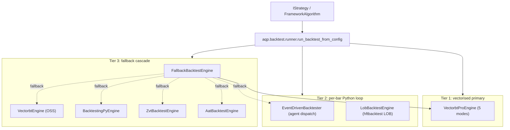
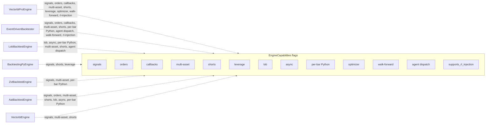

import RunnableCode from '@site/src/components/RunnableCode';

# Backtest engines

> Doc map: [intro](../../intro/index.md) ·
> vbt-pro deep dive: [vbtpro-integration](./vbtpro-integration.md) ·
> LOB / tick-replay: [hft-backtest](./hft-backtest.md) ·
> Class hierarchy: [class-diagram](../platform/class-diagram.md) ·
> Worked tutorial: [tutorials/first-backtest](../../tutorials/first-backtest.md) ·
> Recipe: [how-to/recipes/run-a-backtest-from-yaml](../../how-to/recipes/run-a-backtest-from-yaml.md).

AQP runs every backtest through one of seven interchangeable engines
behind the
[`BaseBacktestEngine`](https://github.com/julianwileymac/agentic_quant_platform/blob/main/aqp/backtest/base.py)
ABC. The runner, persistence, MLflow tracking, and UI never branch on
which engine produced a run — every engine returns the same
[`BacktestResult`](https://github.com/julianwileymac/agentic_quant_platform/blob/main/aqp/backtest/result.py).

The seven engines fall into **three tiers** so you can pick one
without scanning a 7-row table every time:



## Tier 1 — Vectorised primary (`VectorbtProEngine`)

Default for research workloads, parameter screens, walk-forward
optimisation, factor studies, and any backtest that does not need
per-bar Python.

Five constructor modes select the inner vbt-pro path:

- `signals` — array-based entries / exits / sizing
- `orders` — column-of-orders DataFrame
- `optimizer` — built-in vbt-pro `Param` sweeps
- `holding` — buy-and-hold baseline
- `random` — random-signal baseline

Implementation:
[aqp/backtest/vbtpro/engine.py::VectorbtProEngine](https://github.com/julianwileymac/agentic_quant_platform/blob/main/aqp/backtest/vbtpro/engine.py).
Full mode dispatch + Numba-jit constraints in
[vbtpro-integration](./vbtpro-integration.md).

## Tier 2 — Per-bar Python loop

Two engines run a true Python `on_bar` callback. Use them when you
need synchronous decisions inside the inner loop — agent dispatch,
event-sourced LOB replay, custom callbacks vbt-pro can't represent.

- [`EventDrivenBacktester`](https://github.com/julianwileymac/agentic_quant_platform/blob/main/aqp/backtest/event_driven.py) —
  the only engine that exposes `context['agents']` to strategies via
  [`AgentDispatcher`](https://github.com/julianwileymac/agentic_quant_platform/blob/main/aqp/strategies/agentic/agent_dispatcher.py),
  with TTL + LRU dedup of LLM calls.
- [`LobBacktestEngine`](https://github.com/julianwileymac/agentic_quant_platform/blob/main/aqp/backtest/hft.py) —
  hftbacktest-driven LOB tick replay; latency + queue models;
  market-making + execution strategies.

## Tier 3 — Fallback cascade

[`FallbackBacktestEngine`](https://github.com/julianwileymac/agentic_quant_platform/blob/main/aqp/backtest/fallback.py)
tries `primary` first, then walks `fallbacks` until one returns a
`BacktestResult`. The OSS engines exist mainly as cascade fallbacks
and for license-constrained deployments:

- `VectorbtEngine` — OSS vectorbt; signals only (Apache-2.0).
- `BacktestingPyEngine` — single-symbol with `.optimize(...)`
  grid + SAMBO (AGPL-3.0).
- `ZvtBacktestEngine` — permissive-licence CN-bar fallback (MIT).
- `AatBacktestEngine` — async / synthetic LOB fallback (Apache-2.0).

NautilusTrader is **not** wired in (LGPL-3.0; out of scope).

## EngineCapabilities

Every engine declares its surface via
[`EngineCapabilities`](https://github.com/julianwileymac/agentic_quant_platform/blob/main/aqp/backtest/capabilities.py)
on the class attribute. Agents introspect via the
`engine_capabilities` tool; humans can call
`aqp.backtest.engine_capabilities_index()`.



Pick by capability:

- **Vectorised research / parameter screens / WFO** → `VectorbtProEngine`
- **Per-bar agent dispatch (LLM in the loop)** → `EventDrivenBacktester`
- **LOB tick replay, latency + queue modelling** → `LobBacktestEngine`
- **Synthetic LOB realism (OSS path)** → `AatBacktestEngine`
- **Chinese-market data** → `ZvtBacktestEngine`
- **Single-symbol grid optimisation** → `BacktestingPyEngine` with
  `.optimize(ranges, method="grid"|"sambo", ...)`

## When NOT to use the primary engine

The vbt-pro inner loop is Numba-jit compiled — `signal_func_nb` /
`order_func_nb` cannot call Python objects per bar. Two patterns
this rules out:

1. **Per-bar agent consults.** Switch to `EventDrivenBacktester` and
   call `context['agents'].consult(spec_name, inputs, ttl=...)` from
   inside `on_bar`. The
   [`AgentDispatcher`](https://github.com/julianwileymac/agentic_quant_platform/blob/main/aqp/strategies/agentic/agent_dispatcher.py)
   handles TTL + LRU dedup so the LLM gateway is not hammered.
2. **Per-bar custom Python that vbt-pro cannot express.** If the
   inner loop needs a stateful Python object (custom risk model,
   bespoke order book heuristics), use event-driven.

If you _can_ vectorise — or precompute a panel of decisions ahead of
time — use vbt-pro `AgenticVbtAlpha` in precompute mode. The
`vectorbtpro` mode dispatch lives in
[vbtpro-integration](./vbtpro-integration.md).

## Dispatching from YAML

Three equivalent ways to pick an engine inside a strategy recipe:

```yaml
# 1) Engine shortcut (cleanest).
backtest:
  engine: vbt-pro:signals    # or vbt-pro:orders / :optimizer / :holding / :random
  kwargs:
    initial_cash: 100000
    fees: 0.0005

# 2) Explicit class + module.
backtest:
  class: VectorbtProEngine
  module_path: aqp.backtest.vbtpro.engine
  kwargs:
    mode: orders
    initial_cash: 100000

# 3) Fallback cascade.
backtest:
  engine: fallback
  primary: vbt-pro
  fallbacks: [event, aat, zvt, vectorbt]
```

| Shortcut | Resolves to | Notes |
| --- | --- | --- |
| `default` / `event` / `event-driven` | `EventDrivenBacktester` | Backward-compatible default. |
| `primary` / `vbt-pro` / `vectorbt-pro` | `VectorbtProEngine` | Tier 1. |
| `vbt-pro:signals` / `:orders` / `:optimizer` / `:holding` / `:random` | `VectorbtProEngine` | Mode injection. |
| `vectorbt` / `vbt` | `VectorbtEngine` | OSS fallback. |
| `backtesting` / `bt` | `BacktestingPyEngine` | Single-symbol. |
| `zvt` | `ZvtBacktestEngine` | Lazy import; CN bars. |
| `aat` | `AatBacktestEngine` | Lazy import; async LOB. |
| `hft` / `lob` | `LobBacktestEngine` | Tick replay. |
| `fallback` / `cascade` | `FallbackBacktestEngine` | Cascade with `DEFAULT_FALLBACK_CHAIN = ("event", "aat", "zvt", "vectorbt")`. |

[`aqp.backtest.runner.run_backtest_from_config`](https://github.com/julianwileymac/agentic_quant_platform/blob/main/aqp/backtest/runner.py)
routes every YAML through the right engine and stamps `engine` into
`BacktestRun.metrics`.

## Agent + ML components

Strategies plug agents and ML models into either path:

- **Vectorised (vbt-pro)** — panel components in
  [aqp/strategies/vbtpro/](https://github.com/julianwileymac/agentic_quant_platform/tree/main/aqp/strategies/vbtpro):
  - `AgenticVbtAlpha` — precompute or per-window agent dispatch into
    wide entries / exits / size arrays.
  - `MLVbtAlpha` — wraps any `aqp_models.base.Model` (or MLflow URI)
    and emits arrays via threshold / top-k / rank policies.
  - `AgenticOrderModel` — drives `Portfolio.from_orders` from cached
    agent decisions.
- **Event-driven** — `context['agents']` exposes `AgentDispatcher`.
  See
  [`AgentAwareMomentumAlpha`](https://github.com/julianwileymac/agentic_quant_platform/blob/main/aqp/strategies/agentic/agent_aware_alpha.py)
  for a worked example.

For RL injection, every engine that declares
`EngineCapabilities.supports_rl_injection=True` accepts the
[`WeightCentricPipeline`](https://github.com/julianwileymac/agentic_quant_platform/blob/main/aqp_rl/src/aqp_rl/portfolio/pipeline.py)
output through `context['rl_agent']` (AGENTS rule 38).

## Unified result shape

Every engine returns a `BacktestResult` with:

- `equity_curve: pd.Series` indexed by timestamp.
- `trades: pd.DataFrame` with `timestamp, vt_symbol, side, quantity,
  price, commission, slippage, strategy_id`.
- `orders: pd.DataFrame`.
- `summary: dict` — `sharpe`, `sortino`, `max_drawdown`, `calmar`,
  `total_return`, `final_equity`, `n_bars`, `volatility_ann`,
  `n_trades`, `turnover`, `engine`. Engine-specific keys live under
  `vbt_*`, `bt_*`, `zvt_*`, `aat_*`, `hft_*` so downstream code can
  light up native stats without re-running.

## Hash-locked specs + audit ledger

Every dispatched backtest writes a row to
[`backtest_runs`](https://github.com/julianwileymac/agentic_quant_platform/blob/main/aqp/persistence/models.py)
with `experiment_id` (AGENTS rule 34) and a reference to the
hash-locked
[`StrategySpec`](https://github.com/julianwileymac/agentic_quant_platform/tree/main/aqp/strategies)
version. The same spec hash returns the same `*_spec_versions` row
on re-dispatch; content changes always create a new version. This
makes every backtest replayable.

Gold-tier output lands at `aqp_gold_backtests.run_<run_id>` via
[`iceberg_catalog.append_arrow`](https://github.com/julianwileymac/agentic_quant_platform/blob/main/aqp/data/iceberg_catalog.py)
with `medallion_layer="gold"` (AGENTS rule 3, rule 21).

## Worked example: dispatch + tearsheet

Goal: dispatch a backtest, tail its WebSocket frames, list the
ledger row via DataMCP, render an equity curve in your browser.

### Step 1 — dispatch

<RunnableCode runner="stackblitz" stackblitzTemplate="typescript" code={`
const r = await fetch("http://localhost:8000/backtest", {
  method: "POST",
  headers: { "Content-Type": "application/json" },
  body: JSON.stringify({
    strategy_config_path: "configs/strategies/momentum_demo.yaml",
    start: "2024-01-01",
    end: "2024-06-30",
    engine: "vbt-pro:signals",
  }),
});
const { task_id, run_id } = await r.json();
console.log({ task_id, run_id });
`} />

### Step 2 — tail the WebSocket

```bash
curl -N http://localhost:8000/chat/stream/<task_id>
```

Frames arrive in the canonical `{task_id, stage, message, timestamp,
**extras}` envelope (AGENTS rule 4). Expected stages:
`start` → `bar.processed` (×N) → `metrics.computed` → `done`.

### Step 3 — list via DataMCP

The `data.backtests.list` tool is the agent-safe alternative to a
raw `SELECT * FROM backtest_runs`. From any MCP client:

```bash
curl -X POST http://localhost:8000/mcp/data/tools/data.backtests.list/invoke \
    -H "Content-Type: application/json" \
    -H "Authorization: Bearer $(aqp-cli auth token)" \
    -d '{"limit": 5, "order_by": "started_at_desc"}'
```

### Step 4 — equity curve in Pyodide

Render the equity curve client-side from inline sample points so the
snippet stays self-contained. Replace with a fetch to
`/analytics/portfolio/<run_id>/equity-curve.json` when running against
the real platform.

<RunnableCode runner="pyodide" pyodidePackages={["matplotlib", "numpy"]} code={`
import io, base64
import numpy as np
import matplotlib.pyplot as plt

rng = np.random.default_rng(42)
returns = rng.normal(loc=0.0008, scale=0.012, size=250)
equity = 100000 * np.cumprod(1 + returns)

fig, ax = plt.subplots(figsize=(6, 3))
ax.plot(equity)
ax.set_title("Backtest equity curve (demo)")
ax.set_xlabel("Bar")
ax.set_ylabel("Equity (USD)")
ax.grid(True, alpha=0.3)

buf = io.BytesIO()
fig.savefig(buf, format="png", dpi=100, bbox_inches="tight")
print(f"Rendered {len(buf.getvalue())} bytes")
print(f"Final equity: ${equity[-1]:,.0f}")
print(f"Sharpe (annualised): {returns.mean() / returns.std() * np.sqrt(252):.2f}")
`} />

### Step 5 — verify

- `backtest_runs` row with non-NULL `sharpe`, `engine='VectorbtProEngine'`.
- WebSocket emitted a `stage=done` frame with the matching `run_id`.
- `aqp_gold_backtests.run_<run_id>` Iceberg table exists.
- `data.backtests.describe { run_id }` MCP call returns the full row.

### What next

- Run the full tutorial: [tutorials/first-backtest](../../tutorials/first-backtest.md).
- Make it repeatable: [how-to/recipes/run-a-backtest-from-yaml](../../how-to/recipes/run-a-backtest-from-yaml.md).
- Add a new strategy: [how-to/recipes/add-a-strategy](../../how-to/recipes/add-a-strategy.md).
- Promote to paper: [how-to/recipes/promote-a-bot-to-paper](../../how-to/recipes/promote-a-bot-to-paper.md).

## Deeper reads

- [vbtpro-integration](./vbtpro-integration.md) — vbt-pro mode dispatch, Numba constraints, hooks, walk-forward, `Param` sweeps, `IndicatorFactory` bridge.
- [hft-backtest](./hft-backtest.md) — LOB engine, latency profiles, queue models, the five HFT strategies under `aqp/strategies/hft/`.
- [strategy-lifecycle](./strategy-lifecycle.md) — draft → backtested → paper → live.
- [strategy-development](./strategy-development.md) — composer / simulation / ideation / single / batch / compare routes in the operator UI.
- [factor-research](./factor-research.md) — building factor / alpha strategies.
- [ml-alpha-backtest](./ml-alpha-backtest.md) — `AlphaBacktestExperiment` orchestrator + `MLAlphaBacktestRun` schema.
- [class-diagram](../platform/class-diagram.md) — full engine class hierarchy + `BacktestResult` shape.
- [reference/api](../../reference/api/index.mdx) — the `backtest` tag (interactive playground).
- [reference/python](../../reference/python/index.mdx) — auto-generated reference for `aqp.backtest` and `aqp.strategies`.
