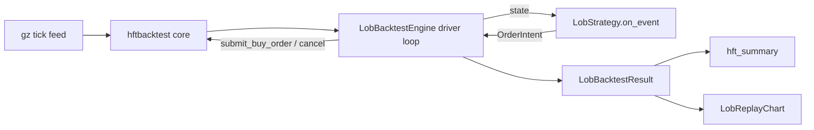

# HFT / LOB backtest engine

> **Audience:** quants running tick-replay backtests for market-making
> or arbitrage strategies, plus agents that need to evaluate a strategy
> spec on cached microstructure data.

The HFT engine in [aqp/backtest/hft.py](../aqp/backtest/hft.py) wraps
[hftbacktest 2.0+](https://github.com/nkaz001/hftbacktest) so any
``LobStrategy`` subclass under
[aqp/strategies/hft/](../aqp/strategies/hft/) becomes runnable
end-to-end. Five strategies ship out of the box:

- ``GLFTMM`` — Guéant-Lehalle-Fernandez-Tapia closed-form MM.
- ``AvellanedaStoikovMM`` — finite-horizon Avellaneda-Stoikov MM.
- ``GridMM`` — symmetric grid quoting around mid.
- ``ImbalanceAlphaMM`` — order-book imbalance skew.
- ``BasisAlphaMM`` — cross-instrument basis as fair value.
- ``QueueAwareMM`` — queue-position-aware MM for large-tick assets.

## Install

The engine ships behind the ``[hft]`` extra. Because hftbacktest is a
Rust crate exposed via PyO3, you need a Rust toolchain at install
time. See [aqp_docs/installation.md](../../intro/installation.md).

## Architecture



Two architecturally important pieces:

1. **Strategy bodies stay pure Python.** ``on_event`` returns a list
   of ``OrderIntent`` records. The engine translates them into
   ``hbt.submit_buy_order`` / ``hbt.cancel`` calls. This keeps the
   strategies LLM-friendly (no Numba constraints) at the cost of a
   Python function call per event — still ~1k events/ms in practice.
2. **Snapshots are bounded.** The driver writes one
   ``(timestamp, equity, position)`` record every ``snapshot_every``
   events. Long replays produce manageable trajectories instead of
   un-renderable equity curves.

## Running a backtest

### Direct API

```python
from aqp.backtest.hft import LobBacktestEngine
from aqp.strategies.hft.alphas import AvellanedaStoikovMM

engine = LobBacktestEngine(
    latency_profile="intp_order_latency",
    queue_model="probabilistic",
    tick_size=0.01,
    lot_size=0.001,
)
strategy = AvellanedaStoikovMM(gamma=0.1, sigma=0.01, k=1.5)
result = engine.run(
    strategy,
    feeds=["btcusdt_20240301.gz"],
    max_events=1_000_000,
    snapshot_every=5_000,
)
print(result.summary["hft_sharpe_sample_aware"])
```

### Celery task (recommended for long replays)

```python
from aqp.tasks.hft_tasks import run_lob_backtest

async_result = run_lob_backtest.delay(
    strategy_alias="AvellanedaStoikovMM",
    strategy_kwargs={"gamma": 0.1, "sigma": 0.01, "k": 1.5},
    dataset_preset="lob_btcusdt_sample",
    max_events=10_000_000,
    snapshot_every=10_000,
)
```

The task emits progress every ~2 seconds with the canonical
``{task_id, stage, message, timestamp, **extras}`` shape (AGENTS rule
4) — extras carry ``events_processed``, ``equity``, and ``position``.

### REST surface

```http
POST /backtest/lob
{
  "strategy": "AvellanedaStoikovMM",
  "dataset_preset": "lob_btcusdt_sample",
  "latency_profile": "intp_order_latency",
  "queue_model": "probabilistic",
  "max_events": 1000000
}
```

→ returns ``{task_id, status, stream_url}`` per
[aqp.api.schemas.TaskAccepted](../aqp/api/schemas.py). The
``stream_url`` is the existing ``/chat/stream/{task_id}`` WebSocket;
no new transport.

### Frontend

Navigate to ``/backtest/lob``. The page wires up the wizard
(strategy / dataset / latency / queue model) and the
``LobReplayChart`` (lightweight-charts equity + position curve).

## Latency / queue models

- ``latency_profile="constant_50us"`` — fixed 50µs round-trip.
- ``latency_profile="intp_order_latency"`` — file-driven model bundled
  with hftbacktest's examples (default).
- ``queue_model="probabilistic"`` — hftbacktest's
  ``ProbQueueModel`` (default).
- ``queue_model="risk_averse"`` — ``RiskAverseQueueModel``.

When a value isn't recognised by your installed hftbacktest version,
the engine logs a warning and falls back to the model's default.

## Interpreting the metrics

The ``BacktestResult.summary`` is augmented by
[aqp/backtest/hft_metrics.py::hft_summary](../aqp/backtest/hft_metrics.py):

| Metric | Meaning |
| --- | --- |
| ``hft_sharpe_sample_aware`` | Sharpe annualised by the actual sample frequency (crypto = 365d, equity = 252d). |
| ``hft_sortino_sample_aware`` | Same for Sortino. |
| ``hft_max_position`` | Largest absolute inventory at any point. |
| ``hft_mean_leverage`` | Mean ``|position_value| / equity``. |
| ``hft_fill_ratio`` | Fills / orders. |

The ``events_processed`` field reflects the number of ``elapse``
calls, not the underlying tick count.

## Custom strategies

Subclass [aqp/strategies/lob.py::LobStrategy](../aqp/strategies/lob.py) and
implement ``on_event(state) -> list[OrderIntent]``. Use the inherited
``buy`` / ``sell`` / ``cancel`` helpers to build intents. Decorate the
class with ``@register("YourMM", source="aqp", category="market_making")``
so the registry index lights up.

## See also

- [aqp_snippets/extractions/_FUTURE_PROMPTS/lob_adapter_prompt.md](https://github.com/julianwileymac/agentic_quant_platform/blob/main/aqp_snippets/extractions/_FUTURE_PROMPTS/lob_adapter_prompt.md) —
  the original spec this implementation closes out.
- [aqp_docs/optimal-control.md](../../concepts/strategy/optimal-control.md) — the JAX HJB closed
  forms that ``GLFTMM`` and ``AvellanedaStoikovMM`` consume.
- [aqp_docs/microstructure-toxicity.md](../../concepts/strategy/microstructure-toxicity.md) — the
  agent loop that mutates strategy YAML on regime flips.
