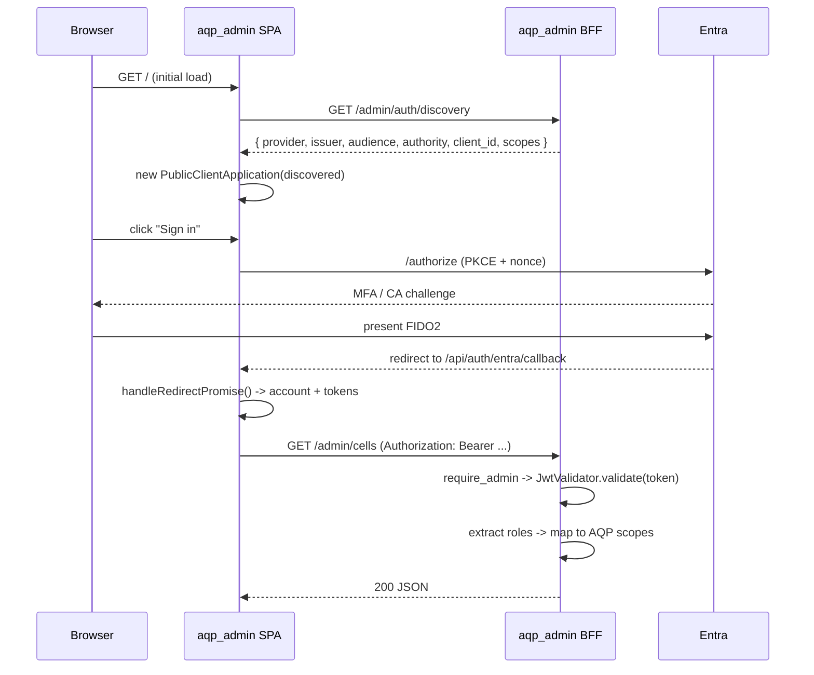

# Wire aqp_admin against the AQP staff Entra tenant

End-to-end procedure for connecting the `aqp_admin` service (backend
BFF + Next.js frontend) to Microsoft Entra ID, using the staff app
registration that the `aqp_entra_directory` Terraform module
provisions.

The result: AQP staff sign in to `manage.aqp.fund` with their
corporate Entra account; the admin BFF validates the resulting
`api://aqp-manage-api` access tokens; the SPA mints tokens via
`@azure/msal-browser` and renews them silently with
`acquireTokenSilent`.

Companion runbooks:

- [Bootstrap the AQP Entra tenant](./entra-terraform-bootstrap.md) —
  the prerequisite that creates the apps + groups + roles.
- [Onboard a new staff member](./entra-onboard-new-staff.md) — group
  + role assignment after the apps land.
- [Rotate Entra secrets](./entra-rotate-secrets.md) — federated
  credentials + break-glass procedures.
- Concept overview:
  [Entra ID as the AQP staff user pool](../concepts/identity/entra-internal-tenant.md).
- ADR:
  [ADR-013 Entra ID as the AQP staff first user pool](../architecture/decisions/013-entra-as-first-pool.md).

## What gets wired

| Surface | What it does |
| --- | --- |
| `aqp_admin/src/aqp_admin/settings.py` | Reads the `AQP_AUTH_MSAL_INTERNAL_*` env vars set by the helper script. Single-tenant when `INTERNAL_TENANT_ID` is set; multi-tenant otherwise. |
| `aqp_admin/src/aqp_admin/deps/identity.py` | JWT validator pinned to the AQP staff Entra v2.0 issuer; verifies `aud=api://aqp-manage-api`, maps `roles` claim through the canonical RBAC lattice. |
| `aqp_admin/src/aqp_admin/api/routers/auth_setup.py` | New `GET /admin/auth/discovery` + `GET /admin/auth/health`. Discovery feeds the SPA's `PublicClientApplication`; health confirms the IdP is reachable. |
| `aqp_admin/frontend/components/auth/AuthProvider.tsx` | Real MSAL flow (`loginRedirect`, `acquireTokenSilent`, `acquireTokenPopup` for step-up). No tenant id hard-coded in the bundle — everything comes from `/admin/auth/discovery`. |
| `scripts/identity/aqp_admin_entra_setup.py` | Operator helper: discovers values from Terraform outputs, prints + optionally writes the env vars, prints the runbook. |

## Prerequisites

- The Terraform stack `entra-internal` has been planned + applied for
  the wiley-tech environment (see
  [bootstrap runbook](./entra-terraform-bootstrap.md)).
- Admin consent has been granted on the staff app's Graph permissions
  (`./scripts/identity/grant_admin_consent.sh "$STAFF_CID"`).
- The `EntraTenantLink` for the AQP staff tenant exists with
  `meta.kind = 'internal'`
  (`python scripts/identity/seed_entra_internal_tenant.py --apply`).

## Step 1 — Generate the env vars

```bash
# Auto-discover from the Terraform outputs in the wiley-tech env.
python scripts/identity/aqp_admin_entra_setup.py
```

The script prints two env blocks. Sample output:

```
# --- Backend env (aqp_admin BFF) ---
AQP_ADMIN_AUTH_PROVIDER=msal_entra
AQP_ADMIN_AUTH_REQUIRED=true
AQP_AUTH_MSAL_INTERNAL_TENANT_ID=12345678-aaaa-bbbb-cccc-deadbeef0000
AQP_AUTH_MSAL_INTERNAL_APP_ID=99999999-1111-2222-3333-444444444444
AQP_AUTH_MSAL_INTERNAL_AUDIENCE=api://aqp-manage-api
AQP_AUTH_OIDC_AUDIENCE=api://aqp-manage-api
AQP_ADMIN_ENTRA_TENANT=12345678-aaaa-bbbb-cccc-deadbeef0000
AQP_ADMIN_ENTRA_REDIRECT_PATH=/api/auth/entra/callback

# --- Frontend env (aqp_admin/frontend) ---
NEXT_PUBLIC_AQP_AUTH_PROVIDER=msal_entra
NEXT_PUBLIC_AQP_ADMIN_API_URL=http://localhost:8900
```

To write a `.env.aqp_admin.entra` file alongside the printout:

```bash
python scripts/identity/aqp_admin_entra_setup.py --write-env
```

The script is intentionally additive: it never overwrites values that
weren't generated by it; the operator merges the block into their
existing Kubernetes manifests / Helm values / `.env.local`.

## Step 2 — Verify the backend can reach Entra

Boot the admin BFF (or restart your existing instance) with the env
vars sourced:

```bash
set -a; source .env.aqp_admin.entra; set +a
uv run aqp-admin  # or: python -m aqp_admin.main
```

Then hit the new health endpoint:

```bash
curl -fsSL http://localhost:8900/admin/auth/health | jq .
```

Expected output:

```json
{
  "ok": true,
  "auth_enabled": true,
  "issuer": "https://login.microsoftonline.com/12345678-aaaa-bbbb-cccc-deadbeef0000/v2.0",
  "audience": "api://aqp-manage-api",
  "jwks_uri": "https://login.microsoftonline.com/12345678-.../discovery/v2.0/keys",
  "discovery_url": "https://login.microsoftonline.com/12345678-.../v2.0/.well-known/openid-configuration",
  "key_count": 7
}
```

If `ok=false`, the JSON body's `stage` field tells you what failed
(`discovery`, `issuer-mismatch`, `jwks`, `jwks-empty`). Common causes:

- Wrong `AQP_AUTH_MSAL_INTERNAL_TENANT_ID` → fix the env var, restart.
- Tenant restrictions block the BFF from reaching `login.microsoftonline.com`
  → talk to Network about egress.

## Step 3 — Verify discovery returns the frontend config

```bash
curl -fsSL http://localhost:8900/admin/auth/discovery | jq .
```

Expected:

```json
{
  "provider": "msal_entra",
  "auth_enabled": true,
  "issuer": "https://login.microsoftonline.com/.../v2.0",
  "audience": "api://aqp-manage-api",
  "scopes": ["api://aqp-manage-api/.default"],
  "jwks_uri": "...",
  "authority": "https://login.microsoftonline.com/...",
  "client_id": "99999999-...",
  "tenant_id": "12345678-...",
  "redirect_path": "/api/auth/entra/callback",
  "claims_namespace": "https://aqp.internal/"
}
```

The frontend fetches this on mount; no tenant ids land in the JS
bundle.

## Step 4 — Boot the frontend with MSAL

```bash
cd aqp_admin/frontend
# .env.local picks up NEXT_PUBLIC_* automatically.
pnpm dev
open http://localhost:3001
```

The first page load triggers the `AuthProvider` to:

1. `fetch('/admin/auth/discovery')` against the BFF.
2. Lazy-import `@azure/msal-browser`.
3. Construct a `PublicClientApplication` with the discovered config.
4. Call `handleRedirectPromise()` (consumes any pending login round-trip).
5. Surface the active account via `useAuth()`.

A signed-in user should see their name + roles in the dashboard
header within a few seconds.

## Step 5 — End-to-end smoke test

The repo's MSAL round-trip helper validates the full chain:

```bash
python scripts/identity/verify_entra_login.py
```

Expected:

```
INFO Got access token: eyJ0… (1456 chars)
INFO Claims look correct.
INFO CA policies found: AQP-Admins-MFA-Required, AQP-Block-Risky-Sign-Ins
INFO All checks passed.
```

## How auth is enforced at runtime



Every subsequent call:

1. SPA pulls the bearer via `acquireTokenSilent`.
2. Backend `require_admin` dependency validates issuer + audience +
   signature against the cached JWKS, expands `roles` through
   `aqp_platform_core.auth.rbac.expand_role`.
3. Step-up routes (`require_admin_step_up`) trigger
   `acquireTokenPopup` for a fresh MFA evaluation.

## Local dev (no Entra tenant needed)

Set:

```bash
export AQP_ADMIN_AUTH_REQUIRED=false
# or:
export NEXT_PUBLIC_AQP_AUTH_PROVIDER=mock
```

Both backend and frontend fall back to a synthetic anonymous user
with `admin:cluster` scope. The dashboard renders without any IdP
round-trip — ideal for offline contributors.

## Troubleshooting

| Symptom | Cause / Fix |
| --- | --- |
| `GET /admin/auth/health → 502 stage=discovery` | BFF cannot reach `login.microsoftonline.com`. Check egress. |
| `GET /admin/auth/health → 502 stage=issuer-mismatch` | The configured tenant id doesn't match the tenant that responded. Double-check `AQP_AUTH_MSAL_INTERNAL_TENANT_ID`. |
| Frontend stuck on the loading spinner | Inspect the browser console. The most common message is `discovery missing client_id/authority` — the BFF returned an incomplete discovery doc, meaning `AQP_AUTH_MSAL_INTERNAL_APP_ID` is empty. |
| Login completes but the user has no roles | The user isn't in any AQP-* directory group, or the staff app's API permission consent wasn't granted. Re-run `grant_admin_consent.sh`. |
| 401 on every API call after login | The bearer's `aud` doesn't match what the BFF expects. Check that the SPA's `scopes` came from `/admin/auth/discovery` (so they include `api://aqp-manage-api/.default`). |
| Step-up popup never appears | `setStepUpSupported(false)` was set because the SPA fell back to mock. Confirm `NEXT_PUBLIC_AQP_AUTH_PROVIDER=msal_entra`. |

## Production deployment notes

The same env vars apply in production. In Kubernetes you typically:

1. Sync the values into a `Secret` via the External Secrets operator,
   sourcing from `secret/aqp/admin/entra/*` in Vault.
2. Mount the Secret as env on the `aqp-admin` Deployment.
3. Build the frontend image with `NEXT_PUBLIC_*` baked in (Next.js
   inlines these at build time).

The Terraform module `aqp_entra_directory` already creates the staff
app with the production redirect URI
`https://manage.aqp.fund/api/auth/entra/callback`; the helper script's
`--admin-origin` defaults to `http://localhost:3001` for dev, override
to `https://manage.aqp.fund` for production manifests.

## Audit trail

Every Entra-side mutation lands in:

- The **Entra audit log** — exported to the corporate SIEM via the
  existing log stream.
- The **AQP `terraform_runs` ledger** for every Terraform apply on
  the `entra-internal` stack.
- The **AQP audit log** (Phase 7 §10) on the admin side — `require_admin`
  attaches the user's `oid` to every `workload_runs` row, so the
  admin's mutation surface is fully attributed.

## Related

- [`how-to/entra-terraform-bootstrap`](./entra-terraform-bootstrap.md)
- [`how-to/entra-onboard-new-staff`](./entra-onboard-new-staff.md)
- [`how-to/entra-rotate-secrets`](./entra-rotate-secrets.md)
- [`concepts/identity/entra-internal-tenant`](../concepts/identity/entra-internal-tenant.md)
- ADR-013: [`architecture/decisions/013-entra-as-first-pool`](../architecture/decisions/013-entra-as-first-pool.md)
- Long-form plan:
  [`docs/plans/entra-internal-tenant-rollout.md`](pathname:///docs/plans/entra-internal-tenant-rollout.md)
