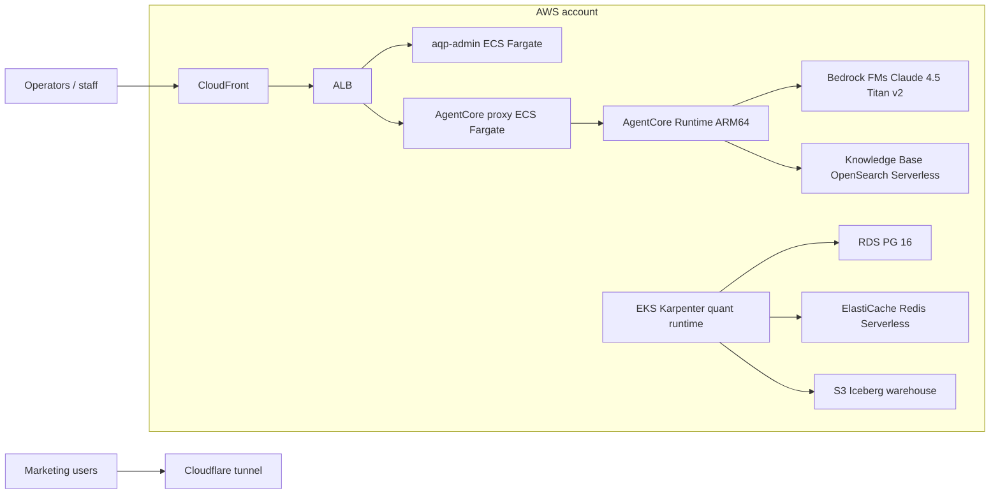

# AWS Hybrid Deployment Guide

> Companion runbook: [aws-runbook.md](aws-runbook.md).
> Architecture decision: hybrid (EKS Karpenter quant runtime + ECS Fargate
> admin + Bedrock AgentCore) — chosen per the blueprint §16.3 scope clarifications.

This guide walks you through deploying AQP to AWS for the first time.
Subsequent rollouts go through the normal `terraform-pipeline.yml`
+ `build-publish.yml` CI workflows; this page is only for the bootstrap
path. Allow ~3–4 hours end-to-end (most of the wall clock is Bedrock
model-access approval + Cloudflare propagation).

## Topology summary



## Prerequisites

| Item | How to confirm |
| --- | --- |
| AWS Organization with Control Tower enrolled | Console -> AWS Control Tower -> Landing zone is `Available`. |
| Seven member accounts: `management`, `log-archive`, `security-audit`, `shared-services`, `dev`, `staging`, `prod` | `aws organizations list-accounts` from the management account. |
| Bedrock model access enabled (Claude Sonnet 4.5, Claude Haiku 4.5, Titan Text Embeddings v2) per workload account in us-east-1 | Console -> Bedrock -> Model access — must show `Access granted`. This is the only manual console step in the bootstrap path. |
| GitHub repo `julianwileymac/agentic_quant_platform` admin access | Required to create the three GitHub Environments (`dev`, `staging`, `prod`). |
| Local `terraform >= 1.10.0`, `aws-cli v2`, `kubectl >= 1.30`, `kustomize >= 5.0`, `cosign >= 2.4`, `helm >= 3.16` | `terraform version` etc. |

## Phase 1 — Bootstrap (one-time, manual)

The bootstrap stack provisions the state backend (S3 + DynamoDB +
KMS) + GitHub OIDC provider in every account. Run with admin
credentials per account; nothing in the regular workflow ever needs
admin afterwards.

```bash
# From the management account first:
cd infrastructure/bootstrap
terraform init
terraform apply -auto-approve

# Capture the published outputs (state bucket, DynamoDB table, KMS key)
# into the per-account backend.hcl files:
terraform output -json > /tmp/bootstrap-outputs.json
```

Repeat per workload account by assuming the `OrganizationAccountAccessRole`
each one (Control Tower wires the trust automatically) and re-running
`terraform init && terraform apply` with the per-account state bucket
name.

## Phase 2 — Landing zone IaC (`infrastructure/envs/<env>`)

The landing zone tree provisions the shared infrastructure inside each
workload account: VPC, EKS cluster, Karpenter, ECR, RDS Postgres,
MSK Kafka, S3 data lake, observability stack. Apply through GitHub
Actions (NEVER `terraform apply` from a laptop in CI mode):

1. In the GitHub repo settings, create the three Environments
   (`dev`, `staging`, `prod`) and add a `AWS_DEPLOYER_ROLE_ARN` repo
   variable per env (the ARN comes from the bootstrap output).
2. Push a no-op commit to `main` so the `terraform-pipeline.yml`
   workflow runs the plan against `dev`. Review the plan diff in
   the workflow summary.
3. Click "Run workflow" -> `tree=infrastructure`, `env=dev`,
   `action=apply`. The job assumes
   `vars.TF_APPLY_ROLE_dev` and runs `terraform apply -auto-approve`
   against `infrastructure/envs/dev/`.
4. Promote to staging + prod by repeating step 3 with the matching
   env. Staging requires one reviewer; prod requires two
   (GitHub Environment protection rules).

## Phase 3 — Application IaC (`aqp_platform/terraform/environments/live`)

The application tree composes the 8 new modules
(`bedrock-agentcore`, `bedrock-knowledge-base`,
`opensearch-serverless`, `cognito-userpool`, `cloudfront`, `alb`,
`ecs-fargate-control-plane`, `eventbridge-stepfunctions`) PLUS the
heritage `aqp_platform/terraform/modules/` composition. Run via:

```bash
# Render backend.hcl from the bootstrap SSM outputs:
cd aqp_platform/terraform/environments/live
aws ssm get-parameter --name /aqp/prod/tfstate_bucket_name \
  --query 'Parameter.Value' --output text > /tmp/bucket
aws ssm get-parameter --name /aqp/prod/tfstate_kms_key_arn \
  --query 'Parameter.Value' --output text > /tmp/kms
aws ssm get-parameter --name /aqp/prod/tfstate_dynamodb_table \
  --query 'Parameter.Value' --output text > /tmp/lock
cat <<EOF > backend.hcl
bucket         = "$(cat /tmp/bucket)"
key            = "aqp_platform/live/terraform.tfstate"
region         = "us-east-1"
encrypt        = true
kms_key_id     = "$(cat /tmp/kms)"
dynamodb_table = "$(cat /tmp/lock)"
EOF
```

Then trigger the `terraform-pipeline.yml` workflow with
`tree=aqp_platform`, `env=live`, `action=plan` -> review -> `action=apply`.

## Phase 4 — Image builds

The `build-publish.yml` workflow ships every AQP container to ECR.
`aqp-agent` is ARM64-only (AgentCore Runtime requirement); every
other service builds multi-arch.

```bash
git tag v1.0.0
git push origin v1.0.0
# Watch the workflow — it pushes the 8 services + signs with Cosign +
# emits SLSA provenance + uploads SBOMs.
```

## Phase 5 — Seed secrets + Bedrock + Knowledge Base

```bash
# Broker credentials (paper trading first):
aws secretsmanager put-secret-value \
  --secret-id aqp/prod/broker/alpaca \
  --secret-string '{"api_key":"<paper-key>","secret_key":"<paper-secret>"}'

# Upload research docs to the KB source bucket — the EventBridge
# rule from modules/eventbridge-stepfunctions triggers a Bedrock
# ingestion job on every PutObject:
aws s3 sync ./research/papers/ s3://$(aws ssm get-parameter \
  --name /aqp/prod/kb_source_bucket \
  --query 'Parameter.Value' --output text)/
```

## Phase 6 — Smoke

```bash
# 1. Confirm the AgentCore Runtime invokes via the smoke workflow:
gh workflow run bedrock-smoke.yml

# 2. Direct invoke from a deployer-role-assumed shell:
aws bedrock-agentcore invoke-agent-runtime \
  --agent-runtime-arn $(aws ssm get-parameter \
    --name /aqp/prod/agentcore_runtime_arn \
    --query 'Parameter.Value' --output text) \
  --payload '{"spec_name":"dataset_loading_assistant","inputs":{"prompt":"ping"}}' \
  /tmp/response.json

# 3. Verify the trace shows up in X-Ray (run id from the smoke output):
aws xray get-trace-summaries \
  --time-range-type TraceId \
  --start-time $(date -u -d '5 minutes ago' +%s) \
  --end-time   $(date -u +%s) \
  --filter-expression "service(\"aqp-admin\")"
```

## Promotion

| From | To | Trigger |
| --- | --- | --- |
| `main` push | dev apply | `terraform-pipeline.yml` plan + auto-merge gate |
| tag `vX.Y.Z-rc.N` | staging apply | `terraform-pipeline.yml` dispatch + 1 reviewer |
| tag `vX.Y.Z` | prod apply | `terraform-pipeline.yml` dispatch + 2 reviewers |

## Rollback

See [aws-runbook.md](aws-runbook.md) for the rollback playbook.
