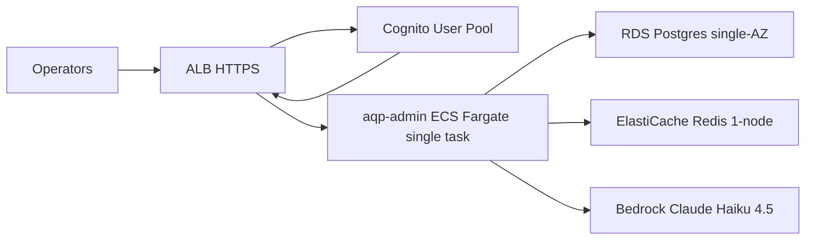

# Single-Account Minimum AWS Deployment

> **Companion docs:** [aws-deploy.md](aws-deploy.md) for the full
> multi-account hybrid topology; [aws-runbook.md](aws-runbook.md) for
> the operational playbook.

The cheapest deployable AQP on AWS. Target cost: **~$140/month fixed**
+ Bedrock token spend. Skips multi-account, EKS, MSK, AgentCore
Runtime, Knowledge Base, CloudFront, and the EventBridge nightly
backtest path. Use it as a stepping stone before promoting to the
full topology.

## What you get



## Pieces composed

| Tier | Module | Cost/mo |
| --- | --- | ---: |
| Network | `infrastructure/modules/vpc` (2 AZ, single NAT) | ~$32 |
| Ingress | `infrastructure/modules/alb` | ~$22 |
| Database | `infrastructure/modules/rds-postgres` (`db.t4g.medium`) | ~$45 |
| Cache | inline ElastiCache (`cache.t4g.small`, 1 node) | ~$25 |
| Compute | `infrastructure/modules/ecs-fargate-control-plane` (1 task, 0.5 vCPU + 1 GB) | ~$15 |
| Identity | `infrastructure/modules/cognito-userpool` (first 50k MAU free) | $0 |
| Container registry | `infrastructure/modules/ecr-repositories` (3 repos) | ~$1 |
| Logs | CloudWatch Logs (~1 GB ingest) | <$1 |
| LLM | Amazon Bedrock Claude Haiku 4.5 (variable) | $? per use |
| **Fixed total** | | **~$140** |

## Files this guide refers to

- [infrastructure/envs/minimum/](../../../../infrastructure/envs/minimum/)
  — infrastructure tier (VPC + ECR + RDS + Redis + Bedrock invoke IAM)
- [aqp_platform/terraform/environments/minimum/](../../../../aqp_platform/terraform/environments/minimum/)
  — application tier (Cognito + ALB + ECS Fargate)
- [aqp_platform/configs/terraform/minimum.yaml](../../../../aqp_platform/configs/terraform/minimum.yaml)
  — `TerraformStackSpec` for the `aqp deploy` CLI
- [aqp_platform/configs/deployment/topology.yaml](../../../../aqp_platform/configs/deployment/topology.yaml)
  `targets.aws-minimum` — topology target binding

## Six steps to live

### 1. Enable Bedrock model access (manual, console)

Console → **Bedrock** → **Model access** → request **Anthropic Claude
Haiku 4.5**. Approval is usually instant. Only this model needs
access for the minimum — Claude Sonnet 4.5 + Titan Embed v2 can wait
until you add the Knowledge Base.

### 2. Bootstrap the state backend

```bash
cd infrastructure/bootstrap
terraform init
terraform apply -auto-approve
terraform output -json | tee /tmp/bootstrap.json
```

This is the only place admin creds are required. The stack ships:

- S3 state bucket (KMS-encrypted, Object Lock GOVERNANCE)
- DynamoDB lock table
- KMS CMK for workload encryption
- GitHub OIDC provider

### 3. Apply the infrastructure tier

```bash
cd infrastructure/envs/minimum
sed "s|<account-id>|$(jq -r .account_id.value /tmp/bootstrap.json)|" \
  backend.hcl.example > backend.hcl
cp terraform.tfvars.example terraform.tfvars
# Edit terraform.tfvars: paste the kms_key_arn + external_id +
# github_oidc_provider_arn from /tmp/bootstrap.json.
terraform init -backend-config=backend.hcl
terraform apply
```

~12 minutes (RDS provisioning is the long pole). Outputs include the
ALB-ready VPC + every SSM parameter the application tier reads.

### 4. Push the first image

```bash
git tag v0.1.0-min
git push origin v0.1.0-min
```

[`build-publish.yml`](../../../../.github/workflows/build-publish.yml)
ships `aqp-admin` (and any other matrix entries) to ECR. The
`AqpGithubDeployerMinimum` role from step 3 is what the workflow
assumes via OIDC.

### 5. Apply the application tier

```bash
cd aqp_platform/terraform/environments/minimum
sed "s|<account-id>|$(jq -r .account_id.value /tmp/bootstrap.json)|" \
  backend.hcl.example > backend.hcl
cp terraform.tfvars.example terraform.tfvars
# Edit terraform.tfvars: paste the acm_certificate_arn_alb + the
# image tag you just pushed.
terraform init -backend-config=backend.hcl
terraform apply
```

~5 minutes. The ALB DNS appears in the outputs.

### 6. Configure AQP runtime

The application reads the deployment endpoints from
`/aqp/minimum/*` SSM. Set the env vars on the ECS task definition (or
via the application's `Settings` overrides):

```bash
AQP_LLM_PROVIDER=bedrock
AQP_BEDROCK_REGION=us-east-1
AQP_AUTH_PROVIDER=aws_cognito
AQP_AUTH_OIDC_ISSUER=<cognito_user_pool_endpoint from outputs>
AQP_DEPLOY_TARGET=aws
AQP_DATABASE_URL=postgresql+psycopg://<auth from Secrets Manager>@<rds_endpoint>:5432/aqp
AQP_REDIS_URL=rediss://<redis_endpoint>:6379/0
```

The matching `bedrock` `ProviderSpec` is already in
[aqp/llm/providers/catalog.py](../../../../aqp/llm/providers/catalog.py)
(shipped in Phase D of the AWS hybrid rollout); no code change needed.

## Verify

```bash
# Hit the ALB:
curl -sS https://$(terraform -chdir=aqp_platform/terraform/environments/minimum \
                    output -raw alb_dns_name)/healthz

# Call Bedrock through the application:
curl -sS https://<alb-dns>/api/llm/echo \
  -H "Authorization: Bearer <cognito-jwt>" \
  -d '{"prompt": "ping"}'
```

The application's `router_complete` injects `aws_region_name=us-east-1`
on the Bedrock call (`_bedrock_extra_kwargs` in
[aqp/llm/providers/router.py](../../../../aqp/llm/providers/router.py));
boto3 walks the chain to the ECS task role's IAM credentials.

## Promotion path

When ready to outgrow the minimum, add modules one at a time. The
SSM-parameter contract means application code doesn't change.

| Add when… | Append to `aqp_platform/terraform/environments/minimum/main.tf` |
| --- | --- |
| You need a custom domain (`admin.aqp.fund`) | `module "cloudfront"` from `infrastructure/modules/cloudfront` |
| You need vector search over research docs | `module "opensearch_serverless"` + `module "bedrock_kb"` |
| You want AgentCore (8-hour sessions, managed memory) | `module "bedrock_agentcore"` + a second `aqp-agent` ECS service |
| You need a Celery worker tier | Stand up `infrastructure/envs/dev` (full EKS+Karpenter) and add the heritage `module "aqp"` here |
| You need cross-account isolation | Promote to the full multi-account topology via `infrastructure/modules/landing-zone` |

Once the full set lands, retarget the topology from
`target=aws-minimum` to `target=aws`. The application reads the
same `/aqp/${env}/*` SSM parameters either way.

## Tear down

```bash
# Application tier first (Fargate services hold ALB target group
# references that prevent ALB deletion):
cd aqp_platform/terraform/environments/minimum
terraform destroy

# Then infrastructure tier:
cd ../../../../infrastructure/envs/minimum
terraform destroy

# RDS has deletion_protection=true by default — set it to false in
# the module call and re-apply before destroy if you really want it gone.
```

Data buckets (`prevent_destroy = true`) are kept on purpose; remove
them manually after confirming no other env references them.
