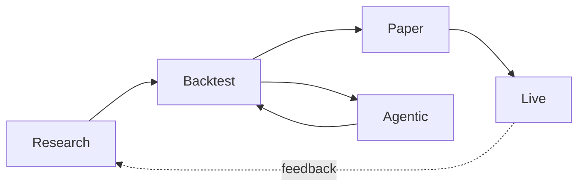

# Documentation Index

Triple-axis table of contents for the AQP docs.

> **Two entry points**:
>
> - Humans → [architecture.md](../concepts/platform/architecture.md)
> - AI agents → [../AGENTS.md](https://github.com/julianwileymac/agentic_quant_platform/blob/main/AGENTS.md)
>
> Both link back here.

## Canonical runtime surfaces (May 2026)

| Surface | Canonical path | Status | Notes |
| --- | --- | --- | --- |
| Local setup + run | [operations/local-setup.md](../how-to/operations/local-setup.md) | active | Default entry point for local development |
| Kubernetes rollout | [operations/kubernetes-deploy.md](../how-to/operations/kubernetes-deploy.md) | active | Production-oriented deployment path |
| Tower 2-node rollout | [operations/tower-cluster-deploy.md](../how-to/operations/tower-cluster-deploy.md) | active | Dedicated tower+laptop target bootstrap path |
| AQP blue/green cutover | [operations/aqp-fund-blue-green-cutover.md](../how-to/operations/aqp-fund-blue-green-cutover.md) | active | `aqp.fund` green-lane validation + switch + rollback |
| Deployment artifacts | [../aqp_platform/deployments/README.md](https://github.com/julianwileymac/agentic_quant_platform/blob/main/aqp_platform/deployments/README.md) | active | Compose + Kubernetes manifests for current architecture |
| Operator UI | [../aqp_client/README.md](https://github.com/julianwileymac/agentic_quant_platform/blob/main/aqp_client/README.md) | active | Vite frontend is the primary UI |
| AQP IDE | [aqp-ide.md](../concepts/infrastructure/aqp-ide.md) | active | Theia 1.72 + 6 AQP extensions + research copilot + notebook |
| AQP IDE roadmap | [aqp-ide-roadmap.md](../concepts/infrastructure/aqp-ide-roadmap.md) | active | Phased plan (Phase A shipped; B + C trigger-driven) |
| AQP IDE CLI entrypoint | [../aqp_cli/docs/index.md](https://github.com/julianwileymac/agentic_quant_platform/blob/main/aqp_cli/docs/index.md) | active | `aqp-cli ide` is the canonical IDE entrypoint |
| Repository split map | [repository-split.md](../concepts/platform/repository-split.md) | migration | Domain boundaries for future standalone repositories |
| Monorepo path contract | [aqp-monorepo-paths.md](../concepts/platform/aqp-monorepo-paths.md) | active | Canonical paths for cross-repo references |
| Code index governance | [code-index-governance.md](../concepts/platform/code-index-governance.md) | active | Agent search/index workflow across split boundaries |
| Legacy Next.js UI | [webui.md](../concepts/trading/webui.md) | rollback | Keep only for emergency rollback context |
| Legacy Solara UI | [../aqp/ui/](../aqp/ui/) | rollback | Deprecated runtime surface |
| Legacy k8s manifests | [../aqp_platform/deploy/k8s/README.md](https://github.com/julianwileymac/agentic_quant_platform/blob/main/aqp_platform/deploy/k8s/README.md) | legacy | Historical manifests; do not use for new rollouts |
| Archived planning/audit docs | [archive/README.md](../archive/README.md) | archive | Historical context only; not operational guidance |

## Operational snippet catalog

Reusable commands that are valid against the current repository layout:

```bash
# Generate local config from schema
make generate-config ENV=local

# Start the local workload stack
make dev

# Start the isolated admin/control-plane stack
make dev-admin

# Deploy current dev overlay to Kubernetes
make deploy-k8s ENV=dev
```

## By audience

### I'm new and human

1. [../README.md](https://github.com/julianwileymac/agentic_quant_platform/blob/main/README.md) — what AQP is, screenshots, release notes.
2. [architecture.md](../concepts/platform/architecture.md) — system map + request lifecycle.
3. [../CONTRIBUTING.md](https://github.com/julianwileymac/agentic_quant_platform/blob/main/CONTRIBUTING.md) — set up the dev environment.
4. [glossary.md](../intro/glossary.md) — terms used everywhere.
5. Pick a subsystem from the table below.

### I'm an AI agent

1. [../AGENTS.md](https://github.com/julianwileymac/agentic_quant_platform/blob/main/AGENTS.md) — terse rule-set + project map.
2. [../WORKFLOW.md](https://github.com/julianwileymac/agentic_quant_platform/blob/main/WORKFLOW.md) — Plan / Act / Reflect cadence,
   FAST vs SLOW modes, intervention nodes.
3. [agentic-development.md](../concepts/agentic/agentic-development.md) — spec-pattern
   as the AQP skill-artifact + ADLC security manifesto.
4. [../.cursor/rules/](../.cursor/rules) — glob-scoped rule files.
5. [glossary.md](../intro/glossary.md) — definitions.
6. [erd.md](../concepts/platform/erd.md) + [class-diagram.md](../concepts/platform/class-diagram.md) — structural maps.
7. [flows.md](../concepts/platform/flows.md) — end-to-end sequences.
8. [repository-split.md](../concepts/platform/repository-split.md) + [code-index-governance.md](../concepts/platform/code-index-governance.md) — current repo boundary map.
9. The relevant subsystem doc (table below).
10. (Cross-session work) [../.agents/state-template.md](https://github.com/julianwileymac/agentic_quant_platform/blob/main/.agents/state-template.md).

## By lifecycle stage



| Stage | Docs |
| --- | --- |
| **Research** | [strategy-development.md](../concepts/strategy/strategy-development.md), [research-papers-rag.md](../concepts/data/research-papers-rag.md), [analysis-framework.md](../concepts/strategy/analysis-framework.md), [analysis-lab.md](../concepts/strategy/analysis-lab.md), [analysis-flows.md](../concepts/strategy/analysis-flows.md), [factor-research.md](../concepts/strategy/factor-research.md), [ml-framework.md](../concepts/strategy/ml-framework.md), [ml-libraries.md](../concepts/strategy/ml-libraries.md), [ml-alpha-backtest.md](../concepts/strategy/ml-alpha-backtest.md), [ml-flows.md](../concepts/strategy/ml-flows.md), [ml-preprocessing-pipeline.md](../concepts/strategy/ml-preprocessing-pipeline.md), [ml-builder.md](../concepts/strategy/ml-builder.md), [ml-testing.md](../concepts/strategy/ml-testing.md), [rl-framework.md](../concepts/rl/rl-framework.md), [rl-lab.md](../concepts/rl/rl-lab.md), [rl-components.md](../concepts/rl/rl-components.md), [rl-iceberg.md](../concepts/rl/rl-iceberg.md), [strategy-browser.md](../concepts/strategy/strategy-browser.md), [data-plane.md](../concepts/data/data-plane.md), [data-catalog.md](../concepts/data/data-catalog.md), [data-pipelines-hub.md](../concepts/data/data-pipelines-hub.md), [visualization-layer.md](../concepts/data/visualization-layer.md) |
| **Backtest** | [backtest-engines.md](../concepts/strategy/backtest-engines.md), [hft-backtest.md](../concepts/strategy/hft-backtest.md), [strategy-lifecycle.md](../concepts/strategy/strategy-lifecycle.md) |
| **Optimal control** | [optimal-control.md](../concepts/strategy/optimal-control.md), [portfolio-options-mm.md](../concepts/strategy/portfolio-options-mm.md), [microstructure-toxicity.md](../concepts/strategy/microstructure-toxicity.md) |
| **Agentic** | [agentic-pipeline.md](../concepts/agentic/agentic-pipeline.md), [providers.md](../concepts/data/providers.md) |
| **Bots** | [bots.md](../concepts/agentic/bots.md) (smallest deployable unit; aggregates universe + strategy + engine + ML + agents + RAG + metrics) |
| **Paper / Live** | [paper-trading.md](../concepts/trading/paper-trading.md), [live-market.md](../concepts/data/live-market.md), [streaming.md](../concepts/data/streaming.md), [streaming-admin.md](../concepts/data/streaming-admin.md) |
| **Cross-cutting** | [observability.md](../concepts/trading/observability.md), [../aqp_client/README.md](https://github.com/julianwileymac/agentic_quant_platform/blob/main/aqp_client/README.md), [webui.md](../concepts/trading/webui.md) _(legacy)_, [core-types.md](../concepts/platform/core-types.md), [domain-model.md](../concepts/platform/domain-model.md), [alpha-vantage.md](../concepts/data/alpha-vantage.md), [credentials.md](../concepts/identity/credentials.md), [cloud-credentials.md](../concepts/identity/cloud-credentials.md), [identity.md](../concepts/identity/identity.md), [scim-provisioning.md](../concepts/identity/scim-provisioning.md), [msal-entra-setup.md](../concepts/identity/msal-entra-setup.md), [multi-tenancy.md](../concepts/identity/multi-tenancy.md), [kubernetes-adapter.md](../concepts/infrastructure/kubernetes-adapter.md), [kubernetes-rpi-deployment.md](../concepts/infrastructure/kubernetes-rpi-deployment.md), [local-platform.md](../concepts/platform/local-platform.md), [terraform-control-plane.md](../concepts/infrastructure/terraform-control-plane.md), [iac-runbook.md](../concepts/infrastructure/iac-runbook.md) |

## By subsystem

### Architecture + reference

| Doc | Purpose |
| --- | --- |
| [architecture.md](../concepts/platform/architecture.md) | System component diagram + request lifecycle |
| [erd.md](../concepts/platform/erd.md) | Per-domain entity-relationship diagrams |
| [class-diagram.md](../concepts/platform/class-diagram.md) | Class hierarchies (Symbol, LLMProvider, Strategy, Engines, Pipeline) |
| [data-dictionary.md](../reference/data-dictionary/index.md) | Table-by-table column reference |
| [flows.md](../concepts/platform/flows.md) | Sequence diagrams for ingestion / backtest / agents / paper |
| [glossary.md](../intro/glossary.md) | Project-specific terminology |
| [domain-model.md](../concepts/platform/domain-model.md) | Narrative on the domain types |
| [core-types.md](../concepts/platform/core-types.md) | `Symbol`, enums, dataclasses |
| [repository-split.md](../concepts/platform/repository-split.md) | Future repository/domain boundary map |
| [code-index-governance.md](../concepts/platform/code-index-governance.md) | Agent search and code-index rules |

### Data plane

| Doc | Purpose |
| --- | --- |
| [data-plane.md](../concepts/data/data-plane.md) | Provider → cache → DuckDB view pipeline |
| [data-catalog.md](../concepts/data/data-catalog.md) | Iceberg catalog + ingest pipeline |
| [data-self-service.md](../concepts/data/data-self-service.md) | Master narrative for the four-phase self-service data fabric expansion |
| [datasets-catalog.md](../concepts/data/datasets-catalog.md) | Kedro-style `BaseDataset` abstraction (data fabric phase 0) |
| [metadata-cache.md](../concepts/data/metadata-cache.md) | Redis prefetch cache backing every entity dropdown (data fabric phase 0) |
| [data-discovery.md](../concepts/data/data-discovery.md) | Active discovery browser unifying ingested + uningested catalog entries (data fabric phase 1) |
| [airbyte-builder.md](../concepts/data/airbyte-builder.md) | Schema-driven Airbyte connector builder + AQP Fetcher codegen (data fabric phase 2) |
| [dagster-sandbox.md](../concepts/data/dagster-sandbox.md) | Ephemeral interactive Dagster + Airbyte sandbox console (data fabric phase 3) |
| [visualization-layer.md](../concepts/data/visualization-layer.md) | Trino-backed Superset and Bokeh exploration layer |
| [pgvector-control-plane.md](../concepts/data/pgvector-control-plane.md) | pgvector control plane — `data.vector.*` MCP tools + PgVector dataset kind + alembic 0045 (Phase 3 refactor) |
| [codebase-mcp.md](../concepts/data/codebase-mcp.md) | Codebase MCP server — agent view of the AQP source tree via `codebase.*` tools (Phase 2 refactor) |
| [sera.md](../concepts/data/sera.md) | SERA (Ai2 Open Coding Agents) as an opt-in LLM provider for the codebase MCP elaborator (Phase 2.5 refactor) |
| [analytics-frontend.md](../concepts/data/analytics-frontend.md) | Interactive analytics in the Vite frontend — QuantStats tearsheets / rolling / underwater / drawdown / ML overlays (Phase 4 refactor) |
| [agent-watchdog.md](../concepts/data/agent-watchdog.md) | Agent stall watchdog Celery beat task + `GET /agents/health` + `data.agents.health` MCP tool (Phase 5 refactor) |
| [alpha-vantage.md](../concepts/data/alpha-vantage.md) | AV provider quota + cache |
| [streaming.md](../concepts/data/streaming.md) | Kafka topic taxonomy + ingester layout |
| [live-market.md](../concepts/data/live-market.md) | Live subscription + WebSocket relay |

### Strategy + ML

| Doc | Purpose |
| --- | --- |
| [analysis-framework.md](../concepts/strategy/analysis-framework.md) | Hash-locked AnalysisSpec + AnalysisRuntime umbrella |
| [analysis-lab.md](../concepts/strategy/analysis-lab.md) | Hybrid `/analysis/lab` UI (dataset-tabs + XYFlow Composer) |
| [analysis-flows.md](../concepts/strategy/analysis-flows.md) | Per-flow reference for the analysis catalog |
| [factor-research.md](../concepts/strategy/factor-research.md) | Building factor / alpha strategies |
| [ml-framework.md](../concepts/strategy/ml-framework.md) | Train → register → deploy → score |
| [ml-libraries.md](../concepts/strategy/ml-libraries.md) | Per-library reference (TF/Keras/Prophet/sklearn/PyOD/sktime/HF) |
| [ml-alpha-backtest.md](../concepts/strategy/ml-alpha-backtest.md) | `AlphaBacktestExperiment` orchestrator + `MLAlphaBacktestRun` schema |
| [ml-flows.md](../concepts/strategy/ml-flows.md) | Lightweight workbench flows catalog |
| [ml-preprocessing-pipeline.md](../concepts/strategy/ml-preprocessing-pipeline.md) | ML preprocessors as data-engine pipeline nodes |
| [ml-builder.md](../concepts/strategy/ml-builder.md) | Graphical experiment builder UX |
| [ml-testing.md](../concepts/strategy/ml-testing.md) | Interactive ML testing workbench |
| [backtest-engines.md](../concepts/strategy/backtest-engines.md) | Engine catalogue + invariants (vbt-pro primary, event-driven, ZVT, AAT, fallback) |
| [vbtpro-integration.md](../concepts/strategy/vbtpro-integration.md) | Deep vectorbt-pro integration: modes, hooks, agent + ML components, walk-forward |
| [hft-backtest.md](../concepts/strategy/hft-backtest.md) | hftbacktest-driven LOB engine, ``LobStrategy`` API, latency / queue models |
| [optimal-control.md](../concepts/strategy/optimal-control.md) | JAX-compiled HJB solvers — Avellaneda-Stoikov + Cartea-Jaimungal-Penalva |
| [portfolio-options-mm.md](../concepts/strategy/portfolio-options-mm.md) | Lucic-Tse 2024-2026 portfolio-level options market making |
| [microstructure-toxicity.md](../concepts/strategy/microstructure-toxicity.md) | Toxicity regime detection + agent-driven YAML mutation loop |
| [strategy-lifecycle.md](../concepts/strategy/strategy-lifecycle.md) | draft → backtested → paper → live |
| [strategy-browser.md](../concepts/strategy/strategy-browser.md) | Data-browser → strategy spec UX |

### Agentic

| Doc | Purpose |
| --- | --- |
| [agentic-development.md](../concepts/agentic/agentic-development.md) | AQP's spec-pattern as the agentic-coder skill-artifact equivalent + consolidated ADLC security manifesto |
| [multi-agent-patterns.md](../concepts/agentic/multi-agent-patterns.md) | Sequential / Parallel / Debate / Coordinator / ReAct topologies mapped to [aqp/agents/graph/](../aqp/agents/graph/) + the seven orchestration adapter topologies |
| [workflow-studio.md](../concepts/agentic/workflow-studio.md) | Additive orchestration control plane — `WorkflowSpec` + `WorkflowRuntime` + seven adapters + replayable runs |
| [orchestration-refactor-rollout.md](../concepts/agentic/orchestration-refactor-rollout.md) | Operator rollout / rollback runbook for every `AQP_ORCHESTRATION_*` flag |
| [agentic-pipeline.md](../concepts/agentic/agentic-pipeline.md) | Crew control plane |
| [providers.md](../concepts/data/providers.md) | LLM provider registry + tier routing |

### Trading + operations

| Doc | Purpose |
| --- | --- |
| [paper-trading.md](../concepts/trading/paper-trading.md) | Session loop + risk model |
| [paper-metadata-gate.md](../concepts/trading/paper-metadata-gate.md) | Strict startup metadata validation + operator runbook |
| [bots.md](../concepts/agentic/bots.md) | Bot entity (TradingBot / ResearchBot), graphical builder, deployment |
| [observability.md](../concepts/trading/observability.md) | OTEL → Jaeger + structured logs |
| [../aqp_client/README.md](https://github.com/julianwileymac/agentic_quant_platform/blob/main/aqp_client/README.md) | Active Vite frontend route/model overview |
| [webui.md](../concepts/trading/webui.md) | Legacy Next.js page tree (rollback only) |

## Latest changes

| Doc | Last touched |
| --- | --- |
| [data-catalog.md](../concepts/data/data-catalog.md) | Persistent host warehouse + Director |
| [glossary.md](../intro/glossary.md) | New (covers Director, Iceberg conventions, tiers) |
| [architecture.md](../concepts/platform/architecture.md) | New (replaces README ASCII art) |
| [erd.md](../concepts/platform/erd.md) | New (per-domain ERDs across 110+ tables) |
| [class-diagram.md](../concepts/platform/class-diagram.md) | New (5 hierarchies) |
| [data-dictionary.md](../reference/data-dictionary/index.md) | New (15 sections) |
| [flows.md](../concepts/platform/flows.md) | New (5 flows) |

## Doc conventions

- **Mermaid** is the diagram format. GitHub renders it natively.
  Don't commit PNG/SVG diagrams unless they're irreplaceable.
- **Cross-link** with relative markdown paths (for example, `bar.md`) so
  the navigation works on GitHub and locally.
- **Cite code** with full repo paths from the doc:
  `[aqp/data/pipelines/director.py](../aqp/data/pipelines/director.py)`.
  Don't link to specific line numbers (they bit-rot fast).
- **Keep it short** — narrative goes in subsystem docs, definitions
  in [glossary.md](../intro/glossary.md), structure in
  [erd.md](../concepts/platform/erd.md) / [class-diagram.md](../concepts/platform/class-diagram.md). Don't
  repeat yourself.
