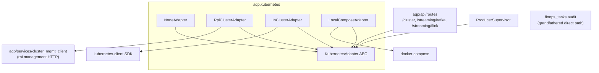

# Kubernetes adapter

AQP wraps every cluster-side operation in a pluggable
:class:`aqp.kubernetes.KubernetesAdapter`. The abstraction makes the
rpi_kubernetes attach optional: AQP works fully standalone with
`NoneAdapter`, attaches to the rpi management API with
`RpiClusterAdapter`, talks to a Kubernetes API directly with
`InClusterAdapter`, or treats the local Docker Compose stack as the
cluster surface with `LocalComposeAdapter`.

## Architecture

`get_kubernetes_adapter()` returns the active adapter based on:

1. Explicit `settings.kubernetes_adapter` (`none` / `rpi_cluster` /
   `in_cluster` / `local_compose`).
2. Auto-promote: empty kind + `cluster_mgmt_url` set → `rpi_cluster`.
3. Default: `none`.

Failures during a call surface as
:class:`KubernetesAdapterUnavailable` (routes return 503) or
:class:`KubernetesAdapterError` (routes return 502). Adapters opt out
of unsupported methods by raising
:class:`KubernetesAdapterUnavailable`.

## Adapter capabilities

See [`.cursor/rules/kubernetes-adapter.mdc`](../.cursor/rules/kubernetes-adapter.mdc)
for the per-method matrix. Today every adapter implements
`is_available()`; `RpiClusterAdapter` covers the full Kafka / Flink /
AlphaVantage / scale_deployment surface; `InClusterAdapter` covers
`scale_deployment` / `pod_logs` / `apply_manifest`; `LocalComposeAdapter`
covers `scale_deployment` / `pod_logs`.

The `/cluster` REST surface is the primary user — `/cluster-mgmt` is
kept as a backwards-compat alias.

## Test patterns

`tests/kubernetes/test_adapter.py` covers:

- The metaclass registers every concrete adapter under
  `"k8s_adapter"` in the AQP registry.
- `NoneAdapter.is_available()` is `False`; every op raises.
- `RpiClusterAdapter` forwards to the wrapped client and translates
  `ClusterMgmtError` → `KubernetesAdapterError`.
- `InClusterAdapter` reports unavailable when kubernetes isn't
  installed (CI default).
- `register_adapter(...)` / `reset_kubernetes_adapter()` give tests
  clean fixtures.

## Adding capabilities

When you need a new cluster op (say `list_namespaces`):

1. Add an abstract method (default: raise
   :class:`KubernetesAdapterUnavailable`) on the ABC in
   [`aqp/kubernetes/protocol.py`](../aqp/kubernetes/protocol.py).
2. Implement it in each adapter that can support it.
3. Add a route in
   [`aqp/api/routes/cluster_mgmt.py`](../aqp/api/routes/cluster_mgmt.py)
   that calls the adapter.
4. Adapters that can't service the op leave the default; routes
   catch `KubernetesAdapterUnavailable` and translate to 503.

## Migrating finops_tasks

The FinOps audit (`aqp/tasks/finops_tasks.py`) currently uses the
`kubernetes` SDK directly because it needs list APIs (`list_pod_for_all_namespaces`,
etc.) that the adapter doesn't yet expose. Adding those list methods
to the adapter ABC + the in-cluster implementation is the migration
target — until then, the direct path is grandfathered by the
[`.cursor/rules/kubernetes-adapter.mdc`](../.cursor/rules/kubernetes-adapter.mdc)
rule.
