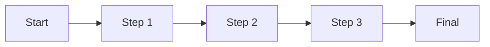
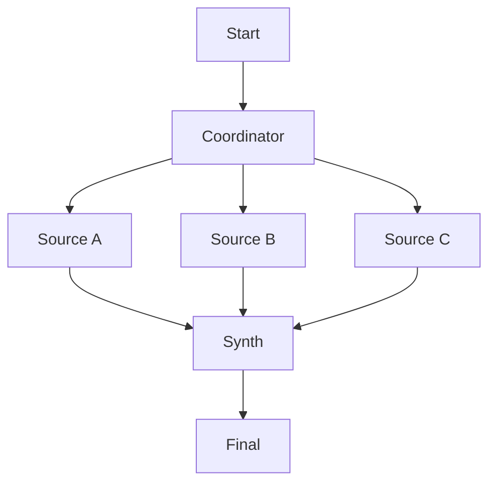
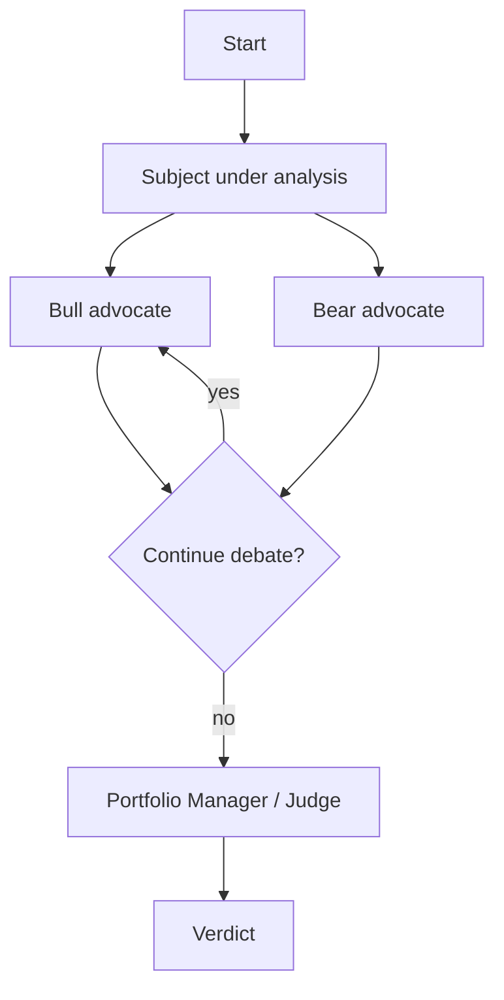
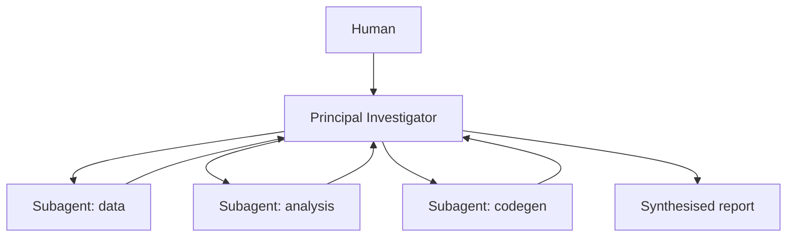
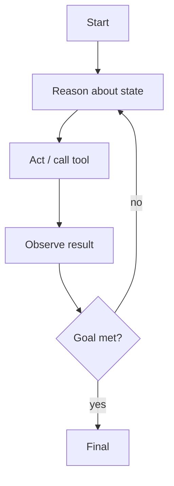

# Multi-agent patterns in AQP

> Catalogue of multi-agent topologies, mapped to existing code in
> [aqp/agents/graph/](../aqp/agents/graph/). Use this when adding a
> new agent crew, deciding between sequential and parallel
> orchestration, or deciding when a debate / consensus pattern is
> warranted.
>
> Doc map: [aqp_docs/index.md](index.md) ·
> Underlying primitives: [agents.md](agents.md) ·
> Spec contract: [agentic-development.md](agentic-development.md) ·
> ADLC + security: [agentic-development.md#3-adlc-security-manifesto](agentic-development.md#3-adlc-security-manifesto).

## When to read this doc

Read this doc when you need to:

- Add a new multi-step agent crew that goes beyond a single
  `AgentSpec` invocation.
- Decide whether a debate / dialectical pattern is appropriate for a
  reasoning task.
- Wire a new entry-point in the LangGraph builder.
- Understand how the existing crews (research, trader, analysis)
  compose under the hood.

This doc does **not** replace [agents.md](agents.md) — that's the
primary reference for `AgentSpec` and `AgentRuntime`. This doc only
covers **how multiple specs are composed**.

## The five canonical patterns

| Pattern | When to use | AQP entry-point |
| --- | --- | --- |
| Sequential | Deterministic linear pipeline | `build_research_graph` / `build_trader_graph` / `build_full_pipeline_graph` in [aqp/agents/graph/builder.py](../aqp/agents/graph/builder.py) (linear edges) |
| Parallel | Independent multi-source research with synthesis | parallel research-team nodes in [aqp/agents/graph/builder.py](../aqp/agents/graph/builder.py) |
| Debate / Dialectical | Adversarial analysis (Bull / Bear, advocate / critic) | [aqp/agents/graph/dialectical.py](../aqp/agents/graph/dialectical.py) → `build_dialectical_debate_graph` (Bull / Bear / Portfolio-Manager) |
| Coordinator / Router | Hierarchical delegation | top-level orchestrator in [aqp/agents/graph/builder.py](../aqp/agents/graph/builder.py) (`build_full_pipeline_graph` plays this role today) |
| ReAct (loop-with-observation) | Open-ended forecasting requiring iterative observe → act | LangGraph state loop with conditional edges via [aqp/agents/graph/conditions.py](../aqp/agents/graph/conditions.py) (`should_continue_debate`, `should_continue_risk`) |

Each pattern below has the same three sections: when to use, the
shape it takes in AQP, and a "Don't" list.

---

## 1. Sequential

### When to use

- Deterministic, well-understood pipelines where each step's output
  is the input to the next.
- The default for any flow that doesn't have a strong reason to
  branch.
- Good for: ingest → normalise → enrich → emit; research →
  selection → trader → analysis (the canonical pipeline).

### AQP shape

- [`build_research_graph`](../aqp/agents/graph/builder.py) — research
  → equity → universe.
- [`build_trader_graph`](../aqp/agents/graph/builder.py) — trader →
  analysis run.
- [`build_full_pipeline_graph`](../aqp/agents/graph/builder.py) —
  research → selection → trader → analysis (end-to-end agentic
  loop).
- State carried via `AgentState` (TypedDict) declared in
  [aqp/agents/graph/state.py](../aqp/agents/graph/state.py).
- Falls back to
  [`SequentialGraph`](../aqp/agents/graph/builder.py) when LangGraph
  isn't installed — same audit trail, no conditional routing.

### Don't

- Don't bypass the runtime per step. Each node calls
  `AgentRuntime.run(...)` so cost caps + telemetry + immutable
  versions are recorded.
- Don't widen the `AgentState` TypedDict for one-off keys — extend
  via the canonical fields documented in
  [aqp/agents/graph/state.py](../aqp/agents/graph/state.py) so
  conditional predicates keep working.

---

## 2. Parallel (research team / fan-out + synthesis)

### When to use

- Multiple independent sources / analyses that can run in parallel
  and then be synthesised.
- Examples: fundamental + technical + macro + sentiment running
  concurrently to produce a unified market view; multi-source
  regulatory ingest.
- Throughput-bound: parallel makes sense when each branch is
  expensive and the branches don't depend on each other.

### AQP shape

- LangGraph state graphs run independent branches concurrently when
  the edges declare them as such.
- The synthesis node consumes the merged state and emits a
  combined verdict.
- For the research-team subgraph in
  [`build_full_pipeline_graph`](../aqp/agents/graph/builder.py), the
  individual research specs (`research.equity`, `research.news_miner`,
  `research.universe`, etc.) feed a downstream selector / trader.

### Don't

- Don't parallelise tool calls that mutate shared state — the
  catalog upserts in
  [`active_metadata`](../aqp/data/catalog/active_metadata.py) are
  serialised on purpose.
- Don't fan out to N agents that all consult the same RAG corpus
  with identical queries — that's a cache miss N times. Cache once
  upstream.
- Don't rely on parallel order. Synthesis must be order-independent
  (associative + commutative over the result set).

---

## 3. Debate / Dialectical

### When to use

- Open-ended judgement where adversarial reasoning surfaces
  blind-spots (e.g. should we take this position? does this strategy
  generalise out-of-sample?).
- Whenever a single-agent verdict would feel "too convenient" — the
  Bull / Bear pattern forces both arguments to be made and judged.
- The literature behind this pattern (TradingAgents) is a known
  source of inspiration; AQP keeps the structure but routes through
  spec-driven `AgentRuntime` so every debate turn is logged.

### AQP shape

- [aqp/agents/graph/dialectical.py](../aqp/agents/graph/dialectical.py)
  contains `build_dialectical_debate_graph` (Bull / Bear /
  Portfolio-Manager).
- Three agent specs ship under [configs/agents/](../configs/agents/):
  - `research.bull_researcher`
  - `research.bear_researcher`
  - `research.portfolio_manager`
- The portfolio manager synthesises both transcripts into a single
  `debate_verdict` with `action ∈ {buy, hold, sell, mutate_params}`.
- The Phase-4 iterative optimisation loop in
  [`build_research_debate_graph`](../aqp/agents/graph/builder.py)
  uses `should_continue_debate` from
  [conditions.py](../aqp/agents/graph/conditions.py) to bound
  rounds (default `max_rounds=2`).
- State extension: `RiskDebateState` and `ResearchDebateState`
  (TypedDicts in
  [state.py](../aqp/agents/graph/state.py)) hold the debate
  transcript across turns.
- All decisions land in
  [decision_log.py](../aqp/agents/graph/decision_log.py) for
  auditability — `append_pending_decision` /
  `resolve_pending_decisions`.

### Don't

- Don't run an unbounded debate. Cost caps + the `max_rounds`
  predicate are non-negotiable.
- Don't let the judge synthesise without seeing both transcripts —
  the synthesis node is the load-bearing piece.
- Don't add a third advocate without thinking carefully about the
  judge prompt. Two-sided debate is well-studied; three-sided
  debates require explicit tie-breaking logic.

---

## 4. Coordinator / Router

### When to use

- Workflows where the human interacts with a single high-level
  orchestrator that delegates to specialised subagents.
- Reduces cognitive load for the operator — they don't direct
  individual specs, they direct the coordinator.
- Examples: end-to-end backtest run with multiple analytical
  subagents; multi-stage research crew coordinated by a "PI"
  agent.

### AQP shape

- [`build_full_pipeline_graph`](../aqp/agents/graph/builder.py)
  plays this role today: a top-level orchestrator that routes to
  research, selection, trader, and analysis nodes.
- Decision-log
  ([decision_log.py](../aqp/agents/graph/decision_log.py))
  captures the routing decisions so the human can replay why a
  particular subagent was invoked.
- The Cursor IDE itself follows this pattern — the parent agent
  dispatches `Task(subagent_type=...)` for read-only exploration
  or implementation.

### Don't

- Don't put domain logic in the coordinator. It coordinates;
  subagents do the work.
- Don't pass full intermediate state up to the human. The whole
  point is the coordinator synthesises — show the synthesis, link
  to the decision log for the trace.

---

## 5. ReAct (loop-with-observation)

### When to use

- Open-ended forecasting / research questions where the answer
  isn't reachable in a single shot, and the model needs to call
  tools, observe results, and iterate.
- Examples: building a market thesis from sequential
  hypothesis-tests; iterative debugging of a strategy's
  poor backtest.
- Trades latency for accuracy — only worth it for tasks where the
  user explicitly wants depth over speed.

### AQP shape

- LangGraph state-graph with conditional edges — the loop is
  modelled as a self-edge gated by a predicate.
- Conditional predicates live in
  [aqp/agents/graph/conditions.py](../aqp/agents/graph/conditions.py)
  (`should_continue_debate`, `should_continue_risk`,
  `should_consult_rag`, `risk_simulator_approves`).
- Tool calls inside the loop go through `AgentRuntime` so the
  cost cap bounds the iteration count.
- For agents that need persistent memory between iterations, the
  Redis-backed checkpointer
  ([checkpointer.py](../aqp/agents/graph/checkpointer.py))
  preserves graph state across process restarts.

### Don't

- Don't ReAct without a hard upper bound on iterations. The
  `max_rounds` parameter on `should_continue_debate` is the
  reference pattern — apply the same upper bound to any new
  ReAct-style condition.
- Don't share Redis checkpoint keys across unrelated runs. Each
  `(spec_version_id, run_id)` is its own checkpoint namespace.
- Don't ReAct on a hot path (live execution). Use it for
  research and post-hoc analysis where latency is acceptable.

---

## Orchestration adapter topologies (Phase 7 addition)

The additive orchestration refactor adds a sibling abstraction —
[`OrchestrationAdapter`](../aqp/agents/orchestration/base.py) — that
exposes the five canonical patterns above as **first-class registry
components**. The patterns themselves don't change; the new
``WorkflowRuntime`` wraps them behind a metaclass-registered alias so
operators can mix-and-match without editing graph builders by hand.

Seven shipping adapter kinds (see
[ADAPTER_KINDS](../aqp/agents/orchestration/registry.py)):

| Adapter | Kind | Wraps | Inspiration |
| --- | --- | --- | --- |
| [`LangGraphAdapter`](../aqp/agents/orchestration/adapters/langgraph_adapter.py) | `graph` | The five canonical builders in [aqp/agents/graph/builder.py](../aqp/agents/graph/builder.py) + `build_dialectical_debate_graph` | aqp |
| [`CrewProcessAdapter`](../aqp/agents/orchestration/adapters/crew_adapter.py) | `crew` | [`run_research_crew`](../aqp/agents/crew.py) + [`run_trader_crew`](../aqp/agents/trading/crew.py) — CrewAI sequential / hierarchical | finrobot |
| [`DialecticalDebateAdapter`](../aqp/agents/orchestration/adapters/debate_adapter.py) | `debate` | [`build_dialectical_debate_graph`](../aqp/agents/graph/dialectical.py) with bounded rounds + forced judge synthesis | tradingagents |
| [`AutomationScheduleAdapter`](../aqp/agents/orchestration/adapters/schedule_adapter.py) | `schedule` | Celery beat — enqueues [`aqp.tasks.orchestration_tasks.run_workflow`](../aqp/tasks/orchestration_tasks.py) | daily_stock_analysis |
| [`SignalFusionAdapter`](../aqp/agents/orchestration/adapters/fusion_adapter.py) | `fusion` | Deterministic [`synthesize`](../aqp/agents/trading/fusion.py) over debate + quant + model contributors | vibe_trading |
| [`WeightCentricExecutionAdapter`](../aqp/agents/orchestration/adapters/weight_centric_adapter.py) | `execution` | [`WeightCentricPipeline`](../aqp/rl/portfolio/pipeline.py) + [`RiskLimits`](../aqp/risk/limits.py) (rule 38) | finrl |
| (Phase 7 future) `WorkflowStudioAdapter` | `studio` | Interactive workflow graph editor | langflow |

### Why use adapters over a hand-rolled builder?

- **Discoverability**: every adapter shows up in the Phase 5 studio
  dropdown via `data.orchestration.list_adapters` — operators don't
  need to read code.
- **Halt parity**: the runtime polls `should_halt(state)` between
  every adapter transition; new adapters inherit that contract for
  free.
- **Replay parity**: every spec snapshotted into
  `workflow_spec_versions` is replayable by `workflow_version_id`
  through `/workflows/runs/{run_id}/replay`.
- **Telemetry parity**: each transition opens a
  [`node_span`](../aqp/agents/observability.py) so per-adapter
  latency / cost / branch decisions land on the same OTEL trace as
  every legacy agent run.

### When to use an adapter vs a graph builder

| Choose adapter when | Choose graph builder when |
| --- | --- |
| You want it in the studio dropdown | The flow is hard-coded into a service |
| You need to replay it by version id | One-off internal pipeline |
| You want bounded-debate / cooperative-cancel without writing them | You're already inside a builder body |
| The flow ships as YAML for ops | The flow is built dynamically per request |

Adapters delegate to graph builders internally — they are **wrappers,
not replacements**. Adding a new adapter never invalidates an existing
builder.

---

## Adding a new pattern

1. Identify which of the five it most resembles. Don't invent a
   sixth unless there's a real reason.
2. Add the builder under
   [aqp/agents/graph/](../aqp/agents/graph/). Mirror the existing
   `build_*_graph` naming.
3. Add the necessary state TypedDict to
   [state.py](../aqp/agents/graph/state.py). Don't sprinkle ad-hoc
   dict keys — `AgentState` is the contract.
4. Add conditional predicates to
   [conditions.py](../aqp/agents/graph/conditions.py) if the graph
   has branches.
5. Decisions emitted by the graph land in
   [decision_log.py](../aqp/agents/graph/decision_log.py).
6. Tests under [tests/agents/](../tests/agents/) — at minimum, a
   `SequentialGraph` fallback test that runs the graph without
   LangGraph installed. Mirror the existing test naming: e.g.
   `test_<graph_name>_run.py`.
7. Update [agents.md](agents.md) and / or this file to describe
   the new entry-point.

## Cross-references

- [agents.md](agents.md) — `AgentSpec` + `AgentRuntime` reference
- [agentic-pipeline.md](agentic-pipeline.md) — end-to-end pipeline
  walkthrough
- [agentic-development.md](agentic-development.md) — spec-pattern
  + ADLC manifesto
- [analysis-agents.md](analysis-agents.md) — analysis-specific
  agent roles
- [research-agents.md](research-agents.md) /
  [selection-agents.md](selection-agents.md) /
  [trader-agents.md](trader-agents.md) — per-team agent rosters
- [providers.md](providers.md) — LLM provider routing under the hood
