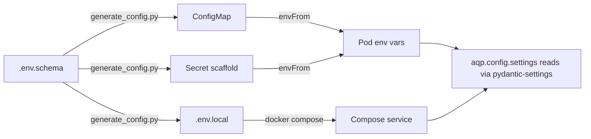

# Operations runbook — Configuration management

How env vars, ConfigMaps, and Secrets flow through the AQP stack.

## The single source of truth

[`aqp_platform/deployments/compose/.env.schema`](../../aqp_platform/deployments/compose/.env.schema) is the source of truth. Every variable declared anywhere (compose, K8s ConfigMap, K8s Secret, application code, frontend) MUST appear in the schema.

Each entry carries metadata:

```
key:            AQP_FOO_BAR
description:    What this knob controls.
required:       true | false
default:        <value or empty>
targets:        local,kubernetes,cloud
classification: plain | secret | rotation-required
```

## Generation

```powershell
# Local dev (.env file)
make generate-config ENV=local

# Cloud / sealed-secrets seed
make generate-config ENV=cloud

# Kubernetes ConfigMap + Secret scaffold
make generate-config ENV=k8s
```

Or directly:

```powershell
python aqp_platform/build/scripts/generate_config.py --env local --out aqp_platform/deployments/compose/.env.local
python aqp_platform/build/scripts/generate_config.py --env k8s --kind configmap
python aqp_platform/build/scripts/generate_config.py --env k8s --kind secret
```

## Validation

`make validate-config` runs the generator in `--diff` mode against every target — produces no output when files are in sync with the schema; prints a unified diff when they've drifted.

## How env reaches a service



## Adding a new variable

1. Add a block to `.env.schema`:

   ```
   key:            AQP_MY_NEW_KNOB
   description:    What it does (one line).
   required:       false
   default:        <safe value or empty>
   targets:        local,kubernetes,cloud
   classification: plain
   ```

2. Regenerate every artifact:

   ```powershell
   make generate-config ENV=local
   make generate-config ENV=k8s
   ```

3. Add the field to `aqp.config.settings.Settings` so the application can read it via `from aqp.config import settings`.

4. Update tests that snapshot the env to include the new key.

## Secret classification rules

| Class | Examples | Storage |
| --- | --- | --- |
| `plain` | `AQP_LOG_LEVEL`, `AQP_CORE_API_URL` | ConfigMap |
| `secret` | `AQP_DATABASE_PASSWORD`, `AQP_AUTH_SCIM_BEARER_TOKEN_HASH` | Secret + sealed-secrets / external-secrets-operator |
| `rotation-required` | `AQP_AUTH_M2M_CLIENT_SECRET`, `AQP_SESSION_COOKIE_SECRET` | Secret + rotation cadence in [rotate-secrets.md](rotate-secrets.md) |

## Never

- Never commit a populated `Secret` to git. The generator writes a `Y2hhbmdlbWU=` placeholder; CI/CD or the external secret operator patches the real values.
- Never read `os.environ.get(...)` directly from `aqp/` business code. Use `from aqp.config import settings`.
- Never hardcode a URL or password. Add it to the schema and route through `settings`.
