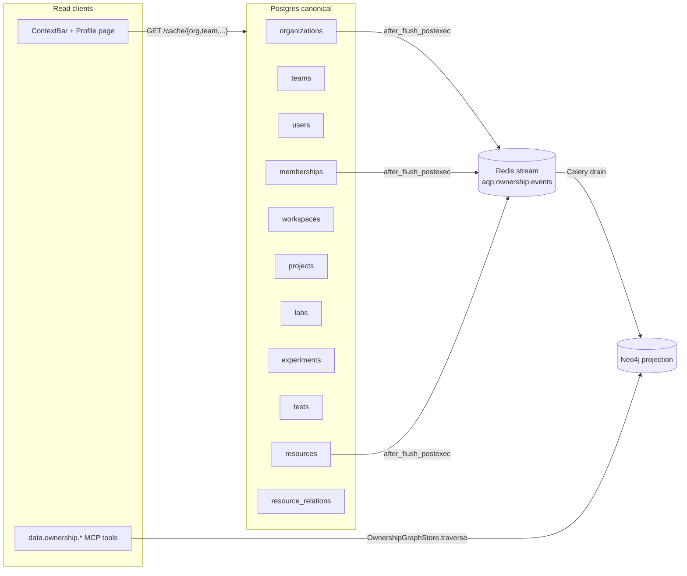

# Ownership graph (Phase 2 of the multi-tenant rollout)

The ownership graph is the projection layer that lets the MCP
catalog + UI ask "what can this user see?" / "who can read this?"
without joining the canonical tenancy tables hop-by-hop.

## Architecture

## Hard rule

Hard rule 33 in [`AGENTS.md`](../AGENTS.md): "All ownership /
membership queries that traverse more than one hop MUST go through
`aqp.graph.OwnershipGraphStore`."

## Node + edge model

| Node kind     | Source table         | Identity         |
| ------------- | -------------------- | ---------------- |
| Organization  | `organizations`      | UUID             |
| Team          | `teams`              | UUID             |
| User          | `users`              | UUID             |
| Workspace     | `workspaces`         | UUID             |
| Project       | `projects`           | UUID             |
| Lab           | `labs`               | UUID             |
| Experiment    | `experiments`        | UUID             |
| Test          | `tests`              | UUID             |
| Resource      | `resources`          | UUID             |

| Edge relation     | from -> to (kinds)            | Source     |
| ----------------- | ----------------------------- | ---------- |
| `HAS_TEAM`        | Organization -> Team          | `teams.org_id` |
| `HAS_WORKSPACE`   | Organization -> Workspace     | `workspaces.org_id` |
| `HAS_PROJECT`     | Workspace -> Project          | `projects.workspace_id` |
| `HAS_LAB`         | Workspace -> Lab              | `labs.workspace_id` |
| `MEMBER_OF`       | User -> (Org\|Team\|Workspace\|Project\|Lab) | `memberships` |
| `OWNS`            | (Org\|Team\|User\|Workspace\|Project) -> Resource | `resources.owner_scope_*` |
| `IN_PROJECT`      | Experiment / Resource -> Project | `*.project_id` |
| `IN_LAB`          | Experiment / Resource -> Lab  | `*.lab_id` |
| `IN_WORKSPACE`    | Resource -> Workspace         | `resources.workspace_id` |
| `IN_EXPERIMENT`   | Test -> Experiment            | `tests.experiment_id` |
| `PARENT_OF`       | Experiment -> Experiment      | `experiments.parent_experiment_id` |
| `DERIVED_FROM` / `CLONES` / `TRANSLATED_FROM` / `USES` / `REFERENCES` | Resource -> Resource | `resource_relations.relation` |

## Sync semantics

- **Source of truth**: Postgres. Every ownership write is a normal
  ORM commit.
- **Event bus**: SQLAlchemy
  [`after_flush_postexec`](../aqp/graph/sqlalchemy_hooks.py) hooks
  translate each row insert/update/delete into an
  [`OwnershipEvent`](../aqp/graph/events.py) on the
  `aqp:ownership:events` Redis stream (or an in-process fallback
  queue when Redis is unreachable).
- **Drain**: the
  [`aqp.tasks.ownership_tasks.drain_events`](../aqp/tasks/ownership_tasks.py)
  Celery beat task runs every 5 s and applies up to
  `AQP_OWNERSHIP_SYNC_BATCH_SIZE` (default 500) events through
  `OwnershipGraphStore.apply_events`.
- **Healer**: the periodic `full_resync` task (default 30 min)
  walks the canonical tables + re-emits everything so any missed
  delivery is repaired.

## Read paths

- **Python**:
  `from aqp.graph import get_ownership_store; store = get_ownership_store(); store.traverse(...)`.
- **MCP tools**:
  - `data.ownership.tree` — outward walk from a node.
  - `data.ownership.list_resources` — every Resource a user can see.
  - `data.ownership.who_can_read` — reverse — every user that can
    read a specific Resource.
- **HTTP** (Phase 6 frontend): the ContextBar talks directly to
  the metadata cache (`/cache/organizations` etc.); deeper queries
  go through the MCP HTTP transport (`/mcp/data/tools/<name>/invoke`).

## Stores

| Backend                       | Use case |
| ----------------------------- | -------- |
| [`PostgresOwnershipGraphStore`](../aqp/graph/postgres_store.py) | Local dev, unit tests, bootstrap/recovery |
| [`Neo4jOwnershipGraphStore`](../aqp/graph/neo4j_store.py) | Production multi-hop queries |

Pick via `AQP_OWNERSHIP_GRAPH_STORE` (default `postgres`).

## See also

- [`aqp_docs/data-mcp.md`](data-mcp.md) — the MCP catalog the
  ownership tools plug into.
- [`aqp_docs/identity.md`](identity.md) — how the User node populates
  + how lazy provisioning seeds memberships.
- [`aqp_docs/experiments-tests.md`](experiments-tests.md) — the umbrella
  tables this graph sits on top of.
