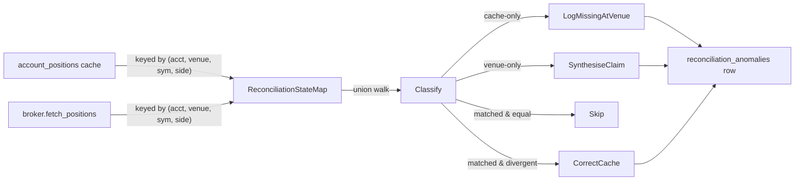

# Position reconciliation

> Status: **Phase 3 shipped** (Alembic 0042 + 0043). Engine:
> [`aqp/trading/reconciliation/`](../aqp/trading/reconciliation/).

## The two failure modes the engine closes

### Nautilus #4012 -- overwrite by instrument id

If reconciliation indexes state by ``instrument_id`` alone, a single
master account holding multiple positions on the same instrument
(across sub-accounts or algorithmic routing paths) loses every row
but the last to "last write wins". The Phase 3 composite key
``(account_id, venue, vt_symbol, position_side)`` makes every position
addressable independently.

### Nautilus #3176 -- phantom UUID on restart

When the system restarts and re-syncs against the venue, the
reconciliation loop discovers positions the cache no longer
remembers. The legacy code minted fresh client UUIDs to "bridge" the
gap; the venue saw them as new orders and the local cache filled up
with ghost rows. Every restart added a fresh batch.

Phase 3's deterministic claim mapping uses the venue's own
``venue_position_id`` / ``venue_execution_id`` as the natural key.
External claims have ``source='reconciliation'`` so the operator can
audit them.

## Two-way loop



Each pass classifies every composite key into one of four buckets:

| Bucket | Meaning | Default resolution |
| --- | --- | --- |
| ``matched_consistent`` | Both sides agree (within tolerance) | No-op |
| ``matched_divergent`` | Both sides have a row but the quantity differs | Correct cache to venue value, write anomaly |
| ``cache_only`` | Cache has a row the venue doesn't | Log only -- operator decides whether to zero out |
| ``venue_only`` | Venue has a row the cache doesn't | Synthesise an external claim row using ``venue_position_id`` |

## Anomaly taxonomy

The :class:`ReconciliationAnomalyRow` records every classified
mismatch. The ``anomaly_kind`` column:

* ``missing_in_cache`` -- venue-only
* ``missing_at_venue`` -- cache-only
* ``quantity_mismatch`` -- both sides have rows, quantities differ
* ``price_mismatch`` -- both sides have rows, average prices differ
  beyond tolerance
* ``duplicate_uuid`` -- two cache rows have the same client UUID
  (data corruption, should never happen)
* ``orphan_external_claim`` -- the venue says this is OUR position
  but it doesn't match any account we own (multi-tenant misrouting)
* ``overfill_tolerated`` -- venue says quantity > cache; engine
  swallowed because ``allow_overfills=True``
* ``status_mismatch`` -- order status diverges (Phase 2 audit, when
  the order-level reconciler is added)

## ``allow_overfills``

Some exchanges (Binance, especially during deposit / withdrawal
windows) emit fills that the cache hasn't seen yet because the
matching WebSocket event arrived after a brief disconnection. The
``allow_overfills`` flag on :class:`ReconciliationEngine` tells the
engine to swallow the discrepancy (severity ``info``) instead of
raising. The row still lands in ``reconciliation_anomalies`` so the
operator can spot patterns later.

## Code example

```python
from aqp.persistence.db import get_session
from aqp.persistence.models_accounts import AccountRow
from aqp.trading.reconciliation import ReconciliationEngine

with get_session() as session:
    account = session.query(AccountRow).filter_by(
        venue="alpaca", account_id="paper-1"
    ).one()

engine = ReconciliationEngine(
    account=account,
    broker=alpaca_adapter,           # implements IDomainBrokerage
    allow_overfills=False,
)
outcome = await engine.reconcile_positions()
print(
    outcome.matched, outcome.cache_only,
    outcome.venue_only, outcome.divergent,
)
```

## Scheduling

The reconcile pass is intended to run:

1. **At session boot** -- the paper / live trading session calls it
   before starting the bar loop. Catches any drift from the previous
   run.
2. **On WebSocket reconnect** -- after a network blip, the broker
   adapter triggers a reconcile to catch up.
3. **Every N minutes via Celery** -- a heartbeat poll catches slow
   drift even when no events have crossed.

The schedule is per-account so a slow venue doesn't block the rest.

## Operator workflows

Operators query ``reconciliation_anomalies`` for:

* Recent divergences (severity ``warn`` or ``error``)
* Pattern detection (same instrument repeatedly divergent -> data
  feed bug)
* Audit trail for regulator review (every venue/cache disagreement
  has a row with timestamps + before/after snapshots)

A future Phase 5 frontend route surfaces this table in a triage UI.
