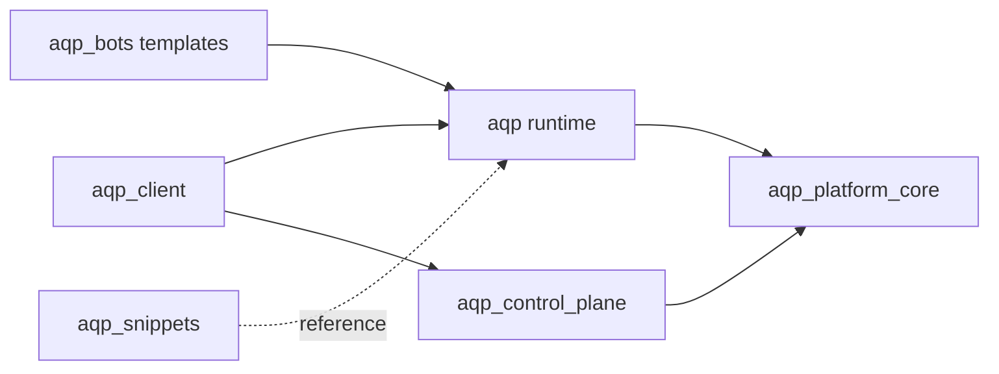

# Repository Split

Status: migration guidance.

This document defines the AQP monorepo boundaries while the platform is
being split into future repositories. The current goal is isolation by
responsibility without breaking imports, deployment manifests, or operator
workflows.

## Principles

- Use a strangler migration: create stable contracts first, then move
  implementations behind compatibility shims.
- Keep shared abstractions in `aqp_platform_core`; do not import from
  higher-level packages there.
- Keep `aqp_control_plane` standalone. It may depend on
  `aqp_platform_core`, but it must not import `aqp.*`.
- Keep `rpi_kubernetes` as cluster bootstrap and platform services only.
  AQP workload controllers and operator features live in this repository.
- Prefer generated or typed API contracts between projects over direct
  imports across future repository boundaries.

## Domain Map

| Domain | Current path | Owns | Does not own |
| --- | --- | --- | --- |
| Control plane | `aqp_control_plane/` | `/manage/*`, workload lifecycle, provider adapters, session/control API | Quant runtimes, Celery business tasks, strategy logic |
| Platform core | `aqp_platform_core/` | Shared value types, ABCs, auth/resource filters, topology, stable wire models | FastAPI routes, ORM models, concrete cloud SDK workflows |
| Client | `aqp_client/` | Operator UI, client docs, generated API contracts, local client behavior | Backend business logic, direct database writes |
| Snippets | `aqp_snippets/` | Curated code knowledge, annotations, prompts, provenance indexes | Runtime imports or production package dependencies |
| Bots | `aqp_bots/`, `aqp_bots/templates/` | Bot runtime, templates, examples, sample specs | Direct bypass of `BotRuntime` or immutable versioning |
| Monolith runtime | `aqp/` | Agents, RL, analysis, backtests, data plane, persistence, tasks, API gateway | New workload control-plane providers |
| Deployment | `aqp_platform/deployments/`, `aqp_platform/terraform/`, `build/` | Compose, Kubernetes, Terraform, image build contracts | Cluster bootstrap owned by `rpi_kubernetes` |

## Allowed Dependencies

Hard dependency rules:

1. `aqp_platform_core` must not import `aqp`, `aqp_cp`, FastAPI, SQLAlchemy,
   Celery, or heavy optional SDKs.
2. `aqp_control_plane` must not import `aqp.*`; use
   `aqp_platform_core` contracts or HTTP APIs.
3. `aqp_client` must call backend APIs through generated clients or local API
   wrappers. It must not duplicate authorization, tenancy, or kill-switch
   semantics.
4. `aqp_snippets` is read-only knowledge for runtime code. Production modules
   must not import from it.
5. `aqp_bots` stores templates and guidance until runtime interfaces are
   extracted from `aqp_bots`.

## Migration Order

1. Stabilize `aqp_platform_core` package contracts and tests.
2. Finish `aqp_control_plane` as the only home for workload lifecycle
   providers and `/manage/*` behavior.
3. Move curated references into `aqp_snippets` with provenance and indexes.
4. Extract `aqp_client` contracts around the existing Vite frontend and API
   gateway behavior before moving source paths.
5. Split `aqp_bots` last, after bot persistence, task dispatch, backtest,
   paper trading, and agent runtime interfaces are explicit.
6. Clean root-level build/deploy files only after the projects can be tested
   independently.

## Future Repo Split Gate

A domain is ready to become its own repository when it has:

- `README.md`, `AGENTS.md`, and a validation command list.
- Independent packaging or build metadata.
- No forbidden imports across future repo boundaries.
- Versioned API or model contracts for consumers.
- CI checks that run without relying on the full monolith checkout, except
  for documented integration tests.

