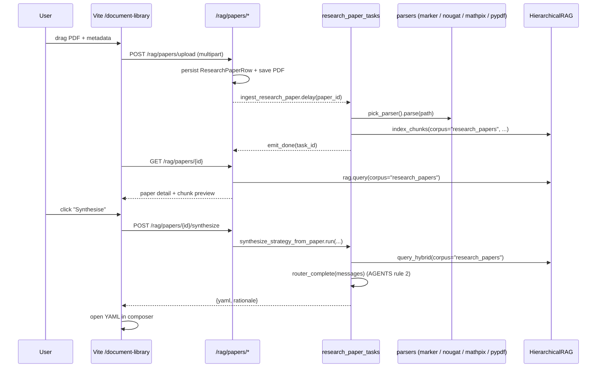

# Research-Papers RAG (math-aware)

A new corpus, `research_papers`, indexes academic and practitioner
PDFs into the existing `HierarchicalRAG` stack with first-class
support for LaTeX equations and rich metadata (asset class, strategy
family, author institution).

## End-to-end flow



## Components

| Layer | Module | Purpose |
| --- | --- | --- |
| ORM | `aqp.persistence.models_research_papers.ResearchPaperRow` | row per ingested paper + rich metadata |
| Migration | `alembic/versions/0035_research_papers.py` | creates the `research_papers` table (immutable per AGENTS rule 6) |
| Parsers | `aqp.rag.parsers.{marker,nougat,mathpix,pypdf}` | math-aware PDF → text + equations |
| Indexer | `aqp.rag.indexers.research_papers_indexer.index_research_papers` | walks parsed blocks with equation-aware chunking, writes through `HierarchicalRAG.index_chunks` |
| Corpus | `aqp.rag.orders.OrderCatalog["research_papers"]` | new `theory` order under L1 `research` / L2 `papers` |
| Hybrid retrieval | `aqp.rag.hybrid_retrieval.reciprocal_rank_fusion` + `RedisVectorStore.search_text` + `HierarchicalRAG.query_hybrid` | dense KNN + BM25 fused via RRF |
| API | `aqp.api.routes.rag` (`/rag/papers/*`) | upload, list, detail, synthesize, hybrid-query |
| Tasks | `aqp.tasks.research_paper_tasks.{ingest_research_paper,synthesize_strategy_from_paper}` | progress-emitting Celery wrappers |
| MCP | `aqp.data.mcp.tools.research_papers.{Browse,Search,Synthesize}ResearchPapersTool` | `data.research_papers.*` for agents (AGENTS rule 22) |
| Frontend | `aqp_client/src/components/strategy-dev/{DocumentLibrary,PaperUpload,PaperDetail,PaperSynthesisDrawer}.tsx` | upload + browse + detail (KaTeX) + synthesise |

## Parser selector chain

```python
from aqp.rag.parsers import pick_parser
parser = pick_parser(preference=["marker", "mathpix", "nougat", "pypdf"])
doc = parser.parse("paper.pdf")
```

- **marker** — primary OSS choice. Preserves LaTeX-rich blocks.
- **mathpix** — commercial API, credential-gated through
  `CredentialResolver` (AGENTS rule 26). Set
  `mathpix.app_id` / `mathpix.app_key` (file or env) to enable.
- **nougat** — Meta's transformer OCR fallback. Heavyweight but
  handles scanned PDFs that Marker can't reach.
- **pypdf** — text-only last resort for any environment where no
  math-aware backend is installed.

## Metadata schema

`ResearchPaperRow` enforces the schema from the 2026 research
report:

| Field | Type | Purpose |
| --- | --- | --- |
| `title` | str | paper title (auto-extracted; user-editable) |
| `authors` | list[str] | author names |
| `author_institution` | str | one canonical institution (e.g. "MIT") |
| `publication_year` | int | publication year |
| `asset_class` | list[str] | equities / options / fixed_income / crypto / fx / futures |
| `strategy_family` | str | momentum / mean_reversion / volatility / microstructure / … |
| `contains_mathematics` | bool | True iff the parser extracted ≥1 equation |
| `equation_count` | int | LaTeX equations preserved |
| `pdf_path` | str | filesystem path under `settings.rag_paper_root` |
| `parser_used` | str | which backend won the selector race |
| `chunk_count` | int | how many vector chunks landed in Redis |
| `meta` | JSON | free-form extras (original filename, …) |

The chunk-level metadata (carried on the Redis vector record) is a
superset of the row-level metadata so every retrieved chunk knows
its paper id, parser, equation count, asset class, and strategy
family without a second Postgres roundtrip.

## Hybrid retrieval

`HierarchicalRAG.query_hybrid(query, corpus="research_papers", ...)`
fuses dense KNN over BGE-M3 embeddings with sparse BM25
(`FT.SEARCH @text:(...)`) via Reciprocal Rank Fusion. The fusion
weights are tunable per call so callers can lean dense-heavy for
exploratory queries or sparse-heavy when the user typed an exact
theorem reference.

## Settings

| Knob | Default | Purpose |
| --- | --- | --- |
| `AQP_RAG_PDF_PARSER` | `marker` | preferred parser (selector falls back) |
| `AQP_RAG_PAPER_ROOT` | `./data/research_papers` | filesystem root for uploaded PDFs |
| `AQP_RAG_PAPER_MAX_MB` | `50` | per-upload size cap |
| `AQP_MATHPIX_APP_ID` / `AQP_MATHPIX_APP_KEY` | empty | credentials for the MathPix backend |

## Hard-rule alignment

- AGENTS rule 2: synthesis routes through `router_complete`.
- AGENTS rule 4: ingest + synthesis tasks emit through
  `_progress.emit / emit_done / emit_error`.
- AGENTS rule 6: migration `0035_research_papers.py` is immutable.
- AGENTS rule 11: indexer feeds chunks through
  `HierarchicalRAG.index_chunks` — no direct Redis writes.
- AGENTS rule 22: agents read papers exclusively via the
  `data.research_papers.*` MCP tools.
- AGENTS rule 26: MathPix credentials resolve through
  `CredentialResolver`.
