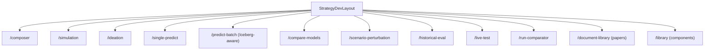

# Strategy Development (Consolidated `/strategy-development/*`)

The Vite frontend exposes a single consolidated umbrella for every
strategy-authoring + strategy-testing surface under
`/strategy-development/*`. Twelve sibling sub-routes share the same
persistent left sub-nav, a run-summary KPI strip, and a cross-route
React context so navigating between (say) Compose → Simulate →
Compare-Models keeps all the inputs (deployment id, symbols, time
window, feature row, last task id) coherent.



## Surfaces

| Route | Component | Wraps |
| --- | --- | --- |
| `/strategy-development` | `StrategyDevIndexRoute` | redirects to `/strategy-development/composer` |
| `/strategy-development/composer` | `StrategyComposer` | `GET /strategies/components` + `POST /strategies` |
| `/strategy-development/simulation` | `SimulationCreator` | dispatches to `BotRuntime` / `LobBacktestEngine` / `AlphaBacktestExperiment` / `RLRuntime` / paper |
| `/strategy-development/ideation` | `IdeationConsole` | `POST /agents/ideate` (router_complete + research_papers RAG) |
| `/strategy-development/single-predict` | `SinglePredictRoute` | `POST /ml/test/single` |
| `/strategy-development/predict-batch` | `PredictBatchRoute` | `POST /ml/test/batch` (now Iceberg-aware) + `POST /ml/test/upload-csv` |
| `/strategy-development/compare-models` | `CompareModelsRoute` | `POST /ml/test/compare` |
| `/strategy-development/scenario-perturbation` | `ScenarioPerturbationRoute` | `POST /ml/test/scenario` |
| `/strategy-development/historical-eval` | `HistoricalEvalRoute` | `POST /ml/evaluate` + `GET /ml/evaluations/{task_id}` |
| `/strategy-development/live-test` | `LiveTestRoute` | `POST /ml/live-test/start` + `useLiveStream` |
| `/strategy-development/run-comparator` | `RunComparator` | chained pairwise `POST /ml/test/compare` |
| `/strategy-development/document-library` | `DocumentLibrary` | `GET /rag/papers`, `POST /rag/papers/upload`, `POST /rag/papers/{id}/synthesize` |
| `/strategy-development/library` | `StrategyLibraryRoute` | `GET /strategies/components` (read-only registry browser) |

## Cross-route state

`aqp_client/src/components/strategy-dev/StrategyDevContext.tsx` holds
the shared selection (`deploymentId`, `deploymentIdB`, `symbols`,
`start`, `end`, `featureRowText`, `perturbations`, `lastTaskId`,
`lastRunSummary`, `composerYaml`, `strategyId`). The context is
backed by `localStorage` under the key `aqp.strategy-dev.selection.v1`
so a hard refresh doesn't lose state.

Sub-routes use `useStrategyDev()` to read + patch the selection:

```ts
const { selection, setSelection } = useStrategyDev();
setSelection({ deploymentId: "abc", lastTaskId: res.task_id });
```

## KPI strip

`RunKpiStrip` reads `selection.lastRunSummary` and renders Sharpe /
total return / max DD / hit rate / trades in the standard
`MetricsGrid`. The strip is intentionally idle when no run has been
launched in the current session so the surface stays calm.

## Hard-rule alignment

- Frontend rule (`.cursor/rules/frontend.mdc`): every long-running
  task is consumed via the existing `useChatStream` / `useLiveStream`
  hooks so the WS pipeline + kill-switch + sandbox banner all stay
  intact.
- AGENTS rule 2: LLM-driven surfaces (`IdeationConsole`,
  `PaperSynthesisDrawer`) route through `router_complete` server-side.
- AGENTS rule 4: progress framing is unchanged — sub-routes never
  publish to Redis directly; they always go through `_progress.emit`
  on the backend.

## How to add a sub-route

1. Create `aqp_client/src/routes/strategy-development/<slug>/page.tsx`
   wrapping the new component.
2. Add the new component under `aqp_client/src/components/strategy-dev/`.
3. Register the route in `aqp_client/src/routes.tsx`'s
   `DYNAMIC_ROUTES` entry for `strategy-development`.
4. Add a `StrategyDevSubRoute` entry to
   `aqp_client/src/components/strategy-dev/SubNav.tsx` so the new
   route appears in the persistent left nav.

## Legacy

The legacy webui `/ml/test` page is now superseded by this consolidated
surface. Bookmarks still work because the flat REAL_ROUTES entry is
preserved, but the sidebar no longer surfaces it.
