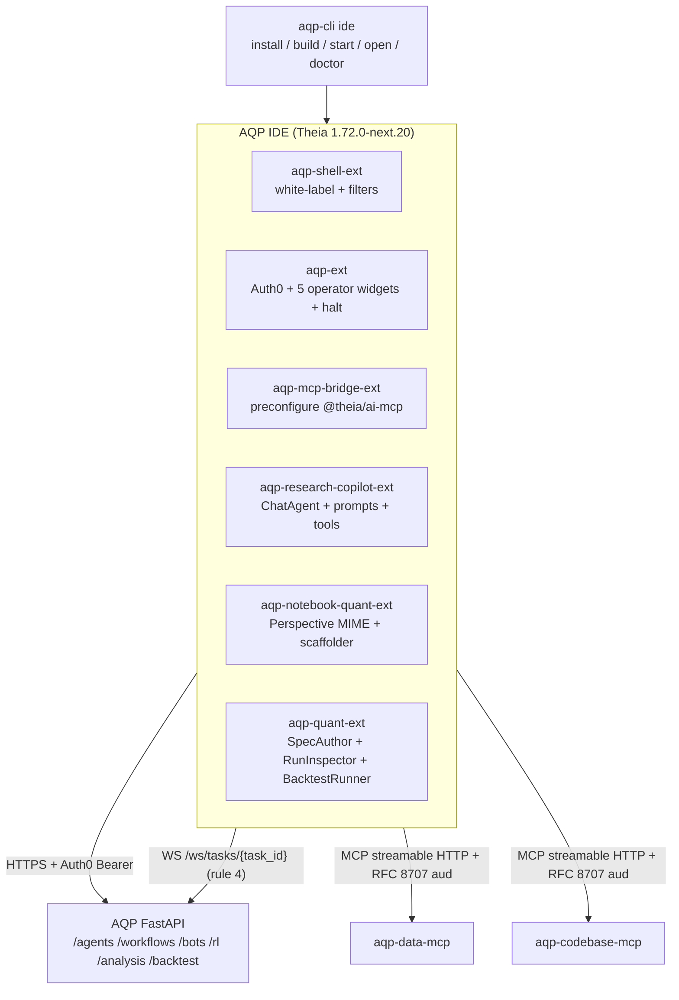

# AQP IDE

**The AQP IDE is a white-labeled Eclipse Theia 1.72 distribution + six AQP
compile-time extensions + an MCP-driven research copilot + a Perspective
Arrow notebook renderer**, designed as the developer environment that
sits next to (not replaces) the `aqp_client/` Vite operator UI.

The canonical entrypoint is the **`aqp-cli ide`** command group; see
[docs/cli-entrypoint.md](docs/cli-entrypoint.md).

## At a glance



## The six AQP extensions

| Extension | Purpose | Status |
| --- | --- | --- |
| [`theia-extensions/aqp/`](theia-extensions/aqp/) | Auth0 PKCE login, 5 operator widgets, 9-endpoint kill-switch, tenancy QuickPick, runtime config endpoint | shipped |
| [`theia-extensions/aqp-shell/`](theia-extensions/aqp-shell/) | White-label theme, `FilterContribution` lockdown, `AQP IDE — <tenancy>` window title, AQP About dialog | shipped |
| [`theia-extensions/aqp-mcp-bridge/`](theia-extensions/aqp-mcp-bridge/) | Pre-configures Theia AI MCP for `aqp-data-mcp` + `aqp-codebase-mcp` with Auth0 bearer + RFC 8707 audience + tenancy headers (AQP rule 49) | shipped |
| [`theia-extensions/aqp-research-copilot/`](theia-extensions/aqp-research-copilot/) | Theia AI `ChatAgent` backed by `router_complete` (AQP rule 2), spec-authoring prompts, AQP REST tool functions | shipped |
| [`theia-extensions/aqp-notebook-quant/`](theia-extensions/aqp-notebook-quant/) | FINOS Perspective MIME renderer for Arrow batches + `File → New AQP Notebook` scaffolder | shipped |
| [`theia-extensions/aqp-quant/`](theia-extensions/aqp-quant/) | `SpecAuthorWidget` + `RunInspectorWidget` (rule 4 progress frame) + `BacktestRunnerWidget` (rules 14/15, 17, 24, 40/41) | shipped |

## Build + run

The canonical entrypoint is **`aqp-cli ide`** (see [docs/cli-entrypoint.md](docs/cli-entrypoint.md)).
You almost never need to invoke `yarn` directly:

```bash
# First-run sequence
aqp-cli auth login --device
aqp-cli ide install        # yarn install (~3-5 minutes first time)
aqp-cli ide build --dev    # yarn build:extensions + build:applications:dev
aqp-cli ide start --open   # spawn Theia, open in browser

# Day-to-day
aqp-cli ide status         # is it running? on which port?
aqp-cli ide logs           # tail ide.log
aqp-cli ide doctor         # preflight checks
aqp-cli ide stop
```

For inner-loop Theia extension development you can still use the
native yarn commands inside `aqp_ide/`:

```bash
cd aqp_ide
yarn install               # one-time
yarn build:extensions
yarn build:applications:dev
yarn browser start         # connect to http://localhost:3000
```

## Docs index

| Doc | Audience | Purpose |
| --- | --- | --- |
| [docs/index.md](docs/index.md) | operators + developers | Doc map |
| [docs/architecture.md](docs/architecture.md) | developers | Process diagram + the four extension mechanisms + InversifyJS + JSON-RPC + MCP |
| [docs/extensions.md](docs/extensions.md) | developers | Per-extension reference with cited files |
| [docs/cli-entrypoint.md](docs/cli-entrypoint.md) | operators | Full `aqp-cli ide` cookbook |
| [docs/mcp-integration.md](docs/mcp-integration.md) | developers | DataMCP + CodebaseMCP wiring details (AQP rule 49) |
| [docs/research-copilot.md](docs/research-copilot.md) | operators + developers | The AQP Research Copilot's prompts + tools + model routing |
| [docs/notebook.md](docs/notebook.md) | operators + developers | Perspective MIME flow + kernel facade + `aqp.notebook.helpers` |
| [docs/quant-widgets.md](docs/quant-widgets.md) | operators | SpecAuthor / RunInspector / BacktestRunner reference |
| [docs/deployment.md](docs/deployment.md) | operators | Docker + single-pod K8s + Theia Cloud roadmap |
| [docs/retire-vendored-workspace.md](docs/retire-vendored-workspace.md) | operators | Checklist to delete `test_theia/theia-ide` |
| [docs/aqp-monorepo-paths.md](docs/aqp-monorepo-paths.md) | developers | In-IDE path contract |
| [docs/code-index.md](docs/code-index.md) | agents | Ownership map (curator-managed) |
| [../aqp_docs/aqp-ide.md](../aqp_docs/aqp-ide.md) | monorepo readers | SSoT pointer from the AQP docs side |
| [../aqp_docs/aqp-ide-roadmap.md](../aqp_docs/aqp-ide-roadmap.md) | engineering | Blueprint → AQP phasing |

## Hard rules + governance

The AQP IDE is bound by the always-on rules:

- [`.cursor/rules/aqp-ide.mdc`](../.cursor/rules/aqp-ide.mdc) — no
  `agentic_quant_platform` source imports from Theia TypeScript; cross
  HTTP only.
- [`.cursor/rules/aqp-management-engine.mdc`](../.cursor/rules/aqp-management-engine.mdc)
  — no token / secret printing.
- [`.cursor/rules/aqp.mdc`](../.cursor/rules/aqp.mdc) — the 55 AQP hard
  rules. The IDE most-cited touchpoints are rules **2** (LLM gateway),
  **4** (progress frame), **22** (DataMCP), **27** (IdentityProvider),
  **45** (WorkloadRuntime), **47** (topology), **49** (MCP audience),
  **52** (step-up MFA).

The retirement of the vendored `test_theia/theia-ide` workspace lives at
[docs/retire-vendored-workspace.md](docs/retire-vendored-workspace.md).

## What this workspace is + is NOT

| It IS | It is NOT |
| --- | --- |
| A white-labeled Theia 1.72 distribution + 6 AQP extensions | A fork of Theia |
| The developer environment for AQP (notebook, MCP copilot, spec authoring) | A replacement for `aqp_client/` (the Vite operator UI) |
| Driven by `aqp-cli ide` for production use | Driven by `yarn` for production use (yarn is inner-loop dev only) |
| Aligned with the [AQP IDE blueprint](../aqp_docs/aqp-ide-roadmap.md) | A clone of Bloomberg / Beacon / Numerix / GS Quant |

---

Upstream Theia IDE README content (preserved for reference) is in
[docs/archive/upstream-theia-ide-readme.md](docs/archive/upstream-theia-ide-readme.md).
