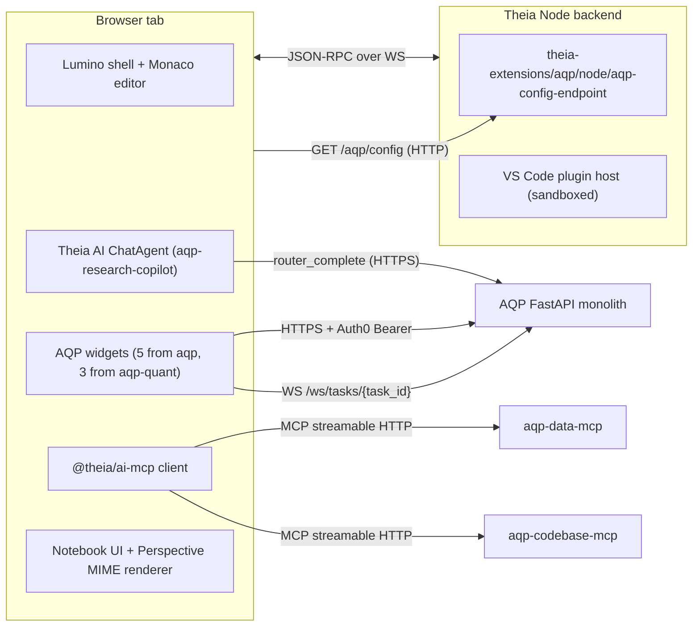
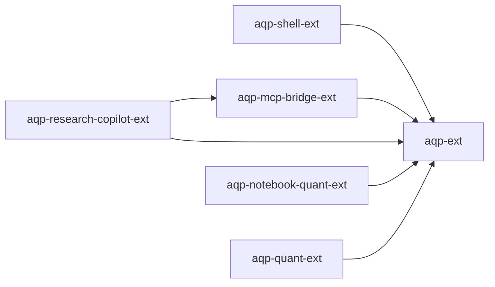

# AQP IDE architecture

The AQP IDE runs as two cooperating processes: a **frontend** (a
Webpack-bundled Single-Page Application running in a browser tab or
Electron renderer) and a **backend** (a Node.js Express server, optionally
headless). The two communicate over a multiplexed WebSocket using a
Theia-specific message-RPC protocol layered on JSON-RPC semantics.

## Process diagram



## The four extension mechanisms (Theia)

| # | Mechanism | When loaded | API surface | AQP usage |
| --- | --- | --- | --- | --- |
| 1 | **Compile-time Theia extensions** | Built into the bundle via npm/yarn deps + `theiaExtensions` entry in package.json | Full Theia API + InversifyJS DI, no sandbox | All six AQP extensions use this mechanism |
| 2 | VS Code extensions (emulation) | Runtime install from Open VSX OR pre-installed via `theiaPlugins` | VS Code extension API (1.105.0 in Theia 1.66) | Pre-installed: `vscode-builtin-extensions`, `vscjava.vscode-java-pack`, `vscjava.vscode-java-dependency` |
| 3 | Theia plugins | Runtime; superset of VS Code API but Theia-only | VS Code API + Theia frontend APIs | Not used (the upstream guidance steers extensions to mechanism #1) |
| 4 | Headless plugins | Runtime; per-backend, no frontend connection | Custom backend APIs only | Reserved for future long-running quant agents (documented as Phase B in `aqp_docs/docs/concepts/infrastructure/aqp-ide-roadmap.md`) |

## InversifyJS dependency injection

Every AQP extension wires its services via a `ContainerModule` declared
in `package.json` under `theiaExtensions`:

```typescript
import { ContainerModule } from '@theia/core/shared/inversify';

export default new ContainerModule(bind => {
    bind(MyService).toSelf().inSingletonScope();
    bind(FrontendApplicationContribution).toService(MyService);
});
```

The canonical pattern for cross-extension consumption is to import the
sibling extension's class directly (e.g. the AQP MCP bridge imports
`AqpConfigService` from `theia-ide-aqp-ext/lib/browser/aqp/aqp-config-service`).
The container then resolves the same singleton across both extensions —
because Theia spins up a single InversifyJS container per process.

## Cross-extension dependency graph



Hard rule: the dependency direction is **strictly one-way**.
`theia-ide-aqp-ext` must never depend on any of the new extensions; that
would couple the production Auth0 + operator widgets to optional features.

## JSON-RPC + WebSocket pattern

AQP does not (yet) need its own JSON-RPC service in Theia — every cross-
process call goes through HTTP (`AqpApiService`) or WebSocket (`AqpWsClient`
in `aqp-quant-ext`). The native Theia JSON-RPC pattern is documented at
[theia-ide.org/docs/json_rpc](https://theia-ide.org/docs/json_rpc) and is
the path to use if a future AQP extension needs a backend RPC service —
e.g. an Arrow Flight gateway (`aqp_docs/docs/concepts/infrastructure/aqp-ide-roadmap.md` Phase B).

## MCP wiring

The MCP bridge is the single sanctioned consumer of `MCPServerManager`
from `@theia/ai-mcp`. Detailed wiring + RFC 9728 / RFC 8707 contract in
[mcp-integration.md](mcp-integration.md).

## Native notebook support

Theia gained native VS Code Notebook API support via PR #12442. The AQP
notebook extras (Perspective MIME renderer + scaffolder) extend that
foundation; details in [notebook.md](notebook.md).

## Multi-tenancy

AQP's tenancy isolation runs end-to-end:

1. The frontend `AqpTenancyStore` (from `theia-ide-aqp-ext`) holds the
   active workspace / project / lab / org / team.
2. `AqpApiService` attaches `X-AQP-*` headers on every HTTP request
   (AQP rule 51).
3. `AqpMcpRegistrar` re-registers MCP servers on every tenancy change
   so the bridged DataMCP + CodebaseMCP calls carry the right tenancy.
4. `AqpWsClient` includes the tenancy in the WebSocket query string
   (browsers can't set Authorization headers on the WS handshake).

The Theia process itself remains single-tenant (one user per backend
instance) per Theia maintainer guidance. Multi-tenant deployment is
documented in [deployment.md](deployment.md) using the Theia Cloud
operator.

## Hard-rule touchpoints

| Hard rule | Where it lives | AQP IDE consumer |
| --- | --- | --- |
| 2 (LLM gateway) | `aqp/llm/providers/router.py::router_complete` | `aqp-research-copilot-ext`'s `RouterCompleteClient` |
| 4 (canonical progress frame) | `aqp/tasks/_progress.py::emit` | `aqp-quant-ext`'s `AqpWsClient` / `RunInspectorWidget` |
| 22 (DataMCP boundary) | `aqp/data/mcp/` | `aqp-mcp-bridge-ext`'s registrations |
| 26 (CredentialResolver) | `aqp/credentials/resolver.py` | The Python notebook helpers (rule 22-compliant) |
| 27 (IdentityProvider) | `aqp/auth/providers/` | `aqp-ext`'s `Auth0Service` + the new bridge/copilot |
| 45 (WorkloadRuntime) | `aqp_platform_core/runtime/workload.py` | `aqp-ext`'s halt fan-out + `aqp-cli ide` doctor |
| 47 (topology) | `aqp_control_plane/services/topology.py` | `aqp-cli ide url --remote` / `detect` / `env` |
| 49 (MCP audience, RFC 8707) | `aqp/api/well_known.py` + `aqp/api/mcp_audience.py` | `aqp-mcp-bridge-ext`'s `X-AQP-MCP-Audience` header |
| 52 (step-up MFA) | `aqp/api/security_stepup.py` | `aqp-ext`'s halt command (existing); future write-tools in copilot |
