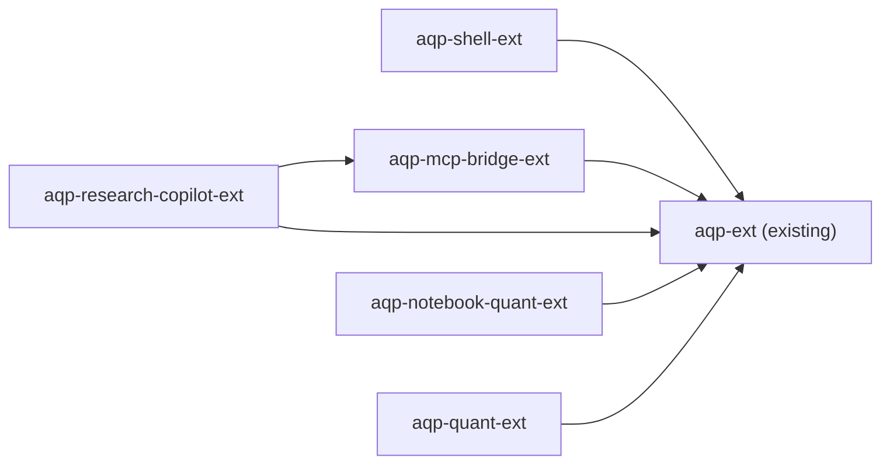

# AQP IDE extensions reference

Six AQP compile-time Theia extensions live under
`theia-extensions/aqp*/`. This page is the per-extension cheat sheet;
the canonical README + AGENTS contract for each lives inside the
extension directory.

## Dependency direction

`aqp-ext` is the foundation. The other five extensions depend on it for
`AqpApiService`, `Auth0Service`, `AqpTenancyStore`, and `AqpConfigService`
— never the other way around.

## 1. `theia-ide-aqp-ext`

Existing extension. Auth0 PKCE login, 5 operator widgets (Agent Runs,
Workflows, Bots, Topology, Management iframe), 9-endpoint kill-switch
(`ctrlcmd+alt+h`), tenancy QuickPick, backend `GET /aqp/config` endpoint.

- README: [../theia-extensions/aqp/README.md](../theia-extensions/aqp/README.md)
- AGENTS: [../theia-extensions/aqp/AGENTS.md](../theia-extensions/aqp/AGENTS.md)
- Key files:
  - [`src/common/aqp-protocol.ts`](../theia-extensions/aqp/src/common/aqp-protocol.ts) — command ids, view ids, kill-switch endpoints, `AqpRuntimeConfig` (now extended with `mcp` + `copilot` slots)
  - [`src/node/aqp-config-endpoint.ts`](../theia-extensions/aqp/src/node/aqp-config-endpoint.ts) — `GET /aqp/config` (extended with MCP + copilot env vars)
  - [`src/browser/aqp-frontend-module.ts`](../theia-extensions/aqp/src/browser/aqp-frontend-module.ts)
  - 5 widgets under [`src/browser/widgets/`](../theia-extensions/aqp/src/browser/widgets/)

## 2. `theia-ide-aqp-shell-ext`

White-label theme + `FilterContribution` lockdown + window-title +
About dialog. Purely cosmetic + filtering; no HTTP, no widgets.

- README: [../theia-extensions/aqp-shell/README.md](../theia-extensions/aqp-shell/README.md)
- AGENTS: [../theia-extensions/aqp-shell/AGENTS.md](../theia-extensions/aqp-shell/AGENTS.md)
- Key files:
  - [`src/browser/aqp-shell-frontend-module.ts`](../theia-extensions/aqp-shell/src/browser/aqp-shell-frontend-module.ts)
  - [`src/browser/filters/aqp-filter-contribution.ts`](../theia-extensions/aqp-shell/src/browser/filters/aqp-filter-contribution.ts)
  - [`src/browser/window/aqp-window-title-contribution.ts`](../theia-extensions/aqp-shell/src/browser/window/aqp-window-title-contribution.ts)
  - [`src/browser/about/aqp-about-dialog-contribution.ts`](../theia-extensions/aqp-shell/src/browser/about/aqp-about-dialog-contribution.ts)
  - [`src/browser/style/aqp-theme.css`](../theia-extensions/aqp-shell/src/browser/style/aqp-theme.css)

## 3. `theia-ide-aqp-mcp-bridge-ext`

Pre-configures Theia AI MCP for `aqp-data-mcp` + `aqp-codebase-mcp`.
Only sanctioned consumer of `MCPServerManager.addOrUpdateServer(...)`.
Auth0 bearer + RFC 8707 audience + tenancy headers (AQP rule 49).

- README: [../theia-extensions/aqp-mcp-bridge/README.md](../theia-extensions/aqp-mcp-bridge/README.md)
- AGENTS: [../theia-extensions/aqp-mcp-bridge/AGENTS.md](../theia-extensions/aqp-mcp-bridge/AGENTS.md)
- Key files:
  - [`src/common/aqp-mcp-protocol.ts`](../theia-extensions/aqp-mcp-bridge/src/common/aqp-mcp-protocol.ts)
  - [`src/browser/mcp/aqp-mcp-server-spec.ts`](../theia-extensions/aqp-mcp-bridge/src/browser/mcp/aqp-mcp-server-spec.ts)
  - [`src/browser/mcp/aqp-mcp-registrar.ts`](../theia-extensions/aqp-mcp-bridge/src/browser/mcp/aqp-mcp-registrar.ts)
  - [`src/browser/commands/aqp-mcp-contribution.ts`](../theia-extensions/aqp-mcp-bridge/src/browser/commands/aqp-mcp-contribution.ts)
- Commands:
  - `AQP: MCP — Reconnect All`
  - `AQP: MCP — Show Status`

## 4. `theia-ide-aqp-research-copilot-ext`

Theia AI `ChatAgent` purpose-built for AQP. All LLM calls go through
AQP's `router_complete` (rule 2); tool functions wrap AQP REST + the
bridged MCP tools; prompt fragments for spec authoring + factor
research + codebase navigation.

- README: [../theia-extensions/aqp-research-copilot/README.md](../theia-extensions/aqp-research-copilot/README.md)
- AGENTS: [../theia-extensions/aqp-research-copilot/AGENTS.md](../theia-extensions/aqp-research-copilot/AGENTS.md)
- Key files:
  - [`src/common/aqp-copilot-protocol.ts`](../theia-extensions/aqp-research-copilot/src/common/aqp-copilot-protocol.ts)
  - [`src/browser/copilot/router-complete-client.ts`](../theia-extensions/aqp-research-copilot/src/browser/copilot/router-complete-client.ts)
  - [`src/browser/copilot/aqp-tool-functions.ts`](../theia-extensions/aqp-research-copilot/src/browser/copilot/aqp-tool-functions.ts)
  - [`src/browser/copilot/aqp-research-agent.ts`](../theia-extensions/aqp-research-copilot/src/browser/copilot/aqp-research-agent.ts)
  - 3 prompt fragments under [`src/browser/copilot/prompts/`](../theia-extensions/aqp-research-copilot/src/browser/copilot/prompts/)

## 5. `theia-ide-aqp-notebook-quant-ext`

FINOS Perspective MIME renderer for
`application/vnd.aqp.perspective-arrow+arrow` + a `File → New AQP Notebook`
scaffolder that pre-populates the helper imports cell.

- README: [../theia-extensions/aqp-notebook-quant/README.md](../theia-extensions/aqp-notebook-quant/README.md)
- AGENTS: [../theia-extensions/aqp-notebook-quant/AGENTS.md](../theia-extensions/aqp-notebook-quant/AGENTS.md)
- Key files:
  - [`src/common/aqp-notebook-protocol.ts`](../theia-extensions/aqp-notebook-quant/src/common/aqp-notebook-protocol.ts)
  - [`src/browser/notebook/perspective-mime-renderer.ts`](../theia-extensions/aqp-notebook-quant/src/browser/notebook/perspective-mime-renderer.ts)
  - [`src/browser/notebook/aqp-notebook-scaffolder.ts`](../theia-extensions/aqp-notebook-quant/src/browser/notebook/aqp-notebook-scaffolder.ts)
  - [`src/browser/commands/aqp-notebook-contribution.ts`](../theia-extensions/aqp-notebook-quant/src/browser/commands/aqp-notebook-contribution.ts)
- Python helpers (AQP-side): `aqp/notebook/helpers.py` (rule 22 + 26)

## 6. `theia-ide-aqp-quant-ext`

Quant widgets that complement the Vite operator UI:
- `SpecAuthorWidget` — JSON-schema editor for the 5 hash-locked specs
- `RunInspectorWidget` — live tail via WebSocket `/ws/tasks/{task_id}`
  (canonical progress frame, rule 4)
- `BacktestRunnerWidget` — dispatcher to `/bots/{ref}/backtest`,
  `/workflows/{name}/run`, `/rl/runs`, `/analysis/runs`

- README: [../theia-extensions/aqp-quant/README.md](../theia-extensions/aqp-quant/README.md)
- AGENTS: [../theia-extensions/aqp-quant/AGENTS.md](../theia-extensions/aqp-quant/AGENTS.md)
- Key files:
  - [`src/common/aqp-quant-protocol.ts`](../theia-extensions/aqp-quant/src/common/aqp-quant-protocol.ts)
  - [`src/browser/services/aqp-runtime-client.ts`](../theia-extensions/aqp-quant/src/browser/services/aqp-runtime-client.ts)
  - [`src/browser/services/aqp-ws-client.ts`](../theia-extensions/aqp-quant/src/browser/services/aqp-ws-client.ts)
  - 3 widgets under [`src/browser/widgets/`](../theia-extensions/aqp-quant/src/browser/widgets/)
  - [`src/browser/commands/aqp-quant-view-contributions.ts`](../theia-extensions/aqp-quant/src/browser/commands/aqp-quant-view-contributions.ts)

## Adding a new AQP extension

Follow the skill at
[`../.cursor/skills/aqp-quant-widget/SKILL.md`](../.cursor/skills/aqp-quant-widget/SKILL.md).
Outline:

1. Create `theia-extensions/aqp-<name>/` with `package.json`, `tsconfig.json`,
   `AGENTS.md`, `README.md`.
2. Add `theiaExtensions` entry pointing at `lib/browser/<name>-frontend-module`
   and optionally `lib/node/<name>-backend-module`.
3. Bind your services + contributions in the frontend module via
   InversifyJS.
4. Add the new package to `applications/browser/package.json` `dependencies`.
5. If your extension reads new env vars, extend `AqpRuntimeConfig` in
   `theia-extensions/aqp/src/common/aqp-protocol.ts` and the config endpoint
   in `theia-extensions/aqp/src/node/aqp-config-endpoint.ts`, then update
   `browser.Dockerfile`'s `ENV` block.
6. Update [extensions.md](extensions.md) (this file) + [index.md](index.md).
7. Reflect into `aqp_index/` per the always-on `aqp-index-reflect.mdc` rule.
