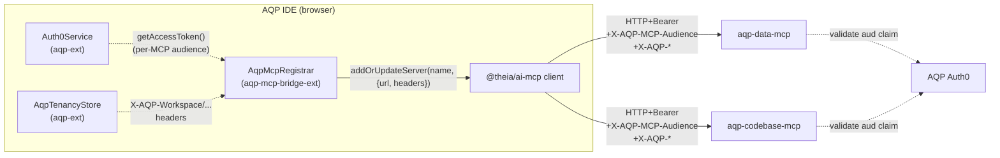

# AQP IDE MCP integration

Status: active.

The AQP IDE bridges Theia AI's MCP client (`@theia/ai-mcp`) to AQP's two
first-party MCP surfaces:

- **`aqp-data-mcp`** — DataMCP tools (`data.*.*`) per AQP rule 22.
- **`aqp-codebase-mcp`** — Codebase MCP tools (`codebase.*.*`) per AQP rule 22.

Both surfaces are served over streamable HTTP and are **RFC 9728** (OAuth
Protected Resource Metadata) + **RFC 8707** (Resource Indicators) compliant
per AQP rule 49.

## Wiring diagram



## Hard-rule contract

1. **Per-MCP audience.** The Auth0 access token used for each MCP server
   MUST carry that MCP's canonical URI as its `aud` claim. AQP exposes
   the canonical URIs via the matching env vars:
   - `AQP_THEIA_MCP_DATA_AUDIENCE`
   - `AQP_THEIA_MCP_CODEBASE_AUDIENCE`

   The bridge emits a `X-AQP-MCP-Audience` request header on every MCP
   call so an operator can verify the wiring from browser devtools without
   inspecting the token.

2. **No token passthrough.** The bridge never reuses an AQP API access
   token for an MCP server. Each MCP surface gets its own `aud`-scoped
   token via `Auth0Service.getAccessToken()` (which internally calls
   `getTokenSilently({ authorizationParams: { audience: ... } })`).

3. **No secret printing.** Bearer tokens NEVER appear in console.log,
   logger output, status command output, or UI affordances. The redacted
   4-character prefix rule (`.cursor/rules/aqp-management-engine.mdc`)
   applies.

4. **Tenancy propagation.** Every MCP request carries the active
   `X-AQP-Workspace` / `X-AQP-Project` / `X-AQP-Lab` / `X-AQP-Org` /
   `X-AQP-Team` headers from `AqpTenancyStore` so AQP's tenancy filter
   (rule 51) sees the right workspace.

5. **Re-registration on state change.** The bridge re-registers both MCP
   surfaces whenever Auth0 state OR tenancy changes. The
   `AQP: MCP — Reconnect All` command forces a manual re-registration.

## Environment variables

Set on the Theia Node backend (e.g. via `aqp-cli ide env` or the K8s
ConfigMap at `aqp_platform/deployments/kubernetes/aqp-ide/configmap-aqp.yaml`):

| Variable | Example | Purpose |
| --- | --- | --- |
| `AQP_THEIA_MCP_DATA_URL` | `https://api.aqp.fund/mcp/data` | Streamable HTTP endpoint of `aqp-data-mcp` |
| `AQP_THEIA_MCP_DATA_AUDIENCE` | `https://api.aqp.fund/mcp/data` | Canonical URI from the data MCP's RFC 9728 PRM doc |
| `AQP_THEIA_MCP_CODEBASE_URL` | `https://api.aqp.fund/mcp/codebase` | Streamable HTTP endpoint of `aqp-codebase-mcp` |
| `AQP_THEIA_MCP_CODEBASE_AUDIENCE` | `https://api.aqp.fund/mcp/codebase` | Canonical URI from the codebase MCP's RFC 9728 PRM doc |

If a slot is missing, the bridge logs a structured warning and skips
that surface — the IDE remains functional with the operator widgets and
notebook MIME renderer; only the copilot MCP tools become unavailable.

## Operator workflow

```bash
# Render the recommended env block (best-effort fills from topology):
aqp-cli ide env

# Persist to a file the Docker compose / K8s overlay can consume:
aqp-cli ide env --write ./.env.theia

# Open the IDE and verify the bridge wired both MCP servers:
aqp-cli ide start --open
# Then inside Theia: Command palette → "AQP: MCP — Show Status"
```

## Adding a new MCP server

Follow the skill at
[`../.cursor/skills/aqp-mcp-wiring/SKILL.md`](../.cursor/skills/aqp-mcp-wiring/SKILL.md).
Outline:

1. Extend `AqpMcpConfigSlot` slots in
   [`../theia-extensions/aqp/src/common/aqp-protocol.ts`](../theia-extensions/aqp/src/common/aqp-protocol.ts)
   (e.g. add `mcp.research_papers`).
2. Extend
   [`../theia-extensions/aqp/src/node/aqp-config-endpoint.ts`](../theia-extensions/aqp/src/node/aqp-config-endpoint.ts)
   to read the matching `AQP_THEIA_MCP_<NAME>_URL` + `_AUDIENCE` env vars.
3. Update
   [`../theia-extensions/aqp-mcp-bridge/src/common/aqp-mcp-protocol.ts`](../theia-extensions/aqp-mcp-bridge/src/common/aqp-mcp-protocol.ts)
   to add the canonical server name.
4. Add a new entry to `AQP_MCP_SURFACES` in
   [`../theia-extensions/aqp-mcp-bridge/src/browser/mcp/aqp-mcp-server-spec.ts`](../theia-extensions/aqp-mcp-bridge/src/browser/mcp/aqp-mcp-server-spec.ts).
5. Update `browser.Dockerfile`'s `ENV` block + the `_THEIA_ENV_KEYS`
   tuple in `aqp_cli/src/aqp_cli/commands/ide.py`.
6. Update this doc.

## AQP-side references

- `aqp_docs/data-mcp.md` (DataMCP boundary)
- `aqp_docs/codebase-mcp.md` (Codebase MCP)
- `aqp_docs/identity.md` (IdentityProvider + audiences)
- `aqp/api/well_known.py` (RFC 9728 Protected Resource Metadata endpoints)
- `aqp/api/mcp_audience.py` (RFC 8707 audience validation)
