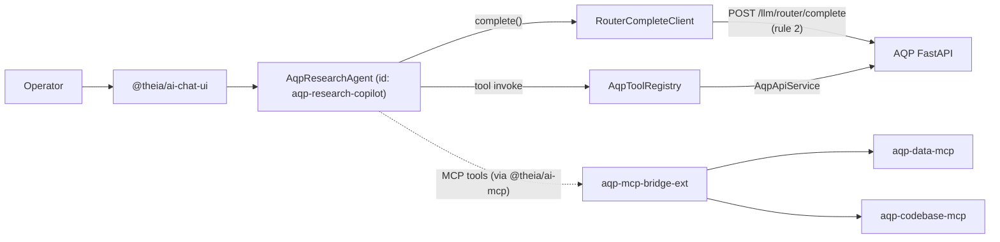

# AQP Research Copilot

The **AQP Research Copilot** is the Theia AI `ChatAgent` shipped by
[`theia-ide-aqp-research-copilot-ext`](../theia-extensions/aqp-research-copilot/).
It is a purpose-built chat agent for AQP's spec-runtime pattern + the
9 backtest engines.

## Architecture



## Hard-rule contract

1. **Rule 2 (LLM gateway).** Every chat completion routes through
   `RouterCompleteClient.complete()` which calls AQP's
   `POST /llm/router/complete`. The copilot extension MUST NOT import
   `@theia/ai-anthropic`, `@theia/ai-openai`, `@theia/ai-ollama`,
   `@theia/ai-vercel-ai`, `@theia/ai-google`, or any vendor SDK.
2. **Rule 22 (DataMCP).** Tool functions wrap AQP REST endpoints through
   `AqpApiService`; data access goes through the bridged MCP servers.
3. **Rule 52 (step-up MFA).** Any future tool function that hits a
   step-up-protected endpoint (`/portfolio/kill_switch`, every `/halt`,
   `/me/byok/*` DELETE, `/tenancy/invites` create, Terraform writes)
   MUST surface a confirmation chip in the chat UI and propagate the
   browser's step-up token.

## Prompts

Three curated prompt fragments shipped with the extension:

| Prompt id | File | When to use |
| --- | --- | --- |
| `aqp.copilot.prompts.spec-authoring` | [`prompts/spec-authoring.md`](../theia-extensions/aqp-research-copilot/src/browser/copilot/prompts/spec-authoring.md) | Drafting / inspecting a hash-locked spec (Agent / Bot / RL / Analysis / Workflow) |
| `aqp.copilot.prompts.factor-research` | [`prompts/factor-research.md`](../theia-extensions/aqp-research-copilot/src/browser/copilot/prompts/factor-research.md) | Discovering + backtesting alpha factors |
| `aqp.copilot.prompts.codebase-navigation` | [`prompts/codebase-navigation.md`](../theia-extensions/aqp-research-copilot/src/browser/copilot/prompts/codebase-navigation.md) | Walking the AQP monorepo via the Codebase MCP |

Operators select a prompt by typing `/` in the chat input and picking
the fragment.

## Tool functions

Defined in [`aqp-tool-functions.ts`](../theia-extensions/aqp-research-copilot/src/browser/copilot/aqp-tool-functions.ts).
All are READ-ONLY in this release; write tools (snapshot a spec, launch
a run, halt a runtime) are deferred to a follow-up release that adds the
step-up confirmation surface.

| Tool name | Backing endpoint | Purpose |
| --- | --- | --- |
| `aqp.spec.list_agent_specs` | `GET /agents/specs` | List every `AgentSpec` name + version |
| `aqp.runs.recent_agent_runs` | `GET /agents/runs/v2?limit=N` | Recent `agent_runs_v2` rows |
| `aqp.spec.list_workflows` | `GET /workflows` | Every `WorkflowSpec` |
| `aqp.spec.list_bots` | `GET /bots` | Every Bot |
| `aqp.spec.list_rl_experiments` | `GET /rl/experiments` | Every `RLExperimentSpec` |
| `aqp.runs.recent_rl_runs` | `GET /rl/runs?limit=N` | Recent `rl_runs` rows |
| `aqp.spec.list_analysis_flows` | `GET /analysis/flows` | Every `AnalysisSpec` |
| `aqp.backtest.list_engines` | `GET /backtest/engines` | Every backtest engine + `EngineCapabilities` |
| `aqp.health.agent_runs` | `GET /agents/health` | Watchdog snapshot — counts + stalled candidates |
| `aqp.topology.snapshot` | `GET /manage/topology/services` | Cluster topology (rule 47) |

## Model routing

Default: AQP's `gpt-4o` provider alias (configurable via the chat input).

When `AQP_THEIA_SERA_ENABLED=true` is set on the Theia backend, the
copilot defaults code-focused tasks to SERA-32B via the `sera` provider
alias. See `aqp_docs/docs/concepts/data/sera.md` for the SERA opt-in contract.

## SERA opt-in

```bash
# In aqp_platform/deployments/kubernetes/aqp-ide/configmap-aqp.yaml:
AQP_THEIA_SERA_ENABLED=true
```

The copilot then surfaces a `SERA-32B` chip in the model picker and
defaults `codebase.elaborate_finding` / spec-authoring code generation
to it. Chat completions still route through `router_complete` (rule 2);
SERA is just another alias in the AQP provider catalog.

## Tenancy

The copilot inherits tenancy via `AqpApiService` for tool calls and via
`AqpMcpRegistrar`'s re-registration loop for MCP tool calls. Changing
tenancy via `AQP: Set Tenancy` immediately reroutes both surfaces.

## What this copilot does NOT do

- Open any Theia widget on its own.
- Persist chat history outside Theia AI's normal session storage.
- Mutate any AQP state in this release (all tools are GET-only).
- Bypass AQP rule 2 (`router_complete` is the only LLM call path).

## See also

- [mcp-integration.md](mcp-integration.md) — how MCP servers are wired
- [extensions.md](extensions.md) — full extension reference
- `aqp_docs/docs/concepts/data/providers.md` — AQP `router_complete` contract
- `aqp_docs/docs/concepts/data/sera.md` — SERA-32B opt-in
