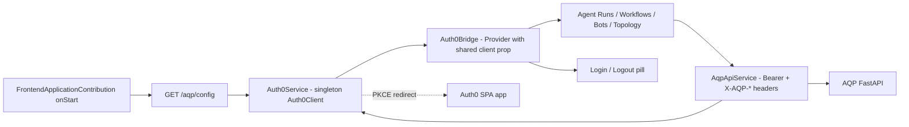

# theia-ide-aqp-ext

Theia IDE extension for the [Agentic Quant Platform (AQP)](https://github.com/JulianWiley/agentic_quant_platform).

Adds:

- **Auth0 single-page-app login** in the IDE status bar
  (`@auth0/auth0-spa-js` for the token lifecycle, `@auth0/auth0-react`
  for in-widget hooks - both share one `Auth0Client` instance).
- **Four left-panel operator widgets** wired against the AQP FastAPI:
  - **AQP: Agent Runs** - lists `/agents/specs`, runs one via
    `POST /agents/runs/v2/sync`, lists recent runs via
    `GET /agents/runs/v2`, halts via `POST /agents/halt`.
  - **AQP: Workflows** - `GET /workflows`, `POST /workflows/{name}/run`,
    `GET /workflows/runs?status=running`, `POST /workflows/halt`.
  - **AQP: Bots** - `GET /bots`, `POST /bots/{ref}/halt`,
    `POST /bots/halt-all`.
  - **AQP: Topology** (read-only) - `GET /control-plane/topology`.
- **Global kill-switch command** (`AQP: Halt EVERYTHING`, default
  binding `ctrlcmd+alt+h`) that fans out in parallel to every AQP halt
  endpoint (`/agents/halt`, `/paper/stop-all`, `/bots/halt-all`,
  `/rl/halt-all`, `/quant-agents/halt`, `/workflows/halt`,
  `/terraform/halt`, `/assistants/halt`).
- **Tenancy quick-pick** that fetches `/orgs`, `/teams`, `/workspaces`,
  `/projects`, `/labs` from the backend and stores the selection in
  Theia's `StorageService`. Every outgoing request gets the matching
  `X-AQP-Workspace / Project / Lab / Org / Team` headers consumed by
  `aqp/auth/deps.py::current_context`.

## Architecture in 30 seconds



Runtime config is served by the Theia Node backend at `GET /aqp/config`
- NOT baked into the JS bundle - so the same container image works for
localhost, staging, and prod by varying env vars only.

## Required env vars

The Theia backend reads these on every request to `/aqp/config`:

| Env var | Required | Default | Notes |
| --- | --- | --- | --- |
| `AQP_THEIA_AUTH0_DOMAIN` | yes | (empty) | e.g. `your-tenant.us.auth0.com` |
| `AQP_THEIA_AUTH0_CLIENT_ID` | yes | (empty) | SPA app client_id from Auth0 |
| `AQP_THEIA_AUTH0_AUDIENCE` | yes | (empty) | MUST equal the AQP backend's `AQP_AUTH_OIDC_AUDIENCE` |
| `AQP_THEIA_PUBLIC_ORIGIN` | recommended | `http://localhost:3000` | Used to default the redirect URI |
| `AQP_THEIA_AUTH0_REDIRECT_URI` | optional | `${AQP_THEIA_PUBLIC_ORIGIN}/` | Trailing slash MUST match Auth0 Allowed Callback URLs |
| `AQP_THEIA_AUTH0_SCOPE` | optional | `openid profile email offline_access` | `offline_access` enables refresh tokens (recommended) |
| `AQP_THEIA_AUTH0_ORGANIZATION` | optional | (none) | Auth0 Organization id, when using Orgs |
| `AQP_THEIA_API_URL` | yes | `http://localhost:8000` | AQP FastAPI base URL |

When any of the three required Auth0 vars are missing, the IDE comes up
with a clear "AQP not configured" banner in every AQP widget instead of
crashing - so an unconfigured Theia container is still usable as a plain
editor.

## Auth0 dashboard setup (one-time)

The plan calls for **reusing the AQP Auth0 tenant** but registering a
**new SPA application** for Theia (separate client_id, separate
callback URLs, but same API audience so AQP accepts the tokens with
zero backend changes).

1. In the AQP Auth0 tenant -> **Applications -> Create Application**.
2. Name: `Theia IDE` (or similar). Type: **Single Page Web Applications**. Click Create.
3. On the new app's **Settings** tab:
   - **Allowed Callback URLs**: add `http://localhost:3000/` for dev
     and the eventual public URL with trailing slash (e.g.
     `https://theia.example.com/`). Trailing slash MUST match the
     `redirect_uri` (`${AQP_THEIA_PUBLIC_ORIGIN}/` by default).
   - **Allowed Logout URLs**: same values.
   - **Allowed Web Origins**: same values, but DROP the trailing slash.
   - **Token Endpoint Authentication Method**: `None` (PKCE).
   - **Refresh Token Rotation**: ON. **Refresh Token Expiration**:
     rotating with a small absolute lifetime (e.g. 30 days). This is
     required when the SPA opts in to refresh tokens (we do via
     `useRefreshTokens: true`), avoids the third-party-cookie failure
     mode in Safari / Brave, and limits exposure of any leaked refresh
     token.
4. Save. Copy **Domain** and **Client ID** into the Theia container env:
   - `AQP_THEIA_AUTH0_DOMAIN` = the tenant domain (the SAME as the AQP
     frontend's `VITE_AUTH0_DOMAIN`).
   - `AQP_THEIA_AUTH0_CLIENT_ID` = the NEW client_id you just created.
5. **API audience reuse**: set `AQP_THEIA_AUTH0_AUDIENCE` to the SAME
   value as the AQP backend's `AQP_AUTH_OIDC_AUDIENCE` (also the SAME
   as the AQP Vite frontend's `VITE_AUTH0_AUDIENCE`). Because the AQP
   backend validates tokens by audience + issuer, the JWTs Theia mints
   from this SPA app will be accepted without any AQP-side changes.
6. **Permissions / scopes**: if the AQP API in Auth0 has explicit
   permissions (e.g. `data:read`, `data:write`, `admin`), grant the
   Theia SPA the SAME ones as the existing AQP SPA so the same Auth0
   Action that injects `https://aqp/scopes`, `https://aqp/roles`,
   `https://aqp/org_id`, etc. fires on Theia logins too.
7. Reload Theia. Click the `AQP: Sign in` pill in the status bar. You
   should be redirected to Auth0, complete login, and land back at the
   IDE with `AQP: <your-name>` in the status bar.

If the Auth0 redirect comes back with `Callback URL mismatch`, the most
common cause is a missing trailing slash - the URL the SDK sends MUST
appear EXACTLY in **Allowed Callback URLs** (including or excluding the
trailing slash).

## Build + run

The Theia repo expects yarn 1.x. The browser Dockerfile encapsulates the
entire toolchain inside `node:24-bookworm` so the host's yarn version is
irrelevant for the container build:

```bash
# from the theia-ide repo root
docker build -f browser.Dockerfile -t theia-ide-aqp:dev .

docker run --rm -p 3000:3000 \
    -e AQP_THEIA_AUTH0_DOMAIN=<tenant>.us.auth0.com \
    -e AQP_THEIA_AUTH0_CLIENT_ID=<theia-spa-client-id> \
    -e AQP_THEIA_AUTH0_AUDIENCE=<aqp-api-audience> \
    -e AQP_THEIA_API_URL=http://host.docker.internal:8000 \
    -e AQP_THEIA_PUBLIC_ORIGIN=http://localhost:3000 \
    theia-ide-aqp:dev

# open http://localhost:3000
```

For host-side iteration (faster edit-build cycle when you're hacking on
the widgets), install yarn 1.x first:

```bash
npm install -g yarn@1.22.22

yarn                       # also regenerates yarn.lock to include @auth0/*
yarn build:extensions      # compiles theia-ide-aqp-ext via lerna scope theia-ide*ext
yarn browser start         # serves at http://localhost:3000
```

Once the host yarn.lock includes the `@auth0/*` deps, tighten the
Dockerfile's `yarn install` back to `yarn --pure-lockfile` for fully
reproducible image builds. See the comment in
[../../browser.Dockerfile](../../browser.Dockerfile) for the exact
command sequence.

## CORS

Theia (`http://localhost:3000`) and the AQP API (`http://localhost:8000`
or `https://api.aqp.example.com`) live on different origins, so AQP must
allow the Theia origin via `AQP_CORS_ORIGINS`. The AQP backend installs
`CORSMiddleware` in `aqp/api/main.py` - just append the Theia public
origin to the list and restart the AQP API.

## Verification checklist after a build

- [ ] `docker run` boots and prints `Theia app listening on http://0.0.0.0:3000`.
- [ ] Browsing to `http://localhost:3000` loads the IDE without console errors.
- [ ] Status bar shows `AQP: Sign in` (or `AQP not configured` if env vars are missing).
- [ ] Command palette (`F1`) lists `AQP: Sign in`, `AQP: Sign out`, `AQP: Halt EVERYTHING`, `AQP: Show Agent Runs`, etc.
- [ ] Clicking `AQP: Sign in` redirects to Auth0, completes the PKCE flow, and returns to a clean URL (no `?code=&state=` left over).
- [ ] After login, opening `AQP: Show Agent Runs` lists at least one spec from the AQP backend (if the backend has any).
- [ ] The Network tab shows requests to AQP carrying `Authorization: Bearer ...` and `X-AQP-*` headers when tenancy is set.
- [ ] `ctrlcmd+alt+h` prompts a confirmation dialog and, if confirmed, posts to all 8 halt endpoints in parallel.

## Where in the AQP backend each widget talks

See `agentic_quant_platform/aqp/api/routes/` for the canonical handlers.
Use [../../docs/aqp-monorepo-paths.md](../../docs/aqp-monorepo-paths.md)
for current AQP domain paths.

| Theia widget | AQP backend module |
| --- | --- |
| Agent Runs | `aqp/api/routes/agent_specs.py`, `aqp/api/routes/agents.py` |
| Workflows | `aqp/api/routes/workflows.py` |
| Bots | `aqp/api/routes/bots.py` |
| Topology | `aqp/api/routes/control_plane.py` |
| Halt fan-out | Multiple - mirrors the `KillSwitch` component in AQP `aqp_client` |
| Tenancy | `aqp/api/routes/{orgs,teams,workspaces,projects,labs}.py` |

When the AQP backend grows new halt endpoints or new tenancy axes,
update the matching constants in
[src/common/aqp-protocol.ts](src/common/aqp-protocol.ts).

## Future work (deliberately out of scope for v1)

- OpenAPI codegen against `GET /openapi.json` to replace the hand-typed
  shapes in `src/browser/aqp/aqp-types.ts`.
- WebSocket subscription to `/ws/terraform/runs/{id}` so the Topology
  widget can stream live plan / apply / destroy progress.
- DataMCP + Codebase MCP browser widget (the MCP browser scope option
  was not selected in the plan questionnaire).
- Electron variant of the extension (browser only matches the current
  Dockerfile target).
- rpi_kubernetes manifests + Cloudflare tunnel hostname for the Theia
  container - see [docs/kubernetes-rpi-deployment.md](../../../../GitHub/rpi_kubernetes/docs/kubernetes-rpi-deployment.md)
  for the host pattern to follow when that lands.
