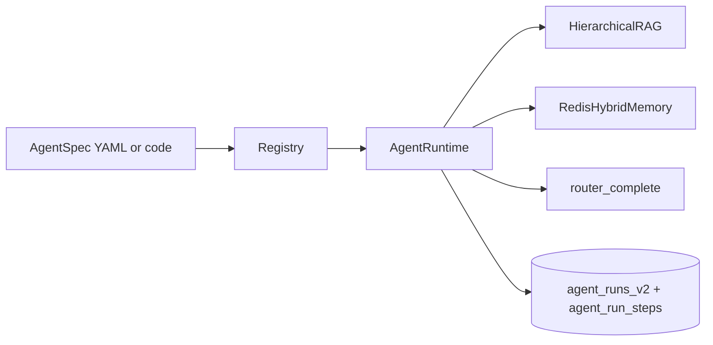

# Agents

This document covers the spec-driven agent surface added by the
agentic-RAG expansion. The legacy CrewAI research crew (under
[aqp/agents/crew.py](../aqp/agents/crew.py)) coexists with the new
runtime; both register routes under `/agents/*` in the FastAPI gateway.

## Concepts

- **AgentSpec** — declarative blueprint (Pydantic). Holds role,
  system_prompt, tools, model, memory, RAG clauses, guardrails,
  output_schema, cost / call caps, and annotations. Defined in
  [aqp/agents/spec.py](../aqp/agents/spec.py).
- **AgentRuntime** — executor that turns a spec into a real run with
  full telemetry. Defined in [aqp/agents/runtime.py](../aqp/agents/runtime.py).
- **Registry** — process-wide name → AgentSpec map. Discovered
  built-ins are registered at import time; YAML files under
  [configs/agents/](../configs/agents/) are auto-loaded on first lookup.
  Declared in [aqp/agents/registry.py](../aqp/agents/registry.py).
- **Reproducibility** — every spec is hash-locked and snapshotted into
  `agent_spec_versions` on first use. Every run records a
  `spec_version_id` so it can be deterministically replayed.

## The four teams

| Team | Specs | Page |
| --- | --- | --- |
| Research | `research.news_miner`, `research.equity`, `research.universe` | [docs/research-agents.md](research-agents.md) |
| Selection | `selection.stock_selector` | [docs/selection-agents.md](selection-agents.md) |
| Trader | `trader.signal_emitter` | [docs/trader-agents.md](trader-agents.md) |
| Analysis | `analysis.step`, `analysis.run`, `analysis.portfolio` (+ reflector) | [docs/analysis-agents.md](analysis-agents.md) |

## Run lifecycle



## Persistence

| Table | Purpose |
| --- | --- |
| `agent_specs` | Logical agent (latest version pointer) |
| `agent_spec_versions` | Immutable hash-locked spec snapshot |
| `agent_runs_v2` | One row per run |
| `agent_run_steps` | One row per step (LLM / tool / RAG / memory / guardrail) |
| `agent_run_artifacts` | Sidecar artifacts referenced by a run |
| `agent_evaluations` + `agent_eval_metrics` | Eval harness results |
| `agent_annotations` | User/agent annotations for optimisation |

## REST surface

```
GET  /agents/specs                              — list registered specs
GET  /agents/specs/{name}                       — spec detail (full payload)
GET  /agents/specs/{name}/versions              — version history
POST /agents/runs/v2/sync                       — synchronous run
GET  /agents/runs/v2                            — list runs (filter by spec/status)
GET  /agents/runs/v2/{id}                       — full trace incl. steps
POST /agents/runs/v2/{id}/replay                — replay against snapshotted spec
GET  /agents/evaluations                        — list eval reports
```

## Guardrails

`AgentSpec.guardrails` (parsed by `AgentRuntime._guardrail_check`):

- `cost_budget_usd` — hard ceiling per run (raises `GuardrailViolation`).
- `rate_limit_per_minute` — TODO: enforced at the call site.
- `max_calls` — caps the number of LLM round-trips per run.
- `forbidden_terms` — strings that must not appear in the output.
- `require_rationale` — output must include a rationale-style key.
- `min_confidence` — output's `confidence` field must clear this floor.

## Don'ts

- Don't bypass `AgentRuntime.run` for spec-driven agents — telemetry,
  guardrails, cost caps, and `agent_runs_v2` rely on it.
- Don't mutate `agent_spec_versions` rows — they are immutable.
- Don't write a new spec without registering it (decorator or YAML);
  the LangGraph builders look up by name and will skip unknown specs.
