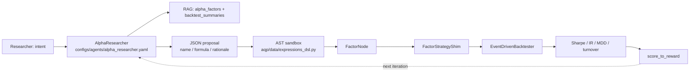

# Alpha Researcher agent + symbolic alpha DSL

> Self-evolving LLM-driven factor mining wired into AQP's
> deployment-consistent execution loop.

## The loop



## Symbolic DSL vocabulary

The full operator + field whitelist lives in
[`aqp/data/expressions_dsl.py`](../aqp/data/expressions_dsl.py).

**Fields:** `$open`, `$high`, `$low`, `$close`, `$volume`, `$vwap`,
`$returns`.

**Operators (curated):** `Ref`, `Delay`, `Mean`, `Std`, `Var`,
`Skew`, `Kurt`, `Sum`, `Min`, `Max`, `Med`, `Mad`, `Quantile`,
`Count`, `IdxMax`, `IdxMin`, `EMA`, `WMA`, `Slope`, `Rsquare`,
`Resi`, `Corr`, `Cov`, `Greater`, `Less`, `Gt`, `Ge`, `Lt`, `Le`,
`Eq`, `Ne`, `And`, `Or`, `Not`, `Mask`, `If`, `Add`, `Sub`, `Mul`,
`Div`, `Abs`, `Sign`, `Log`, `Rank`, `Clip`.

**Numeric literals:** integers + floats + bools + None + short
strings.

Anything else (imports, attribute access, subscripts, lambdas,
comprehensions, walrus, await, yield) raises
:class:`SymbolicAlphaError` at compile time.

## Example proposal

```json
{
  "name": "ema_crossover_pct",
  "formula": "Sign(EMA($close, 12) - EMA($close, 26)) * Rank(Std($returns, 20))",
  "rationale": "Combines MACD-style cross with vol-rank to favour high-vol trends.",
  "expected_horizon_bars": 5,
  "expected_direction": "either"
}
```

## Compile + evaluate

```python
from aqp.agents.quant import AlphaResearcher

researcher = AlphaResearcher(agent_spec_name="alpha_researcher")
proposal = researcher.propose(inputs={"intent": "find a short-horizon mean-reversion factor"})
result = researcher.evaluate(proposal, bars=bars)
print(result.metrics, result.reward)
```

## Engine-agnostic `FactorNode`

The compiled
[`FactorNode`](../aqp/data/expressions_dsl.py) feeds:

- **Event-driven engine** via `.compute(bars)` returning a
  `pd.Series`.
- **vbt-pro orders mode** via `.compute_panel(bars_panel)` returning
  a wide DataFrame.
- **Backtrader (optional)** via `.as_backtrader_indicator()`
  returning a dynamic `bt.Indicator` subclass.

## Companion agent: StrategyExecutor

The
[`StrategyExecutor`](../aqp/agents/quant/strategy_executor.py)
agent decides WHICH RL experiment to train / paper-trade / promote
based on the RAG `rl_trajectory_summaries` corpus and the live
broker state. Routes lifecycle actions through
[`RLRuntime`](../aqp/rl/runtime.py) (rule 16).

## See also

- [docs/agentic-rl.md](agentic-rl.md)
- [Hard rule 39 in AGENTS.md](../AGENTS.md)
- [.cursor/rules/symbolic-alphas.mdc](../.cursor/rules/symbolic-alphas.mdc)
