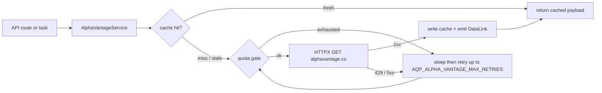

# Alpha Vantage Integration

> Doc map: [docs/index.md](index.md) · See [docs/data-plane.md](data-plane.md) for the broader provider model.

Alpha Vantage now lives directly in AQP as a first-class data provider. The
port keeps the useful admin-panel surface from `rpi_kubernetes` but adapts it
to AQP's local-first service, provider, task, and web UI conventions.

## Configuration

Set an API key in `.env`:

```bash
AQP_ALPHA_VANTAGE_ENABLED=true
AQP_ALPHA_VANTAGE_API_KEY=...
AQP_ALPHA_VANTAGE_RPM_LIMIT=75
AQP_ALPHA_VANTAGE_CACHE_BACKEND=memory
```

You can also use `AQP_ALPHA_VANTAGE_API_KEY_FILE` for mounted secrets. The
client resolves keys in this order: explicit argument, AQP settings, common
environment aliases, configured key file, and default secret-file paths.

## Python Client

The rich client is available from:

```python
from aqp.data.sources.alpha_vantage import AlphaVantageClient

client = AlphaVantageClient()
quote = client.timeseries.global_quote("IBM")
overview = client.fundamentals.overview("IBM")
client.close()
```

The client exposes sync and async endpoint groups:

- `timeseries`: intraday, daily, adjusted daily, weekly, monthly, quote, search, market status.
- `fundamentals`: overview, ETF profile, statements, earnings, dividends, splits, calendars, listings.
- `intelligence`: news sentiment, movers, transcripts, insider and institutional activity.
- `forex`, `crypto`, `options`, `commodities`, `economics`, `technicals`, `indices`.

## REST API

The FastAPI router is mounted at `/alpha-vantage`:

- `GET /alpha-vantage/health`
- `GET /alpha-vantage/usage`
- `GET /alpha-vantage/search?keywords=IBM`
- `GET /alpha-vantage/timeseries/{function}`
- `GET /alpha-vantage/fundamentals/{kind}`
- `GET /alpha-vantage/technicals/{indicator}`
- `GET /alpha-vantage/intelligence/{kind}`
- `GET /alpha-vantage/forex/{kind}`
- `GET /alpha-vantage/crypto/{kind}`
- `GET /alpha-vantage/options/{kind}`
- `GET /alpha-vantage/commodities/{commodity}`
- `GET /alpha-vantage/economics/{indicator}`
- `GET /alpha-vantage/indices/catalog`
- `POST /alpha-vantage/bulk-load`

Bulk loads enqueue a Celery task and write raw payloads under
`AQP_DATA_DIR/alpha_vantage/raw` by default, then register dataset lineage in
the AQP catalog when rows are materialized.

## Provider Catalog

Alpha Vantage fetchers register under the OpenBB-style provider catalog for:

- `equity.info`
- `equity.quote`
- `equity.historical`
- `fundamentals.income_statement`
- `fundamentals.balance_sheet`
- `fundamentals.cash_flow`
- `news.company`
- `options.chains`
- `fx.historical`
- `crypto.historical`

Use:

```python
from aqp.providers import pick_fetcher

fetcher = pick_fetcher("equity.quote", vendor="alpha_vantage")
```

## Web UI

The AQP web UI includes an Alpha Vantage section at `/alpha-vantage` with
provider health, usage, endpoint explorers, and a bulk-load admin page.

## Quota + cache flow



