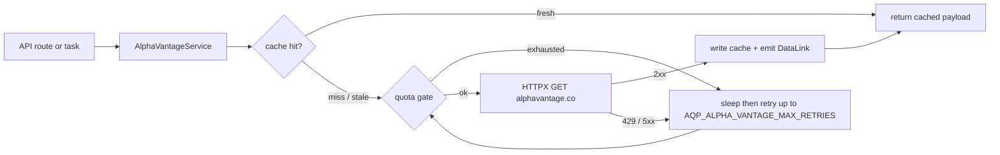

# Alpha Vantage Integration

> Doc map: [docs/index.md](index.md) · See [docs/data-plane.md](data-plane.md) for the broader provider model.

Alpha Vantage now lives directly in AQP as a first-class data provider. The
port keeps the useful admin-panel surface from `rpi_kubernetes` but adapts it
to AQP's local-first service, provider, task, and web UI conventions.

## Configuration

Set an API key in `.env`:

```bash
AQP_ALPHA_VANTAGE_ENABLED=true
AQP_ALPHA_VANTAGE_API_KEY=...
AQP_ALPHA_VANTAGE_RPM_LIMIT=75
AQP_ALPHA_VANTAGE_CACHE_BACKEND=memory
```

You can also use `AQP_ALPHA_VANTAGE_API_KEY_FILE` for mounted secrets. The
client resolves keys in this order: explicit argument, AQP settings, common
environment aliases, configured key file, and default secret-file paths.

## Python Client

The rich client is available from:

```python
from aqp.data.sources.alpha_vantage import AlphaVantageClient

client = AlphaVantageClient()
quote = client.timeseries.global_quote("IBM")
overview = client.fundamentals.overview("IBM")
client.close()
```

The client exposes sync and async endpoint groups:

- `timeseries`: intraday, daily, adjusted daily, weekly, monthly, quote, search, market status.
- `fundamentals`: overview, ETF profile, statements, earnings, dividends, splits, calendars, listings.
- `intelligence`: news sentiment, movers, transcripts, insider and institutional activity.
- `forex`, `crypto`, `options`, `commodities`, `economics`, `technicals`, `indices`.

## REST API

The FastAPI router is mounted at `/alpha-vantage`:

- `GET /alpha-vantage/health`
- `GET /alpha-vantage/usage`
- `GET /alpha-vantage/functions`
- `GET /alpha-vantage/search?keywords=IBM`
- `GET /alpha-vantage/timeseries/{function}`
- `GET /alpha-vantage/fundamentals/{kind}`
- `GET /alpha-vantage/technicals/{indicator}`
- `GET /alpha-vantage/intelligence/{kind}`
- `GET /alpha-vantage/forex/{kind}`
- `GET /alpha-vantage/crypto/{kind}`
- `GET /alpha-vantage/options/{kind}`
- `GET /alpha-vantage/commodities/{commodity}`
- `GET /alpha-vantage/economics/{indicator}`
- `GET /alpha-vantage/indices/catalog`
- `POST /alpha-vantage/bulk-load`

Bulk loads enqueue a Celery task and write raw payloads under
`AQP_DATA_DIR/alpha_vantage/raw` by default, then register dataset lineage in
the AQP catalog when rows are materialized.

The `/alpha-vantage/functions` catalog describes the supported request
controls (required params, optional params, output shape, default cache TTL,
and whether the function can be loaded into the lake). UI pages use this
metadata to render structured controls rather than asking users to type raw
JSON payloads.

Most live data routes accept optional cache controls:

- `cache=false` bypasses the response cache for a request.
- `cache_ttl=<seconds>` overrides the function default TTL when the response
  is cacheable.

CSV responses remain uncached because the transport cache stores JSON
payloads. When `AQP_ALPHA_VANTAGE_CACHE_BACKEND=redis`, the service now
attempts to build a Redis client from `AQP_REDIS_URL`; otherwise it falls back
to the configured local cache behavior.

## Per-endpoint Iceberg lake

Every lake-supported AlphaVantage endpoint writes to a dedicated Iceberg
table under the `aqp_alpha_vantage` namespace. The endpoint metadata
declares the table name and partition strategy:

| Function id | Iceberg table | Partition spec |
| --- | --- | --- |
| `timeseries.intraday` | `aqp_alpha_vantage.time_series_intraday` | `bucket(vt_symbol, 16) + month(timestamp)` |
| `timeseries.daily` | `aqp_alpha_vantage.time_series_daily` | `bucket(vt_symbol, 16) + month(timestamp)` |
| `timeseries.daily_adjusted` | `aqp_alpha_vantage.time_series_daily_adjusted` | `bucket(vt_symbol, 16) + month(timestamp)` |
| `timeseries.weekly_adjusted` | `aqp_alpha_vantage.time_series_weekly_adjusted` | `bucket(vt_symbol, 16) + month(timestamp)` |
| `timeseries.monthly_adjusted` | `aqp_alpha_vantage.time_series_monthly_adjusted` | `bucket(vt_symbol, 16) + month(timestamp)` |
| `fundamentals.overview` | `aqp_alpha_vantage.fundamentals_overview` | `identity(vt_symbol)` |
| `fundamentals.income_statement` | `aqp_alpha_vantage.fundamentals_income_statement` | `identity(vt_symbol)` |
| `fundamentals.balance_sheet` | `aqp_alpha_vantage.fundamentals_balance_sheet` | `identity(vt_symbol)` |
| `fundamentals.cash_flow` | `aqp_alpha_vantage.fundamentals_cash_flow` | `identity(vt_symbol)` |
| `fundamentals.earnings` | `aqp_alpha_vantage.fundamentals_earnings` | `identity(vt_symbol)` |
| `fundamentals.dividends` | `aqp_alpha_vantage.fundamentals_dividends` | `identity(vt_symbol)` |
| `fundamentals.splits` | `aqp_alpha_vantage.fundamentals_splits` | `identity(vt_symbol)` |
| `fundamentals.listing` | `aqp_alpha_vantage.listing_status` | `month(as_of)` |
| `intelligence.news` | `aqp_alpha_vantage.intelligence_news_sentiment` | `bucket(vt_symbol, 16) + month(timestamp)` |
| `intelligence.top_movers` | `aqp_alpha_vantage.intelligence_top_movers` | `month(as_of)` |
| `intelligence.insider` | `aqp_alpha_vantage.intelligence_insider` | `identity(vt_symbol)` |
| `technicals.sma` | `aqp_alpha_vantage.technicals_sma` | `bucket(vt_symbol, 16) + month(timestamp)` |
| `technicals.rsi` | `aqp_alpha_vantage.technicals_rsi` | `bucket(vt_symbol, 16) + month(timestamp)` |

The `GET /alpha-vantage/functions` endpoint returns the full list with
runtime state (`enabled_for_bulk`, `cache_ttl_override`). Toggle either
through the Settings → Data fabric pane or directly with
`PATCH /alpha-vantage/functions/{function_id}`.

## Multi-endpoint bulk loader

The Settings → Data fabric pane and the `/alpha-vantage` admin page expose
an `AlphaVantageBulkLoader` with two modes:

- **Entire active universe**: queues every active `Instrument` row against
  the selected endpoints, optionally filtered by exchange, with a runtime
  estimate at the configured RPM.
- **Filtered selection**: paginated picker over the catalog universe
  (powered by `/data/universe?source=catalog`) with checkbox-driven symbol
  selection.

Both modes call:

```bash
curl -X POST http://localhost:8000/pipelines/alpha-vantage/endpoints \
  -H "content-type: application/json" \
  -d '{
    "endpoints": ["timeseries.daily_adjusted", "fundamentals.overview"],
    "symbols": "all_active",
    "filters": {"exchange": ["NASDAQ", "NYSE"]},
    "cache": true
  }'
```

The Celery task `aqp.tasks.ingestion_tasks.load_alpha_vantage_endpoints`
fans out `(symbol, endpoint)` calls under the existing AlphaVantage rate
limiter, writes per-endpoint Iceberg tables (creating partitioned tables
on first append), registers `dataset_versions`, and emits `DataLink` rows
so `GET /data/securities/{vt_symbol}/coverage` lights up automatically.

## History to Iceberg

Alpha Vantage stock history can be loaded directly into the Iceberg catalog:

```bash
curl -X POST http://localhost:8000/pipelines/alpha-vantage/history \
  -H "content-type: application/json" \
  -d '{
    "symbols": ["AAPL.NASDAQ", "MSFT.NASDAQ"],
    "start": "2023-01-01",
    "end": "2024-01-01",
    "function": "daily_adjusted",
    "outputsize": "full",
    "namespace": "aqp_alpha_vantage",
    "table": "stock_history"
  }'
```

The Celery task fetches with `AlphaVantageClient`, normalizes to canonical AQP
OHLCV columns, writes through `iceberg_catalog.append_arrow`, and registers a
`market.bars` catalog version with the Iceberg identifier and request metadata.

## 1-minute intraday backfill and delta loads

AQP can plan and run a resumable 3-year 1-minute intraday OHLCV load for the
active Alpha Vantage universe. The planner creates one reusable request
component per `(vt_symbol, month, interval)` using `TIME_SERIES_INTRADAY` with
`interval=1min` and `month=YYYY-MM`, then stores the components as JSONL under:

```bash
AQP_ALPHA_VANTAGE_INTRADAY_MANIFEST_DIR=./data/alpha_vantage/intraday_components
```

Default knobs:

```bash
AQP_ALPHA_VANTAGE_INTRADAY_INTERVAL=1min
AQP_ALPHA_VANTAGE_INTRADAY_LOOKBACK_MONTHS=36
AQP_ALPHA_VANTAGE_INTRADAY_BATCH_SIZE=25
AQP_ALPHA_VANTAGE_INTRADAY_NAMESPACE=aqp_alpha_vantage
AQP_ALPHA_VANTAGE_INTRADAY_TABLE=time_series_intraday
```

Queue a plan:

```bash
curl -X POST http://localhost:8000/pipelines/alpha-vantage/intraday/plan \
  -H "content-type: application/json" \
  -d '{"symbols":"all_active","interval":"1min","lookback_months":36}'
```

Queue one load batch from a saved manifest:

```bash
curl -X POST http://localhost:8000/pipelines/alpha-vantage/intraday/load \
  -H "content-type: application/json" \
  -d '{"manifest_path":"./data/alpha_vantage/intraday_components/<plan>.jsonl","batch_size":25}'
```

Queue a combined delta cycle:

```bash
curl -X POST http://localhost:8000/pipelines/alpha-vantage/intraday/delta \
  -H "content-type: application/json" \
  -d '{"plan":{"symbols":"all_active","interval":"1min","lookback_months":36},"load":{"batch_size":25}}'
```

The loader annotates rows with `source`, `provider`, `function`,
`function_id`, `interval`, `source_month`, `request_component_id`, and
`ingested_at`. Before every Iceberg append it drops duplicate rows in the
incoming payload and filters against existing `vt_symbol + timestamp` keys in
`aqp_alpha_vantage.time_series_intraday`, so rerunning a component does not
write duplicate bars for the same stock/instrument timestamp.

Every successful batch registers an AQP `DatasetCatalog`/`DatasetVersion` row
with source metadata and emits best-effort DataHub dataset properties when
`AQP_DATAHUB_GMS_URL` and `AQP_DATAHUB_TOKEN` are configured.

Dagster support exists in two layers:

- Optional AQP-native definitions live at `aqp.dagster.alphavantage_intraday`
  and are installed with the `dagster` extra.
- The rpi Kubernetes Dagster user-code includes assets that call the AQP API to
  queue plan and delta tasks from the cluster deployment.

## Provider Catalog

Alpha Vantage fetchers register under the OpenBB-style provider catalog for:

- `equity.info`
- `equity.quote`
- `equity.historical`
- `fundamentals.income_statement`
- `fundamentals.balance_sheet`
- `fundamentals.cash_flow`
- `news.company`
- `options.chains`
- `fx.historical`
- `crypto.historical`

Use:

```python
from aqp.providers import pick_fetcher

fetcher = pick_fetcher("equity.quote", vendor="alpha_vantage")
```

## Web UI

The AQP web UI includes an Alpha Vantage section at `/alpha-vantage` with
provider health, usage, endpoint explorers, and a bulk-load admin page. The
Data Explorer can also select an Alpha Vantage universe source and queue the
history-to-Iceberg pipeline.

## Quota + cache flow



