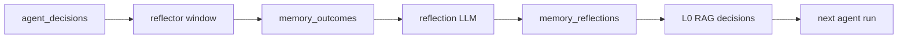

# Analysis Agents

Three interpretation agents + one deferred reflector. Together they
close the Alpha-GPT three-stage loop (Ideation → Implementation →
Review) and the TradingAgents-style outcome-reflection loop.

## Specs

| Spec | Module | Purpose |
| --- | --- | --- |
| `analysis.step` | [aqp/agents/analysis/step_analyst.py](../aqp/agents/analysis/step_analyst.py) | Verdict + improvements for a single agent step. |
| `analysis.run` | [aqp/agents/analysis/run_analyst.py](../aqp/agents/analysis/run_analyst.py) | End-to-end interpretation of a backtest / paper / live run. |
| `analysis.portfolio` | [aqp/agents/analysis/portfolio_analyst.py](../aqp/agents/analysis/portfolio_analyst.py) | Portfolio aggregate + risk + regulatory exposure. |
| Reflector (helper) | [aqp/agents/analysis/reflector.py](../aqp/agents/analysis/reflector.py) | Resolve outcomes + write reflections + re-index L0. |

## Reflection loop (TradingAgents pattern)



1. The reflector pulls every recent decision row that doesn't yet have
   an outcome.
2. It computes raw / benchmark / excess return over a configurable
   window via the bars adapter.
3. It writes one `MemoryOutcome` row + one `MemoryReflection` row.
4. It re-indexes the decision into the L0 `decisions` corpus so the
   next research / selection / trader run picks it up via
   `HierarchicalRAG`.

## REST + Celery

```
POST /agents/analysis/step              — task
POST /agents/analysis/run               — task
POST /agents/analysis/portfolio         — task
POST /agents/analysis/reflect           — task wrapper for run_reflection_pass
POST /agents/analysis/sync/run          — synchronous variant
POST /memory/reflect/run                — synchronous reflection pass
```

Tasks live in [aqp/tasks/analysis_tasks.py](../aqp/tasks/analysis_tasks.py).

## YAMLs

- [configs/agents/analysis_step.yaml](../configs/agents/analysis_step.yaml)
- [configs/agents/analysis_run.yaml](../configs/agents/analysis_run.yaml)
- [configs/agents/analysis_portfolio.yaml](../configs/agents/analysis_portfolio.yaml)
