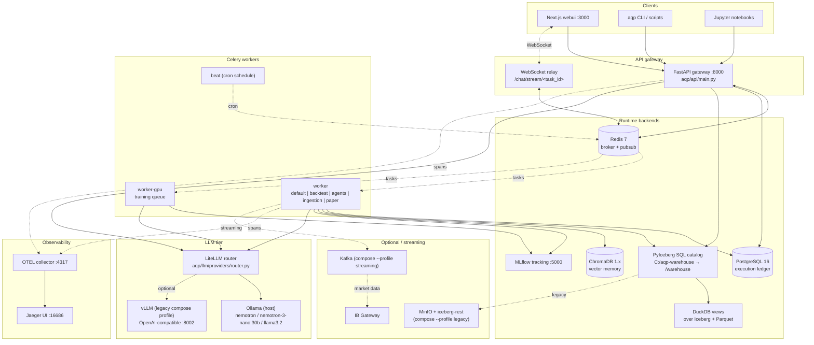
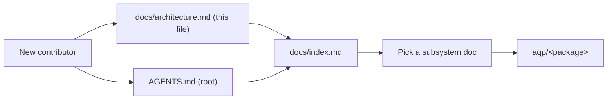

# Architecture

> Human entry point. Pair with [AGENTS.md](../AGENTS.md) (the agentic
> entry point) and [docs/index.md](index.md) (the doc map).

AQP is a **local-first, agentic quantitative research and trading
platform**. Every LLM call, every backtest, every reinforcement-learning
rollout, and every piece of metadata stays on local hardware — no
proprietary alpha leaves the box. The codebase distills patterns from
Microsoft Qlib, AI4Finance FinRL, QuantConnect Lean, OpenBB, vnpy, and
TradingAgents into one coherent platform.

## System component diagram



Solid lines are the default-profile data paths; dotted lines are
optional / opt-in profiles.

## Request lifecycle

A typical "kick off a backtest from the UI" request:

```mermaid
sequenceDiagram
    actor User
    participant UI as Next.js webui
    participant API as FastAPI
    participant Redis as Redis (broker)
    participant Worker as Celery worker
    participant DB as Postgres
    participant Iceberg as Iceberg
    participant MLflow

    User->>UI: Click "Run backtest"
    UI->>API: POST /backtest {strategy_id, start, end}
    API->>DB: insert BacktestRun(status=pending)
    API->>Redis: enqueue aqp.tasks.backtest_tasks.run_backtest
    API-->>UI: 202 Accepted {task_id, stream_url}
    UI->>API: WebSocket /chat/stream/{task_id}
    Worker->>Redis: dequeue task
    Worker->>DB: load BacktestRun, Strategy
    Worker->>Iceberg: read bars (DuckDB view)
    Worker->>MLflow: start_run()
    loop per bar
        Worker->>Worker: strategy.on_bar()
        Worker->>Redis: publish progress (aqp:task:&lt;id&gt;)
        Redis-->>UI: WebSocket frame
    end
    Worker->>MLflow: log metrics + artifacts
    Worker->>DB: update BacktestRun(status=completed, sharpe, ...)
    Worker->>Redis: publish stage=done
    Redis-->>UI: WebSocket frame
    UI-->>User: render summary
```

The same shape applies to ingestion, agentic crews, paper trading, and
RL training — only the worker's task module changes. See
[docs/flows.md](flows.md) for per-flow detail.

## Subsystem responsibility table

| `aqp/<package>/` | Responsibility | Canonical doc |
| --- | --- | --- |
| [agents/](../aqp/agents/) | CrewAI agent definitions, prompts, tools | [agentic-pipeline.md](agentic-pipeline.md) |
| [api/](../aqp/api/) | FastAPI app + 30 route modules | [webui.md](webui.md) (consumer) |
| [backtest/](../aqp/backtest/) | Backtest engines (vectorbt, custom, replay) | [backtest-engines.md](backtest-engines.md) |
| [cli/](../aqp/cli/) | `aqp` CLI entry points | [providers.md](providers.md) |
| [core/](../aqp/core/) | `Symbol`, enums, dataclasses, type contracts | [core-types.md](core-types.md) |
| [data/](../aqp/data/) | Iceberg catalog, ingestion pipeline, indicator zoo | [data-catalog.md](data-catalog.md), [data-plane.md](data-plane.md) |
| [llm/](../aqp/llm/) | Provider registry, LiteLLM router, Ollama client | [providers.md](providers.md) |
| [ml/](../aqp/ml/) | ML model factory, feature engineering, deployments | [ml-framework.md](ml-framework.md) |
| [mlops/](../aqp/mlops/) | MLflow autolog hooks, lineage helpers | [observability.md](observability.md) |
| [observability/](../aqp/observability/) | OTEL setup, tracers | [observability.md](observability.md) |
| [persistence/](../aqp/persistence/) | SQLAlchemy ORM + LedgerWriter | [domain-model.md](domain-model.md), [erd.md](erd.md) |
| [providers/](../aqp/providers/) | Data-feed adapters (yfinance, AV, IBKR, …) | [data-plane.md](data-plane.md) |
| [risk/](../aqp/risk/) | Position-, daily-, drawdown-loss limits | [paper-trading.md](paper-trading.md) |
| [rl/](../aqp/rl/) | gym envs + SB3 thin adapters (FinRL pattern) | [ml-framework.md](ml-framework.md) |
| [runtime/](../aqp/runtime/) | Control-plane state (provider overrides, kill switches) | [providers.md](providers.md) |
| [services/](../aqp/services/) | Higher-level domain services (Alpha Vantage, etc.) | [alpha-vantage.md](alpha-vantage.md) |
| [strategies/](../aqp/strategies/) | `BaseStrategy` + concrete alpha implementations | [factor-research.md](factor-research.md), [strategy-lifecycle.md](strategy-lifecycle.md) |
| [streaming/](../aqp/streaming/) | Kafka producers/consumers, IBKR / Alpaca ingesters | [streaming.md](streaming.md), [live-market.md](live-market.md) |
| [tasks/](../aqp/tasks/) | Celery task modules (backtest, ingest, agents, …) | (per consumer) |
| [trading/](../aqp/trading/) | Paper-trading session loop, broker abstractions | [paper-trading.md](paper-trading.md) |
| [ui/](../aqp/ui/) | Legacy Solara UI (deprecated; see `legacy` profile) | [webui.md](webui.md) |
| [utils/](../aqp/utils/) | Cross-cutting utilities (key derivation, etc.) | – |
| [ws/](../aqp/ws/) | Redis pub/sub bridge + WebSocket helpers | [observability.md](observability.md) |

## Deployment modes

### docker-compose (default)

```bash
docker compose up -d
```

Brings up `redis`, `postgres`, `chromadb`, `mlflow`, `api`, `worker`,
`worker-gpu`, `beat`, `webui`, `paper-trader`, `otel-collector`,
`jaeger`. The Iceberg catalog runs in PyIceberg SQL mode against the
host bind mount `C:/aqp-warehouse`. `iceberg-rest` and `minio` are
**not** started — they're under the `legacy` profile.

### docker-compose `legacy` profile

```bash
docker compose --profile legacy up -d minio minio-init iceberg-rest
```

Restores the older Tabular REST + MinIO topology. Set
`AQP_ICEBERG_REST_URI=http://iceberg-rest:8181` and the `AQP_S3_*` env
vars in `.env` to switch the catalog client over.

### docker-compose `streaming` profile

```bash
docker compose --profile streaming up -d
```

Adds Kafka, IB Gateway, and the `aqp-stream-ingest` workers for
real-time market data.

### docker-compose `vllm` profile

```bash
docker compose --profile vllm up -d vllm
```

Adds a containerised vLLM inference server (`:8002`). Configure with
`AQP_VLLM_BASE_URL` so the LiteLLM router can dispatch through it.

### Native dev (no Docker)

```bash
pip install -e ".[all]"
alembic upgrade head
uvicorn aqp.api.main:app --reload
celery -A aqp.tasks.celery_app worker --loglevel=info
```

The catalog falls back to a local `./data/iceberg/` SQL catalog. See
[CONTRIBUTING.md](../CONTRIBUTING.md) for full setup steps.

### Kubernetes

Manifests live under [deploy/k8s/](../deploy/k8s/). Targets the
`rpi_kubernetes` cluster which provides Kafka, MinIO, Ray, and a
managed Postgres. See the README in that directory.

## Where to start



| If you want to … | Read |
| --- | --- |
| Run AQP for the first time | [CONTRIBUTING.md](../CONTRIBUTING.md) |
| Understand the data plane end-to-end | [data-plane.md](data-plane.md) |
| Run a manifest-driven pipeline | [data-engine.md](data-engine.md) |
| Add a new ingest source | [data-catalog.md](data-catalog.md) |
| Browse / augment the unified entity registry | [entity-registry.md](entity-registry.md) |
| Author a new strategy | [factor-research.md](factor-research.md) + [strategy-lifecycle.md](strategy-lifecycle.md) |
| Add an LLM provider | [providers.md](providers.md) |
| Add an ML model | [ml-framework.md](ml-framework.md) |
| Wire a new agent into the crew | [agentic-pipeline.md](agentic-pipeline.md) |
| Sync metadata to DataHub | [datahub-sync.md](datahub-sync.md) |
| Schedule jobs via Dagster | [dagster.md](dagster.md) |
| Trace a slow request | [observability.md](observability.md) |
| Hack on the webui | [webui.md](webui.md) |

## Key invariants

These hold across the whole codebase — break them at your peril.

1. **All symbols are `Symbol` objects, all symbol IDs are `vt_symbol`
   strings.** Never split on `.` to extract ticker/exchange — use
   `Symbol.parse(...)`.
2. **All LLM calls go through `router_complete`.** This guarantees
   tier routing, key resolution, control-plane overrides, and cost
   accounting.
3. **All Iceberg writes go through `iceberg_catalog.append_arrow`.**
   This handles namespace creation, schema evolution, and
   create-or-replace semantics.
4. **All progress emits go through `aqp/tasks/_progress.py`.** Don't
   publish to Redis pub/sub directly.
5. **All cross-task state goes through Postgres.** Celery tasks must
   be idempotent and re-runnable.
6. **Migrations are immutable once committed.** Add a new migration;
   never edit `alembic/versions/0*.py` files after they ship.
7. **Configuration is read once via `from aqp.config import settings`.**
   Don't construct `Settings()` directly.

If a PR violates any of these, expect to be sent back to refactor.
