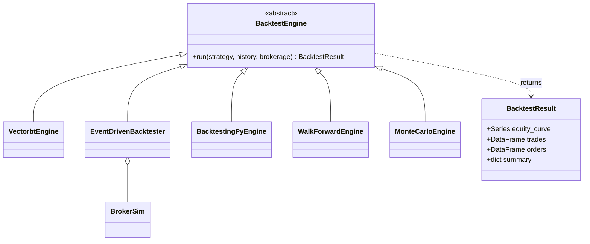

# Backtest engines

> Doc map: [docs/index.md](index.md) · Class hierarchy: [docs/class-diagram.md#4-backtest--paper--live-ibrokerage--idataqueuehandler](class-diagram.md#4-backtest--paper--live-ibrokerage--idataqueuehandler).

AQP ships three interchangeable backtest engines that all return the same
`aqp.backtest.engine.BacktestResult` shape so the runner, persistence, UI,
and MLflow tracking don't need to care which engine produced a run.

| Engine               | Use case                                         | Extra      |
|----------------------|--------------------------------------------------|------------|
| `EventDrivenBacktester` | Lean-style 5-stage pipeline replay (default)  | *(core)*   |
| `VectorbtEngine`     | Vectorized multi-asset Portfolio.from_signals    | `vectorbt` |
| `BacktestingPyEngine`| Single-symbol `backtesting.py` loop + optimize   | `backtesting` |

## Dispatching from YAML

Three equivalent ways to pick an engine inside a strategy recipe:

```yaml
# 1) Engine shortcut (cleanest).
backtest:
  engine: vectorbt
  kwargs:
    initial_cash: 100000
    fees: 0.0005

# 2) Explicit class + module.
backtest:
  class: VectorbtEngine
  module_path: aqp.backtest.vectorbt_engine
  kwargs: {...}

# 3) Omit engine entirely → the event-driven engine.
backtest:
  kwargs:
    initial_cash: 100000
    commission_pct: 0.0005
```

`aqp.backtest.runner.run_backtest_from_config` routes every YAML through
the right engine and stamps `engine: "event"|"vectorbt"|"backtesting"`
into `BacktestRun.metrics`.

## Vectorbt adapter

`VectorbtEngine` runs the alpha stage of a strategy across a multi-symbol
OHLCV panel, converts the resulting `Signal`s into boolean entries / exits
/ short-entries / short-exits matrices, and calls
`vbt.Portfolio.from_signals` once. Highlights:

- **Multi-asset by default** — every symbol in the bars frame becomes a
  column in the `close` pivot.
- **Long-only fast path** — when no short signals are generated the engine
  uses the simpler `from_signals(entries, exits)` signature (skipping the
  4-tuple short arguments) for a meaningful speed-up.
- **Equity normalisation** — `_to_backtest_result` rescales vectorbt's
  `pf.value()` to start at `initial_cash` so summary metrics match the
  event-driven engine's semantics.
- **Helpers** — `run_vectorized_signals(close, entries, exits, ...)` and
  `ma_crossover_grid(close, fast_windows, slow_windows, ...)` let you grid-
  search parameter combinations without the `FrameworkAlgorithm` overhead.

## backtesting.py adapter

`BacktestingPyEngine` is single-symbol (a hard constraint of the
underlying library) — if a multi-symbol YAML is dispatched it raises a
clear `ValueError`. The adapter wraps an `IAlphaModel` into a
`backtesting.Strategy` subclass at runtime and forwards signals to
`self.buy` / `self.sell` / `self.position.close`.

The `.optimize(ranges, method="grid"|"sambo", maximize="Sharpe Ratio",
return_heatmap=True)` helper maps a dict of constructor-kwarg ranges onto
`Backtest.optimize`, so you can run a 10×10 SMA-crossover grid with one
call.

## Unified result

All three engines return a `BacktestResult` with:

- `equity_curve: pd.Series` indexed by timestamp.
- `trades: pd.DataFrame` with `timestamp, vt_symbol, side, quantity, price,
  commission, slippage, strategy_id` (vectorbt / bt.py values are
  translated on the way out).
- `orders: pd.DataFrame`.
- `summary: dict` — `sharpe`, `sortino`, `max_drawdown`, `calmar`,
  `total_return`, `final_equity`, `n_bars`, `volatility_ann`,
  `n_trades`, `turnover`, `engine`. For `BacktestingPyEngine` the
  library's native metrics (`Sharpe Ratio`, `SQN`, `Profit Factor`, etc.)
  are also copied into the summary under `bt_*` keys.

## Which engine to use?

- Research / screening large parameter spaces → **Vectorbt** — orders of
  magnitude faster than event-driven.
- Lean-parity event-by-event behaviour + custom slippage / multi-stage
  risk models → **EventDrivenBacktester**.
- You need `backtesting.py`'s sambo / heatmap optimisation or you're
  porting a single-asset strategy from their docs → **BacktestingPyEngine**.

## Engine hierarchy



